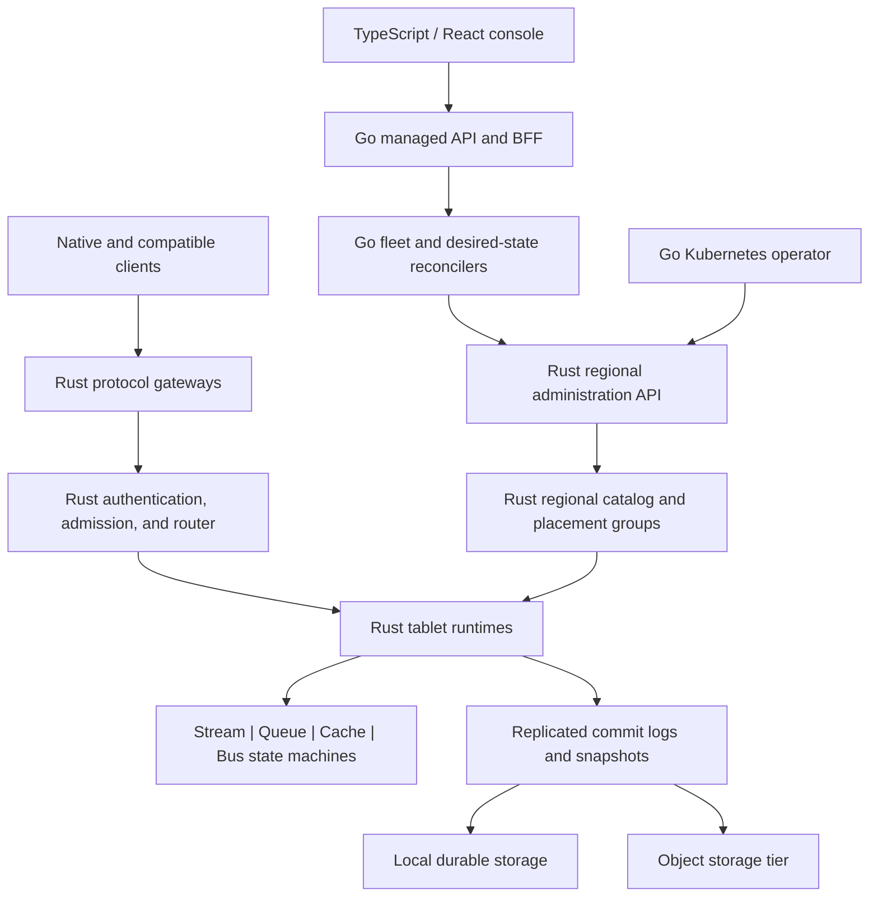

# Epoch Architecture

**Status:** Initial architecture baseline  
**Date:** 22 July 2026  
**Source of product requirements:** [PRD.md](PRD.md)  
**Requirement coverage:** [REQUIREMENTS_TRACEABILITY.md](REQUIREMENTS_TRACEABILITY.md)

Normative target behavior is split into [SEMANTICS.md](SEMANTICS.md),
[API_CONTRACTS.md](API_CONTRACTS.md), and [SECURITY.md](SECURITY.md). Those
documents explicitly distinguish the target contract from the current scaffold.

## 1. Purpose

Epoch is one product with four explicit workload profiles:

1. Cache and State
2. Stream Log
3. Work Queue
4. Event Bus

The profiles share identity, policy, resource management, storage building blocks,
replication, observability, and operations. They do not share one universal
execution path. In particular, a volatile cache operation must not pay for a
durable log append, and a queue acknowledgement must not be represented as a
stream consumer offset.

This document defines the initial component boundaries and the critical safety
rules. Detailed wire formats, state machines, and compatibility claims belong
in versioned specifications and must be supported by tests before they become
product claims.

## 2. Architectural principles

- Semantics are selected explicitly through typed resources and guarantee
  profiles.
- Rust owns every path that stores, replicates, routes, transforms, or delivers
  customer data.
- Go manages hosted fleets and desired state but is not a correctness dependency
  for an already-running regional data plane.
- TypeScript and React provide the browser console; the console never connects
  directly to storage nodes.
- Protobuf and gRPC are the versioned Rust/Go boundary.
- Regional metadata is strongly consistent. Stale leaders, producers,
  consumers, sessions, and leases are rejected using monotonic fencing epochs.
- A write is not described as durable until its configured commit rule is met.
- Persisted formats are explicit and versioned. Native Rust object layouts are
  never treated as durable contracts.
- All derived indexes are rebuildable from a committed log and a verified
  snapshot.
- Failure behavior, unknown outcomes, redelivery, replay, repair, and guarantee
  degradation are observable product behavior.

## 3. System context



There are three distinct operational layers:

1. **Data plane:** protocol handling, routing, profile execution, replication,
   storage, delivery, and data-path authorization in Rust.
2. **Regional control:** the strongly consistent catalog, membership, placement,
   fencing, failover, repair, and local administration in Rust.
3. **Hosted management:** organization/project APIs, fleet capacity,
   multi-region desired state, autoscaling policy, metering, billing, and cloud
   integration in Go.

The hosted management layer may be unavailable without stopping existing
regional reads, writes, delivery, failover, or repair. Management mutations can
be temporarily unavailable in that condition.

## 4. Logical and physical resource model

The logical hierarchy is:

```text
Organization
  Project
    Environment
      Namespace
        Resource
          Shard
```

A **Resource** is a Cache/Table, Stream, Queue, Event Bus, Subscription, Schema,
Pipe, Connector, or Policy. Each data-bearing resource has one or more logical
**Shards**:

- a Stream shard is an ordered partition;
- a Cache shard is a hash-key ownership range;
- a Queue shard owns a subset of messages and session groups;
- a Bus ingress or subscription shard owns route or delivery state.

Each shard maps to one physical **Tablet**. A tablet is the unit of leadership,
replication, placement, snapshot, restore, split, transfer, repair, and resource
accounting. Each tablet contains exactly one profile-specific state machine in
the initial architecture. Tablets from different profiles can share a node, but
they do not share a state machine or retention lifecycle.

Each durable tablet is backed by a consensus group. Many groups share a node
process, peer connections, schedulers, I/O batching, block cache, and telemetry;
there is no process per resource. System tablets hold data-path coordination
state such as consumer groups, transaction coordinators, schema revisions, and
subscription ledgers. High-volume coordination data does not live in the
regional catalog.

## 5. Rust data-node boundary

One `epoch-node` executable supports role selection. Standalone mode enables all
roles; clustered and managed deployments can isolate roles:

| Role | Responsibility |
|---|---|
| Gateway | Native and compatibility protocols, authentication, policy, quotas, validation, normalization |
| Storage | Tablet leaders/followers, profile state machines, log, snapshots, compaction, tiering |
| Regional controller | Catalog consensus, placement, membership, failover, repair, safe changes |
| Delivery | Queue dispatch, subscription delivery, webhook retries and redrive |
| Connector | Sandboxed transform and connector execution with controlled egress |

The executable is composed from libraries rather than placing product logic in
the binary crate. Protocol adapters call typed in-process engine interfaces. If
a gateway is deployed separately, it uses the native gRPC data API and receives
the same authorization and admission behavior.

The runtime separates latency-sensitive work from background work:

- async network and request routing;
- serialized or core-pinned shard mutation execution;
- blocking disk and encryption work;
- bounded snapshot, compaction, tiering, restore, and repair pools;
- separately budgeted routing, webhook, and connector delivery.

Backpressure begins at admission. Background work must not consume all recovery
bandwidth or destroy the latency SLO of foreground work.

## 6. Request path

A native or compatible write follows this sequence:

1. The gateway authenticates the principal and evaluates the locally cached,
   versioned policy bundle.
2. It enforces payload, connection, rate, memory, and tenant quotas.
3. It validates schemas where configured and normalizes the request into a typed
   profile operation and common envelope.
4. The router resolves resource, shard, tablet, leader, and epoch from a cached
   regional partition map.
5. The tablet validates leadership, resource generation, producer/session/lease
   fences, and the idempotency token.
6. The profile performs either:
   - a direct volatile Cache mutation;
   - an in-memory replicated mutation; or
   - a proposal to the tablet's durable commit log.
7. After the configured acknowledgement rule is satisfied, the tablet returns a
   typed receipt containing its achieved guarantee and commit position.

A stale route is not hidden. The node returns a typed `NotLeader` or `Fenced`
detail with the current epoch and a safe retry hint. Clients use idempotency
tokens to resolve a timeout whose commit result is unknown.

## 7. Storage and replication

### 7.1 Commit log

The tablet consensus log is also its ordered application commit log. Customer
data is not synchronously duplicated into a generic Raft WAL and a second
source-of-truth application log. A storage adapter writes versioned frames to
immutable segments, while state machines produce reconstructible indexes and
snapshots.

A persisted frame contains, at minimum:

- format and feature version;
- cluster, group, tablet, namespace, and resource identity as applicable;
- consensus term and index;
- profile logical position or sequence;
- frame type and flags;
- timestamp or hybrid logical clock observation;
- metadata and raw payload lengths;
- per-frame checksum.

The stable encoding is an explicit binary frame header, versioned Protobuf
metadata, and raw payload bytes. Segment headers and manifests include format,
encryption-key, compression, range, and checksum information. Sealed segment and
snapshot manifests receive a cryptographic digest. Exact layouts and golden
vectors live under `spec/formats`.

Consensus indices and user-visible logical positions are distinct. Consensus
entries such as membership changes must not create gaps that compatibility
clients interpret as missing customer records.

### 7.2 Replication

The initial direction is Multi-Raft with one group per tablet and a vetted Rust
consensus library behind an Epoch adapter. The library choice remains subject to
the spike in [ADR-0003](adr/0003-consensus-adapter.md); Epoch will not implement
a new consensus algorithm during Phase 0.

The current workspace contains Stage 1 of that spike plus a local stable-store
sub-slice: an Epoch-owned, fixed-three-voter adapter over an exact upstream
`raft-rs` revision, deterministic `epoch-testkit` transport, and the EPRS v1
stable journal over `FileWal` exposed through `PersistentRaftAdapter`. EPRS
records immutable voter identity, complete `HardState`, normal-entry
index/term/data, and an applied/publishable digest checkpoint without persisting
raw library protobuf. It supports checksummed
local reopen and logical uncommitted-suffix replacement. An opt-in node probe
wraps it in a dedicated actor, bounded ordered HTTP peer queues, local
status/proposal lookup, and a static three-container topology. The probe carries
opaque diagnostics only: the adapter is not connected to a tablet/profile state
machine and no product durable-majority acknowledgement is exposed. Snapshots,
compaction, membership changes, authoritative catalog
fencing, and read barriers remain disabled. The byte contract is documented in
[EPRS v1 consensus stable journal](../spec/formats/consensus-stable-store-v1.md);
the complete scope and non-claims are recorded in
[Consensus Feasibility Spike](CONSENSUS_SPIKE.md) and the runnable boundary in
[Experimental Consensus Probe](CONSENSUS_PROBE.md).

Rust peer replication uses batched, framed, mutually authenticated connections
with separate priorities for control, append, snapshot, and repair traffic.
Administrative and Rust/Go calls use gRPC. Bulk replication is not required to
remain gRPC if matched benchmarks show a purpose-built transport is needed.

Zone-aware placement supplies voters. A quorum acknowledgement requires a
majority to durably append according to the resource's media policy. An old or
isolated leader cannot commit after a higher epoch is issued because replicas
reject stale epochs and the old leader cannot form a quorum.

### 7.3 Durability profiles

| Profile | Success point |
|---|---|
| Volatile | Applied to leader memory |
| Replicated memory | Applied to the leader and configured replica memories |
| Local durable | Appended to leader storage and completed configured group fsync |
| Quorum durable | Durably appended by a voter majority |
| All in-sync replicas | Quorum committed and acknowledged by every current in-sync replica |
| Geo async | Regionally committed; remote checkpoint advances asynchronously |

No protected resource silently downgrades. A policy can explicitly permit a
weaker mode, in which case the downgrade is returned and audited.

### 7.4 Snapshots, recovery, and object tier

Snapshots are checksummed, versioned state-machine checkpoints. Recovery loads
the newest verified snapshot and replays the committed tail. A recovered state
must produce the same digest as the pre-crash state in deterministic tests.

Only sealed and committed segments are eligible for upload. Local deletion is
allowed only after the object checksum and manifest update are durably recorded.
The primary remote representation is an open Epoch segment format. Analytics
capture to Parquet, JSON, or another open interchange format is a separate
export, not the replication source of truth.

The current standalone vertical slice is intentionally narrower. Fresh data
directories use one exclusively locked segmented node WAL under
`$EPOCH_DATA_DIR/engine-wal/segment-*.wal`; `engine.wal` is its crash-safe
activation marker and cross-version lock. Stream creation, append, and offsets
are recorded alongside Queue creation, enqueue, lease, settlement, redrive, and
time-driven maintenance. Local-durable mutations fsync before application;
volatile mutations bypass the journal.

Segments rotate at a configured byte threshold and retain the checksummed v1
frame format. Record sequence is global across files, not reset per segment. A
versioned identity and checksummed manifest bind the WAL UUID, ordered segment
set, committed lengths, ending sequences, and whole-file checksums. Startup
rejects missing, unexpected, reordered, truncated, foreign, or checksum-invalid
committed history. Recovery may discard only bytes beyond the active segment's
manifested length; sealed segments are immutable. A pending manifest transition
makes an interrupted rotation deterministic. The directory is append-only at
this milestone: rotation does not implement retention, compaction, snapshots,
or tiering.

A valid legacy `$EPOCH_DATA_DIR/engine.wal` remains on the single-file writer;
the current binary replays and continues appending to it without creating a
segmented history. Fresh activation installs a marker that old binaries cannot
interpret as a WAL, preventing a split history. Ambiguous mixed layouts fail
closed. Safe automatic migration is deferred. These compatibility rules and
fixtures are not the final tablet consensus log or snapshot format.

The local manifest detects missing or independently changed committed files,
not rollback of an entire self-consistent storage volume. Backup/restore must
treat the activation marker and `engine-wal/` as one atomic unit; authenticated
anti-rollback evidence belongs to the later backup and consensus design.

## 8. Profile engines

### 8.1 Stream Log

A stream partition is a tablet whose committed data frames are user-visible
records. Sparse offset, time, and key indexes are derived. Retention,
compaction, and tiering rewrite sealed segments through an atomic manifest
change; an active segment is never rewritten.

Producer sequence state supports idempotence. Consumer offsets and group
coordination live in sharded system tablets. Read-committed fetch hides prepared
and aborted transaction records. Partition order is the only default ordering
claim.

### 8.2 Work Queue

An enqueue frame stores an immutable payload. Lease, acknowledgement, release,
retry, expiry, session, and dead-letter frames refer to the record identity.
Derived indexes represent ready, scheduled, leased, priority, session, dedupe,
expiry, and dead-letter state.

Acquire is a committed transition that chooses eligible records and creates
fenced lease tokens. Ack, Nack, Release, Reject, and Extend validate the tablet,
leader, consumer/session, message, and lease generations before committing.
Expired or superseded tokens cannot mutate state.

In the standalone slice, a local-durable Queue uses deterministic command
replay. The engine clones the current state, validates and applies a proposed
transition, fsyncs its command, and only then publishes that state in memory.
Consequently a failed enqueue or settlement cannot become visible, while a
restart reconstructs lease generations and opaque tokens exactly.

The alpha implementation can use memory-resident indexes plus checksummed
snapshots and tail replay. A bounded-memory, disk-backed derived-index design and
recovery benchmark are required before advertising billion-message backlogs.

### 8.3 Cache and State

Volatile cache shards serialize mutations in memory and bypass the durable log.
They implement TTL and eviction in the shard runtime. Replicated-memory shards
use the peer replication path without claiming disk survival. Durable state
shards replicate deterministic mutations, snapshot state, and optionally expose
a change stream.

Native multi-key operations are atomic only when their keys resolve to one shard
unless an explicitly supported transaction domain is selected. RESP
compatibility must report unsupported cross-slot or scripting behavior instead
of silently weakening it.

### 8.4 Event Bus

A durable bus publish first commits to an ingress or archive tablet. The record
captures the route-plan version used for deterministic evaluation. Each durable
subscription owns independent delivery state, retry, rate, and dead-letter
policy. A publish acknowledgement means the ingress commit succeeded; it does
not mean a webhook or external target completed.

Filters compile into a bounded, deterministic representation. Network
enrichment and connectors run outside the storage role with explicit timeout,
memory, secret, and egress policy.

### 8.5 Cross-profile pipes

The physical payload can be shared only inside one tablet and transaction domain
in v1. A pipe that crosses tablets commits a new target record while preserving
the origin resource, record ID, and position. This avoids distributed reference
counting, garbage collection, retention coupling, and ambiguous recovery.
Co-located immutable references may be added later after evidence and a separate
format decision.

## 9. Time, leases, and fencing

Engines depend on an injectable clock and never call wall time directly. The
clock exposes wall time for user schedules, monotonic elapsed time for local
timers, and a persisted hybrid logical clock for ordered state transitions.

Clock observations never move backward. Forward or backward wall-clock
anomalies are clamped or slewed and emit an operational event. Scheduled work
may be conservatively late during an anomaly; it must not be acknowledged early
because a clock jumped.

Leadership, producer ownership, consumer sessions, queue leases, and transaction
coordinators use monotonic epochs. Every mutation includes the relevant fence;
tokens from an older epoch are rejected even if their nominal time has not
expired. Deterministic clocks are mandatory in the simulator and local emulator.

## 10. Transactions

The first atomic boundary is one tablet. Cross-partition transactions arrive in
P1 and are bounded to a regional transaction domain:

1. a sharded transaction-coordinator tablet allocates producer identity and
   epoch;
2. participant tablets durably prepare records;
3. the coordinator durably records commit or abort;
4. participant tablets append the decision marker;
5. read-committed readers expose only committed records.

Transactions have a timeout, maximum bytes, and maximum participant count.
Consumed offsets can participate. Arbitrary external APIs cannot participate
unless a connector supplies a documented transactional protocol; otherwise
delivery remains at-least-once with idempotency guidance.

## 11. Regional and hosted control

### 11.1 Regional Rust authority

A small root catalog group maps namespaces to sharded catalog groups. Catalog
groups own resource specs needed by the data plane, partition maps, membership,
placement, epochs, policy and quota snapshots, schema references, and operation
status. Phase 0 can use one catalog group, but its keys and APIs must not assume
that it remains singular.

Rust regional controllers reconcile actual tablet placement, capacity safety,
replica health, leader transfer, split, repair, rebalance, drain, and rolling
compatibility. Risky changes support plan, validation, bounded execution, and
abort/rollback where semantics allow it.

Standalone mode uses the same API and state machines with one member. A
three-or-more-node cluster enables quorum profiles.

### 11.2 Go managed plane

The Go plane owns:

- organization, project, environment, entitlement, and commercial metadata;
- public management API and console backend;
- fleet capacity and cloud infrastructure;
- desired regional and multi-region topology;
- autoscaling policy and safe change-plan orchestration;
- backup/DR workflow coordination;
- metering, budgets, billing, and anomaly detection.

Go persists management-only state in a transactional database. It submits
versioned desired specs to the Rust regional administration API with an
idempotency token and expected generation. Rust validates and commits the
regional state, then returns `observed_generation` and conditions. Go never
reads or changes segment files, Raft logs, queue indexes, transaction state, or
cache memory.

The Kubernetes operator follows the same boundary: custom resources express
desired state, while the Rust catalog is authoritative for live data-plane
state.

## 12. API contracts

Contracts are defined under versioned Protobuf packages. The native API uses
separate typed services rather than a generic `Execute` service:

| Service | Representative methods |
|---|---|
| Cache | `Get`, `Mutate`, `Batch`, `Scan`, `WatchChanges` |
| Stream | `Produce`, `Fetch`, `ListOffsets`, `CommitOffsets`, `ConsumerSession` |
| Queue | `Send`, `Receive`, `Settle`, `ExtendLease`, `GetById` |
| Bus | `Publish`, `Pull`, `Subscribe` |
| Transaction | `InitProducer`, `Begin`, `Commit`, `Abort`, `Lookup` |
| Schema | `Resolve`, `Validate`, revision and compatibility operations |
| Regional Admin | `Plan`, `ApplyResource`, `Delete`, `WatchOperation`, backup, restore, drain, transfer, rebalance |

High-throughput produce, fetch, send, receive, and settle paths support streaming
and batching. Every mutation carries a deadline, request or idempotency token,
and expected epoch or generation where applicable.

The common envelope stores payload as bytes plus content type and schema
reference. It carries stable identity, source, type, subject, event time, key,
headers, trace context, delivery attributes, dedupe identity, transaction
identity, and namespaced byte extensions. JSON is one payload encoding, not the
in-memory API representation.

Every successful write returns a receipt with:

- immutable resource and record identity;
- resource generation and tablet/leader epoch;
- logical position or offset;
- configured and achieved durability;
- replica acknowledgement count;
- commit timestamp;
- duplicate/original position when deduped;
- route-plan version where applicable.

Typed error details include `NotLeader`, `Fenced`, `QuorumUnavailable`,
`UnknownCommit`, `Throttled`, `SchemaRejected`, `Conflict`,
`UnsupportedSemantic`, `PlacementUnsatisfied`, `LeaseLost`, and
`TransactionAborted`. SDK retry decisions use error details, never text.

Within `epoch.*.v1`, changes are additive. Breaking checks, golden fixtures,
feature negotiation, and named client-version conformance guard evolution.
RESP3, Kafka, AMQP, MQTT, CloudEvents, and cloud-compatible facades are adapters
with independent versioned compatibility matrices.

## 13. Identity, security, and tenancy

- External identity uses OIDC/OAuth or compatible protocol credentials mapped to
  an Epoch principal. Internal identity uses mTLS.
- Versioned, signed policy bundles and verification keys are cached regionally
  with explicit expiry and revocation behavior.
- Authorization is evaluated at organization, project, namespace, resource,
  group/subscription, and operation scope.
- Namespace data uses envelope encryption. New segments use the current data key;
  rotation and background rewrite are observable operations.
- Connector and webhook workers have separate identity, secret references,
  outbound allowlists, DNS controls, rate limits, and SSRF protections.
- Console payload browsing is disabled by policy where required and always calls
  an audited Rust data-access API. The Go plane does not inspect storage files.
- Tenant-derived metrics avoid unbounded labels. Logs redact payloads, secrets,
  and raw credentials by default.

## 14. Observability and operations

Every request and background operation carries stable request, resource, tablet,
record, and trace identities as applicable. Profile metrics follow the golden
signals in the PRD without unbounded per-key or per-message labels.

Every resource reports its deployment mode, requested guarantee, achieved
placement, leader/replicas, current epoch, commit position, lag/backlog, storage
tier, recent change operations, and conditions. Guarantee degradation, repair,
truncation, replay, redrive, payload access, promotion, and key use emit immutable
audit events.

Operational work is represented by resumable, observable operations rather than
long synchronous API calls. Backup and restore include manifest verification and
regular automated restore tests.

## 15. Deployment modes

| Mode | Composition | Guarantee ceiling |
|---|---|---|
| Embedded | Rust library and process-local storage | Process-local or local-disk only |
| Standalone | One `epoch-node` process with all roles | Machine-local persistence; no machine-loss survival |
| Cluster | Three or more Rust nodes; optional Go operator | Quorum durability, failover, repair, partition scale |
| Managed | Rust regional clusters plus Go fleet/control services | Managed multi-zone, backup, autoscale, IAM, and optional geo DR |

Non-Rust applications receive an embedded-like experience through a supervised
child process or sidecar over a Unix-domain socket, named pipe, or loopback. The
Rust embedding crate exposes lifecycle and supported operations, not internal
storage structures.

## 16. Repository boundaries

The intended top-level layout is:

```text
/crates       Rust engines, storage, replication, protocols, binaries, testkit
/control      Go hosted APIs and fleet services
/operator     Go Kubernetes operator
/console      TypeScript/React web application
/sdk          Native SDKs and generated bindings
/spec         Protobuf, formats, compatibility contracts, formal models
/tests        Cross-language integration, conformance, chaos, and benchmarks
/docs         Architecture, ADRs, security, operations, and development guides
/deploy       Containers, local cluster, and Kubernetes packaging
/tools        Code generation and benchmark helpers
```

The detailed provisional workspace and toolchain decision is in
[ADR-0007](adr/0007-repository-and-toolchains.md).

Developer commands and the verified local toolchain are documented in
[DEVELOPMENT.md](DEVELOPMENT.md). Verification layers and evidence requirements
are documented in [TESTING.md](TESTING.md).

## 17. Delivery order

The architecture is delivered through evidence-producing vertical slices:

1. contracts, invariants, deterministic testkit, benchmark baseline;
2. standalone stream append/fetch with crash-safe segments;
3. three-node catalog and replicated tablet with quorum/fencing;
4. queue leases, acknowledgement, retry, scheduling, and DLQ;
5. independent volatile cache path, then replicated and durable modes;
6. regional operations, operator, auth, audit, backup, and migration;
7. named Kafka, RESP3, and AMQP compatibility subsets, schemas, compaction, and
   tiering;
8. Event Bus, webhooks, MQTT, transforms, and connectors;
9. hosted dedicated/serverless plane, console, billing, private networking, and
   geo-async DR;
10. bounded transactions and GA hardening, followed by P2 expansion.

Correctness, fencing, recovery, observability, and matched benchmarks are exit
gates, not deferred cleanup. See [ADR-0006](adr/0006-delivery-sequence.md).
The milestone-level schedule is maintained in [DELIVERY_PLAN.md](DELIVERY_PLAN.md).

## 18. Initial safety invariants

- No quorum success is returned before a durable voter majority has appended the
  entry.
- No acknowledged queue deletion occurs before the Ack state is durably
  committed.
- Applied index never exceeds committed index.
- Logical positions are not reused within a resource history.
- A stale leader, producer, consumer, session, lease, or transaction coordinator
  cannot mutate current state.
- At-least-once delivery can duplicate but cannot silently skip a committed,
  eligible record under the documented durability model.
- Read-committed readers never expose aborted transaction records.
- Snapshot plus committed tail deterministically reconstructs the state-machine
  digest.
- Local or remote data is deleted only after the replacement or retention action
  is durably and verifiably recorded.
- Existing regional data paths do not require the hosted Go plane.
- No guarantee downgrade or cross-profile semantic conversion is silent.

These invariants require formal models, property tests, history checking,
deterministic fault simulation, and long-running fault/soak tests.

## 19. Open evidence gates

The architecture intentionally leaves the following implementation choices
provisional until their ADR evidence exists:

- the consensus library, transport details, and acceptable group density;
- the bounded-memory derived-index implementation for very large queues;
- the exact byte layout and compatibility window of every durable format;
- transaction participant and timeout limits;
- object-tier request/caching economics and export formats;
- the open-source/commercial boundary and license;
- named protocol and client versions in the public compatibility matrix.

None of these gates changes the locked boundary that the Rust regional data node
owns correctness and the Go hosted plane owns desired-state fleet management.

## 20. Decision records

- [ADR-0001: Workload Profiles and Tablets](adr/0001-workload-profiles-and-tablets.md)
- [ADR-0002: Rust and Go Boundary](adr/0002-rust-go-boundary.md)
- [ADR-0003: Consensus Adapter](adr/0003-consensus-adapter.md)
- [ADR-0004: Storage Format and Versioning](adr/0004-storage-format-versioning.md)
- [ADR-0005: Injectable Time and Fencing](adr/0005-time-and-fencing.md)
- [ADR-0006: Delivery Sequence and Initial Wedge](adr/0006-delivery-sequence.md)
- [ADR-0007: Provisional Repository and Toolchains](adr/0007-repository-and-toolchains.md)
- [ADR-0008: Segmented Standalone WAL](adr/0008-segmented-standalone-wal.md)
