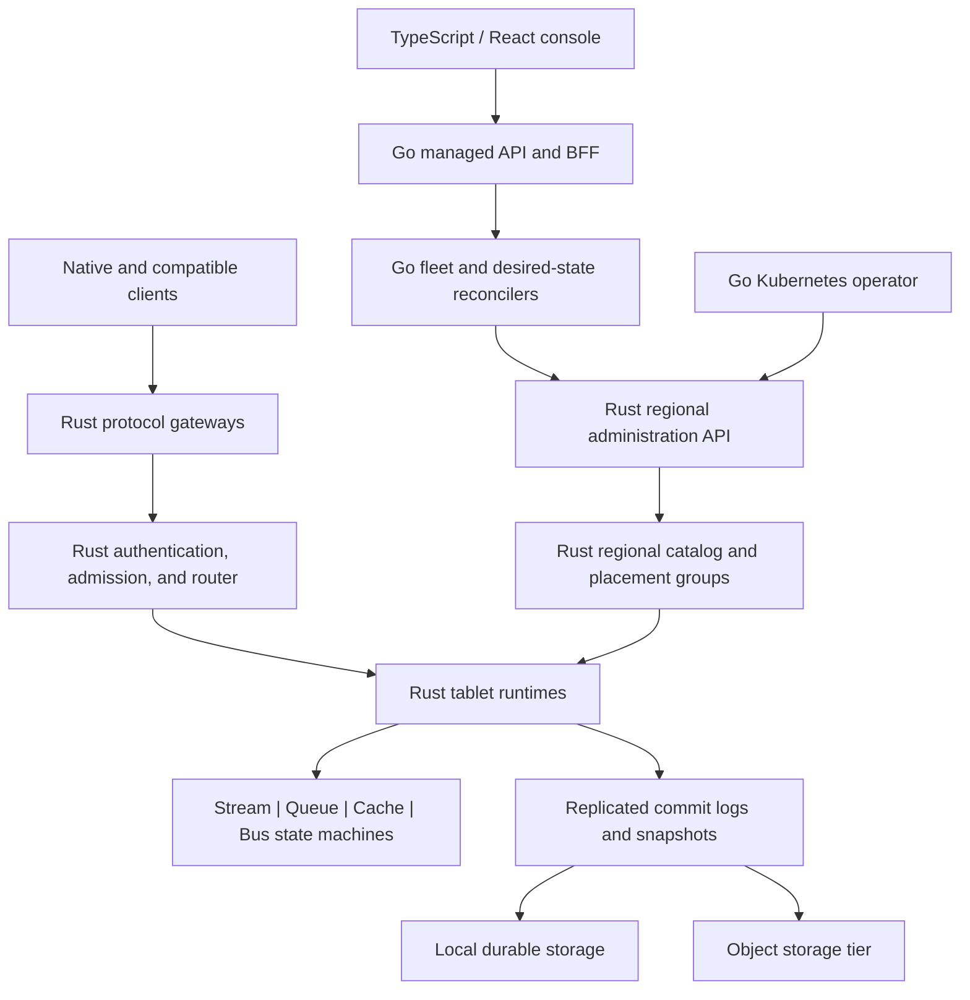

# Epoch Architecture

**Status:** Initial architecture baseline  
**Date:** 29 July 2026
**Source of product requirements:** [PRD.md](PRD.md)  
**Requirement coverage:** [REQUIREMENTS_TRACEABILITY.md](REQUIREMENTS_TRACEABILITY.md)

Normative target behavior is split into [SEMANTICS.md](SEMANTICS.md),
[API_CONTRACTS.md](API_CONTRACTS.md), and [SECURITY.md](SECURITY.md). Those
documents explicitly distinguish the target contract from the current scaffold.

## 1. Purpose

Epoch is one product with four explicit workload profiles:

1. Cache and State
2. Stream Log
3. Work Queue
4. Event Bus

The profiles share identity, policy, resource management, storage building blocks,
replication, observability, and operations. They do not share one universal
execution path. In particular, a volatile cache operation must not pay for a
durable log append, and a queue acknowledgement must not be represented as a
stream consumer offset.

This document defines the initial component boundaries and the critical safety
rules. Detailed wire formats, state machines, and compatibility claims belong
in versioned specifications and must be supported by tests before they become
product claims.

## 2. Architectural principles

- Semantics are selected explicitly through typed resources and guarantee
  profiles.
- Rust owns every path that stores, replicates, routes, transforms, or delivers
  customer data.
- Go manages hosted fleets and desired state but is not a correctness dependency
  for an already-running regional data plane.
- TypeScript and React provide the browser console; the console never connects
  directly to storage nodes.
- Protobuf and gRPC are the versioned Rust/Go boundary.
- Regional metadata is strongly consistent. Stale leaders, producers,
  consumers, sessions, and leases are rejected using monotonic fencing epochs.
- A write is not described as durable until its configured commit rule is met.
- Persisted formats are explicit and versioned. Native Rust object layouts are
  never treated as durable contracts.
- All derived indexes are rebuildable from a committed log and a verified
  snapshot.
- Failure behavior, unknown outcomes, redelivery, replay, repair, and guarantee
  degradation are observable product behavior.

## 3. System context


```mermaid
flowchart TB
    Clients["Native and compatible clients"] --> Gateways["Rust protocol gateways"]
    Gateways --> Router["Rust authentication, admission, and router"]
    Router --> Tablets["Rust tablet runtimes"]
    Tablets --> Engines["Stream | Queue | Cache | Bus state machines"]
    Tablets --> Replication["Replicated commit logs and snapshots"]
    Replication --> NVMe["Local durable storage"]
    Replication --> Object["Object storage tier"]

    Console["TypeScript / React console"] --> ManagedAPI["Go managed API and BFF"]
    ManagedAPI --> Reconciler["Go fleet and desired-state reconcilers"]
    Reconciler --> RegionalAdmin["Rust regional administration API"]
    RegionalAdmin --> Catalog["Rust regional catalog and placement groups"]
    Catalog --> Tablets

    Operator["Go Kubernetes operator"] --> RegionalAdmin
```

There are three distinct operational layers:

1. **Data plane:** protocol handling, routing, profile execution, replication,
   storage, delivery, and data-path authorization in Rust.
2. **Regional control:** the strongly consistent catalog, membership, placement,
   fencing, failover, repair, and local administration in Rust.
3. **Hosted management:** organization/project APIs, fleet capacity,
   multi-region desired state, autoscaling policy, metering, billing, and cloud
   integration in Go.

The hosted management layer may be unavailable without stopping existing
regional reads, writes, delivery, failover, or repair. Management mutations can
be temporarily unavailable in that condition.

## 4. Logical and physical resource model

The logical hierarchy is:

```text
Organization
  Project
    Environment
      Namespace
        Resource
          Shard
```

A **Resource** is a Cache/Table, Stream, Queue, Event Bus, Subscription, Schema,
Pipe, Connector, or Policy. Each data-bearing resource has one or more logical
**Shards**:

- a Stream shard is an ordered partition;
- a Cache shard is a hash-key ownership range;
- a Queue shard owns a subset of messages and session groups;
- a Bus ingress or subscription shard owns route or delivery state.

Each shard maps to one physical **Tablet**. A tablet is the unit of leadership,
replication, placement, snapshot, restore, split, transfer, repair, and resource
accounting. Each tablet contains exactly one profile-specific state machine in
the initial architecture. Tablets from different profiles can share a node, but
they do not share a state machine or retention lifecycle.

Each durable tablet is backed by a consensus group. Many groups share a node
process, peer connections, schedulers, I/O batching, block cache, and telemetry;
there is no process per resource. System tablets hold data-path coordination
state such as consumer groups, transaction coordinators, schema revisions, and
subscription ledgers. High-volume coordination data does not live in the
regional catalog.

For the current regional Stream implementation, the resource's logical shard
index is the public partition identity and each shard maps to its own tablet and
consensus group. Inside that tablet the existing canonical Stream state machine
still uses physical partition 0. The runtime externalizes the catalog shard in
responses and rebinds it after recovery; it does not change command or native
snapshot bytes. Keyed clients discover the versioned resource-wide partitioner
before selecting one of those independent groups.

## 5. Rust data-node boundary

One `epoch-node` executable supports role selection. Standalone mode enables all
roles; clustered and managed deployments can isolate roles:

| Role | Responsibility |
|---|---|
| Gateway | Native and compatibility protocols, authentication, policy, quotas, validation, normalization |
| Storage | Tablet leaders/followers, profile state machines, log, snapshots, compaction, tiering |
| Regional controller | Catalog consensus, placement, membership, failover, repair, safe changes |
| Delivery | Queue dispatch, subscription delivery, webhook retries and redrive |
| Connector | Sandboxed transform and connector execution with controlled egress |

The executable is composed from libraries rather than placing product logic in
the binary crate. Protocol adapters call typed in-process engine interfaces. If
a gateway is deployed separately, it uses the native gRPC data API and receives
the same authorization and admission behavior.

The runtime separates latency-sensitive work from background work:

- async network and request routing;
- serialized or core-pinned shard mutation execution;
- blocking disk and encryption work;
- bounded snapshot, compaction, tiering, restore, and repair pools;
- separately budgeted routing, webhook, and connector delivery.

Backpressure begins at admission. Background work must not consume all recovery
bandwidth or destroy the latency SLO of foreground work.

## 6. Request path

A native or compatible write follows this sequence:

1. The gateway authenticates the principal and evaluates the locally cached,
   versioned policy bundle.
2. It enforces payload, connection, rate, memory, and tenant quotas.
3. It validates schemas where configured and normalizes the request into a typed
   profile operation and common envelope.
4. The router resolves resource, shard, tablet, leader, and epoch from a cached
   regional partition map.
5. The tablet validates leadership, resource generation, producer/session/lease
   fences, and the idempotency token.
6. The profile performs either:
   - a direct volatile Cache mutation;
   - an in-memory replicated mutation; or
   - a proposal to the tablet's durable commit log.
7. After the configured acknowledgement rule is satisfied, the tablet returns a
   typed receipt containing its achieved guarantee and commit position.

A stale route is not hidden. The node returns a typed `NotLeader` or `Fenced`
detail with the current epoch and a safe retry hint. Clients use idempotency
tokens to resolve a timeout whose commit result is unknown.

## 7. Storage and replication

### 7.1 Commit log

The tablet consensus log is also its ordered application commit log. Customer
data is not synchronously duplicated into a generic Raft WAL and a second
source-of-truth application log. A storage adapter writes versioned frames to
immutable segments, while state machines produce reconstructible indexes and
snapshots.

A persisted frame contains, at minimum:

- format and feature version;
- cluster, group, tablet, namespace, and resource identity as applicable;
- consensus term and index;
- profile logical position or sequence;
- frame type and flags;
- timestamp or hybrid logical clock observation;
- metadata and raw payload lengths;
- per-frame checksum.

The stable encoding is an explicit binary frame header, versioned Protobuf
metadata, and raw payload bytes. Segment headers and manifests include format,
encryption-key, compression, range, and checksum information. Sealed segment and
snapshot manifests receive a cryptographic digest. Exact layouts and golden
vectors live under `spec/formats`.

Consensus indices and user-visible logical positions are distinct. Consensus
entries such as membership changes must not create gaps that compatibility
clients interpret as missing customer records.

### 7.2 Replication

The initial direction is Multi-Raft with one group per tablet and a vetted Rust
consensus library behind an Epoch adapter. The library choice remains subject to
the spike in [ADR-0003](adr/0003-consensus-adapter.md); Epoch will not implement
a new consensus algorithm during Phase 0.

The current workspace contains Stage 2 of that spike: an Epoch-owned,
fixed-three-voter adapter over an exact upstream
`raft-rs` revision, deterministic `epoch-testkit` transport, and the EPRS v1
stable journal over `FileWal` exposed through `PersistentRaftAdapter`. EPRS
records immutable voter identity, complete `HardState`, normal-entry
index/term/data, and an applied/publishable digest checkpoint without persisting
raw library protobuf. It supports checksummed
local reopen and logical uncommitted-suffix replacement. Additive EPRS kind-3
records embed compatible EPSN v1 or v2 checkpoints plus a contiguous tail.
V2 carries one canonical Catalog, Stream, Queue, Cache, or Event Bus image, a
rolling consensus digest, and a bounded exact-retry suffix. Checkpoint creation
fsyncs an ordinary record, atomically replaces the journal with identity plus a
kind-4 compacted baseline, then installs the logical snapshot. The
snapshot-aware Raft store can send that image to a lagging fixed voter, whose
typed profile is installed before later committed entries apply. Reopen
reconstructs the same checkpoint-plus-tail state without replaying discarded
commands. An opt-in node runtime
wraps it in a dedicated actor, bounded ordered HTTP peer queues, and a static
three-container topology. Its default probe mode carries opaque diagnostics.
Alternative experimental modes attach one single-partition Stream, Queue, or
Event Bus tablet or one single-shard Cache tablet. Strict typed commands apply
on the actor after consensus commit; startup installs a native checkpoint when
present and then applies its retained tail, while legacy histories still
replay. The clustered path never writes the standalone engine journal. Success reports
the fixed-voter majority evidence and the logical Stream offset only through
the dedicated experimental API; it does not claim zone placement. A profile
application error on the actor drains both listeners and exits the process. If
an HTTP lookup ever observes a commit without the exact actor-applied receipt,
the typed service fails closed and does not apply state from the request task.
The standalone public API guarantee remains unchanged; the regional Stream v1
surface described below is an explicit, separate contract.

That tablet now has an additive command-v2 batch boundary. Canonical record
arrays carry unique client sequences inside none, gzip, LZ4-frame,
Snappy-framed, or Zstd-frame payloads. Exact metadata and hard compressed,
expanded, record-count, and Zstd-window limits are checked before proposal and
again on every voter. A cloned profile transition publishes the complete batch
or nothing and returns one exact offset per client sequence. Version-one single
append bytes and digests remain unchanged. This is compressed consensus/replay
evidence, not the stable streaming Produce API or a compression throughput
claim; see [ADR-0015](adr/0015-stream-batch-compression.md).

An additive command-v3 boundary now places consumer-group ownership and the
durable next offset in that same replicated state machine. Caller-supplied
monotonic generations fence previous owners; forward commit and explicit reset
produce typed applied or committed-rejected receipts. Lag and replay reads are
pure observations of actor-applied state, so regional routing can place the
normal ReadIndex barrier in front of them. This remains a per-shard checkpoint
primitive; resource-wide membership is the separate v5 layer below, and atomic
assignment-plus-offset handoff remains later transaction work. Go, Java, and
Python expose the checkpoint primitive through the regional Stream v1 client.
See
[ADR-0016](adr/0016-stream-consumer-group-checkpoints.md).

Command v6 connects that checkpoint fence to the shard-zero coordinator
without creating a second authority. Each assigned shard independently
replicates an offset-preserving session claim, and claimed fetch plus subsequent
commit require its exact member/generation. Native snapshot v3 persists the
new fence bit while retaining v1/v2 decode. Go, Java, and Python orchestrate a
bounded claim–revalidate protocol across shard groups, pin the resource
generation, and return no assignment after a concurrent rebalance. This is an
at-least-once cross-group protocol, not a distributed transaction; see
[ADR-0029](adr/0029-stream-session-fenced-consumption.md).

Command v4 makes Stream retention another canonical state transition rather
than a voter-local timer. Configure replaces the complete record-count,
compact-JSON-byte, and inclusive-age policy and enforces it immediately;
maintain advances idle age expiry at an explicit committed time. Append uses
the same monotonic watermark. Combined policies always remove the oldest
records, advance `base_offset` without renumbering the retained suffix, and
remove record-scoped dedupe entries. A group checkpoint below the retained
base is preserved and flagged out of range until an explicit fenced reset. The
policy, base, records, groups, dedupe state, and watermark are part of the
canonical Stream image installed before retained-tail replay. Regional
configure and maintain use the ordinary leader/fence/idempotency path;
observation uses the ordinary leader ReadIndex barrier. See
[ADR-0023](adr/0023-stream-retention-policies.md).

Regional Stream discovery additionally advertises
`fnv1a64_utf8_mod_n_v1`, UTF-8 key encoding, event-ID fallback, and the
resource shard count. Repository-local Go, Java, and Python clients hash the
event key (or ID) identically, discover the selected logical shard, and pin the
initial resource generation. If expansion races target discovery, they fail
before writing instead of silently remapping an uncertain append. Logical
shard identity is attached by the node response layer, while the persisted
single-partition tablet scope remains compatible. See
[ADR-0024](adr/0024-stream-multishard-key-routing.md).

Additive command v5 makes logical shard 0 the resource-wide consumer-session
coordinator. Its deterministic state contains the captured shard count,
lexically ordered bounded members, inclusive deadlines, a monotonic committed
time watermark, and one membership generation. Join, fenced heartbeat, leave,
and expiry maintenance run through the same majority/apply/checkpoint
path as records. Assignment is `shard mod live-member-count`, so voters recover
the same complete plan without client or Go-control-plane authority. Native
Stream snapshot v2 adds this map and still accepts v1 snapshots. The
coordinator does not atomically write the independent v3 checkpoint on each
shard or push revoke events. The regional runtime schedules the existing
maintenance command through the current shard-zero leader. See
[ADR-0025](adr/0025-stream-consumer-sessions.md).

The regional runtime also runs one bounded maintenance scan per configured
interval. Every profile state machine supplies a pure earliest replicated
deadline; only a route whose local consensus actor is the current leader may
propose. The exact due deadline, rather than scheduler wake time, becomes the
command's applied time. Deterministic identities suppress overlapping ticks,
while bounded Queue, Cache, and Event Bus sweeps include the current profile
index to continue residual work safely. Stream retention is per shard and
consumer-session expiry is shard-zero-only. This keeps time-driven mutations
inside Raft and keeps Go, SDKs, and reads out of the authority path. See
[ADR-0027](adr/0027-regional-leader-maintenance.md).

The regional runtime separately schedules node-local consensus checkpoints.
Catalog and every materialized profile group are eligible on every healthy
voter after configurable applied-index growth. Role is intentionally
irrelevant: this operation changes only one voter's recovery layout. The
eligibility check and EPSN v2 capture/EPRS replacement execute atomically on
the consensus actor; pending Raft `Ready` work skips the tick. Authorized
topology reports process-local counters plus durable applied/checkpoint/
retained-first boundaries for each group. See
[ADR-0028](adr/0028-automatic-regional-consensus-checkpoints.md).

The regional multi-tablet alpha composes that adapter with `epoch-catalog`.
Catalog group 1 commits canonical resource commands through three EPRS-backed
voters. A bounded group supervisor reserves that identity, demultiplexes peer
frames by group and epoch on one listener, and hosts several independent
consensus actors in one node process. Committed catalog state is materialized
deterministically into Cache, Stream, Queue, and Event Bus tablets with
never-reused tablet/group identities. Resource/shard discovery reports the
local role and observed leader; data dispatch requires exact resource-generation
and tablet-epoch fences. Mutations reject a follower instead of forwarding or
inventing success. Regional reads default to safe Raft `ReadIndex`: the current
leader confirms a majority and the actor applies the local typed profile
through the returned index before dispatch. An explicit `local_stale` request
keeps the direct stale-capable behavior; there is no silent downgrade.

The application-facing Stream, Queue, Cache, and Event Bus adapters are fully qualified beneath
`/v1/organizations/{organization}/projects/{project}/environments/{environment}/namespaces/{namespace}/{streams|queues|caches|buses}/{name}/shards/{shard}`.
They delegate to the same materialized tablets and never proxy through Go.
Go, Java, and Python clients share a private leader-discovery/fencing core,
authenticate, copy resource-generation/tablet-epoch fences, preserve explicit
mutation idempotency keys across one bounded rediscovery, and request
linearizable reads. Stream sessions always select shard 0 and expose
join/heartbeat/leave/maintenance plus membership/assignment observation. Queue
exposes its complete implemented lifecycle: enqueue,
credit acquire, all lease dispositions, maintenance, histories, redrive,
counts, flow, mutation lookup, and status. Cache exposes every strict value
kind, set/delete/CAS/increment, atomic transactions, fenced locks, explicit
expiry, observation, mutation lookup, and status. The generic regional and direct
tablet routes remain internal verification surfaces. Event Bus exposes
subscription upsert/removal, publish, delivery acquire/ack/fail/maintenance,
mutation lookup, archive replay, delivery query, and status. Its regional
materialization enables the durable delivery outbox but still delegates target
execution to an external component. See
[ADR-0017](adr/0017-regional-stream-v1-and-sdk-routing.md),
[ADR-0018](adr/0018-regional-queue-v1-and-sdk-routing.md), and
[ADR-0019](adr/0019-regional-cache-v1-and-sdk-routing.md), and
[ADR-0020](adr/0020-regional-event-bus-v1-and-sdk-routing.md).

The current placement remains fixed at three configured voters, but it is now
topology-aware at admission. Every Rust node reports its authenticated
region/zone/class, exact fixed voter set, and live consensus-group capacity.
Go requires a complete consistent inventory before catalog mutation, validates
allowed regions, minimum zones, and node class, and charges only newly added
shards. This is real constraint validation and capacity rejection, not dynamic
membership, voter selection, online rebalance, rack placement, or a production
placement API. See [ADR-0009](adr/0009-regional-tablet-catalog.md),
[ADR-0012](adr/0012-topology-aware-admission.md), and
[ADR-0013](adr/0013-quorum-read-barriers.md).

`crates/epoch-tablet` also contains the canonical single-partition Queue tablet
state machine. `epoch-node` attaches it as the only selected profile for one
fixed consensus group, rebuilds it from EPRS before readiness, and mounts
strict mutation/status/count/DLQ/redrive/consumer-flow routes on the internal listener and
the versioned regional Queue adapter on the authenticated public listener. The
actor alone applies committed commands; reads never advance time; business
rejections are committed receipts; structural divergence fails the actor and
drains both listeners. Real-runtime and container gates prove leader-term and
consumer fencing, bounded consumer credit, settlement replenishment, scheduled
redelivery, immutable history, convergence, and all-node `SIGKILL` replay. See
[Experimental Replicated Queue Tablet](QUEUE_TABLET.md).

The Cache profile now has a separate deterministic tablet boundary. An additive
`epoch-cache::CacheShard` uses sorted state, a checked shard-global revision,
pure reads, bounded staged transactions, checked counter/TTL arithmetic, and
deterministic expiry without changing the original volatile `Cache`. The
single-shard `epoch-tablet::CacheTablet` adds canonical committed commands,
absent-state ABA protection, advisory entry-term-fenced locks, exact replay,
recorded rejection outcomes, and a chained digest. `epoch-node` attaches it as
a third mutually exclusive typed profile, rebuilds it from retained EPRS
history before readiness, and exposes strict mutation, lookup, status, and pure
local-observation routes only on the internal listener. See
[Experimental Replicated Cache Tablet](CACHE_TABLET.md).

The Event Bus has a bounded typed ingress/outbox tablet. The standalone
route engine stores subscriptions in canonical name order, validates bounded
filters, transforms, resource targets, and absolute HTTP(S) targets, and uses
checked route-plan and publish positions. `epoch-tablet::BusTablet` adds
canonical route/publish plus fenced acquire/ack/fail/maintenance commands,
scoped proposal IDs, committed-order time, exact receipt replay, recordable
atomic capacity rejection, deterministic delivery-plan evidence, and a v2
digest over route, archive, independent delivery, dispatcher-epoch, and attempt
state. `epoch-node` mounts it as a fourth mutually exclusive typed profile,
rebuilds it from EPRS before readiness, and exposes strict
mutation/status/archive/delivery-query routes on the internal listener and the
authenticated, fully qualified regional Event Bus v1 adapter.
Real-runtime and container tests prove fixed-voter convergence, target
isolation, leader replacement, catch-up, and all-node recovery. Built-in target
execution remains explicitly unimplemented: the outbox proves durable intent
and settlements, not that a target side effect occurred. See
[Experimental Replicated Event Bus Tablet](BUS_TABLET.md).

User-exportable snapshots/backups, PITR, membership changes, general placement
solving, online transfer/repair/rebalance, authenticated peer transport, follower
linearizable routing, and cross-tablet read transactions remain disabled. The
leader-only regional read barrier is experimental. The byte contract is
documented in [EPRS v1 consensus stable
journal](../spec/formats/consensus-stable-store-v1.md); the complete scope and
non-claims are recorded in
[Consensus Feasibility Spike](CONSENSUS_SPIKE.md), the opaque boundary in
[Experimental Consensus Probe](CONSENSUS_PROBE.md), and the typed milestone in
[Experimental Stream Tablet](STREAM_TABLET.md), and the Queue boundary in
[Experimental Replicated Queue Tablet](QUEUE_TABLET.md), and the Cache boundary
in [Experimental Replicated Cache Tablet](CACHE_TABLET.md). Consensus checkpoint
operation and its non-claims are in
[Consensus Checkpoints and Snapshot Catch-up](CONSENSUS_CHECKPOINTS.md) and
[ADR-0022](adr/0022-profile-native-checkpoints-and-physical-reclamation.md).
Regional automatic ownership is specified by
[ADR-0028](adr/0028-automatic-regional-consensus-checkpoints.md).

Rust peer replication uses batched, framed, mutually authenticated connections
with separate priorities for control, append, snapshot, and repair traffic.
Administrative and Rust/Go calls use gRPC. Bulk replication is not required to
remain gRPC if matched benchmarks show a purpose-built transport is needed.

Zone-aware placement supplies voters. A quorum acknowledgement requires a
majority to durably append according to the resource's media policy. An old or
isolated leader cannot commit after a higher epoch is issued because replicas
reject stale epochs and the old leader cannot form a quorum.

### 7.3 Durability profiles

| Profile | Success point |
|---|---|
| Volatile | Applied to leader memory |
| Replicated memory | Applied to the leader and configured replica memories |
| Local durable | Appended to leader storage and completed configured group fsync |
| Quorum durable | Durably appended by a voter majority |
| All in-sync replicas | Quorum committed and acknowledged by every current in-sync replica |
| Geo async | Regionally committed; remote checkpoint advances asynchronously |

No protected resource silently downgrades. A policy can explicitly permit a
weaker mode, in which case the downgrade is returned and audited.

### 7.4 Snapshots, recovery, and object tier

Snapshots are checksummed, versioned state-machine checkpoints. Recovery loads
the newest verified snapshot and replays the committed tail. A recovered state
must produce the same digest as the pre-crash state in deterministic tests.

Only sealed and committed segments are eligible for upload. Local deletion is
allowed only after the object checksum and manifest update are durably recorded.
The primary remote representation is an open Epoch segment format. Analytics
capture to Parquet, JSON, or another open interchange format is a separate
export, not the replication source of truth.

The current standalone vertical slice is intentionally narrower. Fresh data
directories use one exclusively locked segmented node WAL under
`$EPOCH_DATA_DIR/engine-wal/segment-*.wal`; `engine.wal` is its crash-safe
activation marker and cross-version lock. Stream creation, append, and offsets
are recorded alongside Queue creation, enqueue, lease, settlement, redrive, and
time-driven maintenance. Local-durable mutations fsync before application;
volatile mutations bypass the journal.

Segments rotate at a configured byte threshold and retain the checksummed v1
frame format. Record sequence is global across files, not reset per segment. A
versioned identity and checksummed manifest bind the WAL UUID, ordered segment
set, committed lengths, ending sequences, and whole-file checksums. Startup
rejects missing, unexpected, reordered, truncated, foreign, or checksum-invalid
committed history. Recovery may discard only bytes beyond the active segment's
manifested length; sealed segments are immutable. A pending manifest transition
makes an interrupted rotation deterministic. The directory is append-only at
this milestone: rotation does not implement retention, compaction, snapshots,
or tiering.

A valid legacy `$EPOCH_DATA_DIR/engine.wal` remains on the single-file writer;
the current binary replays and continues appending to it without creating a
segmented history. Fresh activation installs a marker that old binaries cannot
interpret as a WAL, preventing a split history. Ambiguous mixed layouts fail
closed. Safe automatic migration is deferred. These compatibility rules and
fixtures are not the final tablet consensus log or snapshot format.

The local manifest detects missing or independently changed committed files,
not rollback of an entire self-consistent storage volume. Backup/restore must
treat the activation marker and `engine-wal/` as one atomic unit; authenticated
anti-rollback evidence belongs to the later backup and consensus design.

## 8. Profile engines

### 8.1 Stream Log

A stream partition is a tablet whose committed data frames are user-visible
records. Sparse offset, time, and key indexes are derived. Retention,
compaction, and tiering rewrite sealed segments through an atomic manifest
change; an active segment is never rewritten.

Producer sequence state supports idempotence. Consumer offsets and group
coordination live in sharded system tablets. Read-committed fetch hides prepared
and aborted transaction records. Partition order is the only default ordering
claim.

The current regional slice implements that partition-to-tablet boundary for
several shards of one Stream. Partition order, offsets, checkpoints, retention,
leadership, and recovery are independent per shard. The versioned FNV-1a UTF-8
partitioner is stable only for a fixed resource generation and shard count;
safe online expansion and key remapping remain separate work.

The current single-partition tablet batch is one atomic command: every record
is validated and appended to a cloned state before the clone becomes visible.
Its correlated receipt does not imply that the eventual native Produce stream
will make every batch atomic. That future non-atomic mode must return an
independent result for each client sequence and preserve partial retry
semantics. Compression is an input/storage transport choice; fetched records
are ordinary decompressed envelopes and their logical offsets do not depend on
codec ratio.

### 8.2 Work Queue

An enqueue frame stores an immutable payload. Lease, acknowledgement, release,
retry, expiry, session, and dead-letter frames refer to the record identity.
Derived indexes represent ready, scheduled, leased, priority, session, dedupe,
expiry, and dead-letter state.

Acquire is a committed transition that chooses eligible records and creates
fenced lease tokens. Ack, Nack, Release, Reject, and Extend validate the tablet,
leader, consumer/session, message, and lease generations before committing.
Expired or superseded tokens cannot mutate state.

The replicated Queue's additive flow-control transition combines request credit
with a per-consumer live-lease window inside the same actor-serialized cloned
state change. It counts authoritative lease state across consumer epochs,
returns exact before/after capacity evidence, and preserves legacy v1 command
bytes by using command v2 only for the new operation. The consumer-flow read is
pure; regional routing supplies its normal default ReadIndex barrier. See
[ADR-0014](adr/0014-queue-consumer-credit.md).

In the standalone slice, a local-durable Queue uses deterministic command
replay. The engine clones the current state, validates and applies a proposed
transition, fsyncs its command, and only then publishes that state in memory.
Consequently a failed enqueue or settlement cannot become visible, while a
restart reconstructs lease generations and opaque tokens exactly.

The alpha implementation can use memory-resident indexes plus checksummed
snapshots and tail replay. A bounded-memory, disk-backed derived-index design and
recovery benchmark are required before advertising billion-message backlogs.

### 8.3 Cache and State

Volatile cache shards serialize mutations in memory and bypass the durable log.
They implement TTL and eviction in the shard runtime. Replicated-memory shards
use the peer replication path without claiming disk survival. Durable state
shards replicate deterministic mutations, snapshot state, and optionally expose
a change stream.

Native multi-key operations are atomic only when their keys resolve to one shard
unless an explicitly supported transaction domain is selected. RESP
compatibility must report unsupported cross-slot or scripting behavior instead
of silently weakening it.

The first replicated Cache tablet intentionally supports only shard `0`,
`no-eviction`, and bounded distinct-key transactions. Item versions are drawn
from a checked shard-global revision so delete/recreate and expiry/recreate do
not repeat versions. Reads treat an expired value as absent without mutating
state; maintenance reclaims values in `(deadline, key)` order. In the regional
profile, the current leader automatically proposes that existing bounded
command at the earliest value or lock deadline; explicit calls remain valid.
Committed Cache commands clamp candidate time to the prior effective time.
Advisory locks use `(tablet_epoch, acquisition_log_index)` as their downstream
fence, rotate opaque lease tokens on renewal, and reject tokens on commands
admitted under a different term without allowing a second owner before the
exclusive deadline. Already-appended same-term commands can still commit after
a leadership change. New writes carry `expected_term`, which the consensus actor
checks atomically with leader role immediately before proposal; this is a write
admission fence, not a linearizable read barrier. The profile has an internal
canonical voter-recovery snapshot and compacted EPRS baseline; downloadable
Cache backups/PITR, multi-shard routing, and the full concurrency history remain
open.

The regional Cache v1 adapter delegates directly to this tablet. SDK reads
always request a leader ReadIndex; mutations carry discovered generation,
tablet epoch, term, and a caller-owned idempotency key. The Go, Java, and Python
clients validate typed values, transaction bounds, owner epochs, opaque lease
tokens, and maintenance limits before discovery. They do not add another cache
state machine or turn the fixed-voter alpha into a production durability claim.

### 8.4 Event Bus

A durable bus publish first commits to an ingress or archive tablet. The record
captures the route-plan version used for deterministic evaluation. Each durable
subscription owns independent delivery state, retry, rate, and dead-letter
policy. A publish acknowledgement means the ingress commit succeeded; it does
not mean a webhook or external target completed.

Filters compile into a bounded, deterministic representation. Network
enrichment and connectors run outside the storage role with explicit timeout,
memory, secret, and egress policy.

The regional Event Bus v1 adapter delegates directly to this tablet. Go, Java,
and Python clients discover the leader, carry resource-generation/tablet-epoch
and term fences, preserve every caller-owned mutation key across one bounded
rediscovery, and request linearizable barriers for archive, delivery, mutation,
and status reads. Settlement passes through the opaque lease token returned by
acquire.

An optional leader-owned Rust worker executes only signed HTTP/webhook records.
It reads pure candidates, commits an exact acquisition and awaits its Raft
receipt before I/O, sends a CloudEvents 1.0 binary-mode request through the
public-address-only egress boundary, and commits the observed result. Signing
keys remain external to replicated state; the outbox captures only the key ID.
Go, Java, and Python expose matching target constructors and exact-body
verification helpers. This remains an at-least-once observation of an external
system, not a consensus-backed side effect. See
[ADR-0030](adr/0030-leader-owned-signed-webhook-delivery.md).

The current core slice evaluates immutable in-memory route plans rather than a
compiled filter bytecode. It bounds a resource to 100,000 subscriptions, each
configured route to 64 patterns and 64 filter/transform entries per collection,
replay/delivery-query responses to 10,000 records, acquisition/maintenance to
100 records, and target URLs to 8 KiB. Resource configuration selects lower
operational limits (defaults: 1,024 subscriptions, 100,000 archived events, and
100,000 retained delivery records). Capacity, deadline, and `u64` position
exhaustion reject before mutation; no ordering counter saturates or wraps.

The experimental replicated profile persists each subscription mutation,
publish ingress, and delivery-ledger transition through the fixed voter set
before applying it locally. Each matched subscription receives a stable ID,
captured timeout/max-in-flight/retry policy, term/dispatcher-fenced lease,
immutable attempts, retry eligibility, acknowledgement, or dead-letter state.
Status reports route/archive/outbox counters and complete digests, plus
`target_dispatch: external_executor_not_implemented` and
`durable_target_outbox: true`. Archive replay and delivery queries are
explicitly local, stale-capable observations. The delivery-plan digest and
outbox prove which deterministic transformed targets were selected and what
dispatchers later committed; they are not evidence that an external side
effect occurred.

### 8.5 Cross-profile pipes

The physical payload can be shared only inside one tablet and transaction domain
in v1. A pipe that crosses tablets commits a new target record while preserving
the origin resource, record ID, and position. This avoids distributed reference
counting, garbage collection, retention coupling, and ambiguous recovery.
Co-located immutable references may be added later after evidence and a separate
format decision.

## 9. Time, leases, and fencing

Engines depend on an injectable clock and never call wall time directly. The
clock exposes wall time for user schedules, monotonic elapsed time for local
timers, and a persisted hybrid logical clock for ordered state transitions.

Raw wall-clock observations may move in either direction. Process-local
monotonic time must not move backward, and persisted logical or effective
state-machine time must not regress in committed order. The current Queue and
Cache tablets clamp each command's candidate time to their prior committed
effective time. The broader design still requires clock-anomaly uncertainty
handling, slewing, and operational events. Scheduled work may be conservatively
late during an anomaly; it must not be acknowledged early because a clock jumped.

Leadership, producer ownership, consumer sessions, queue leases, and transaction
coordinators use monotonic epochs. Every mutation includes the relevant fence;
tokens from an older epoch are rejected even if their nominal time has not
expired. Deterministic clocks are mandatory in the simulator and local emulator.

## 10. Transactions

The first atomic boundary is one tablet. Cross-partition transactions arrive in
P1 and are bounded to a regional transaction domain:

1. a sharded transaction-coordinator tablet allocates producer identity and
   epoch;
2. participant tablets durably prepare records;
3. the coordinator durably records commit or abort;
4. participant tablets append the decision marker;
5. read-committed readers expose only committed records.

Transactions have a timeout, maximum bytes, and maximum participant count.
Consumed offsets can participate. Arbitrary external APIs cannot participate
unless a connector supplies a documented transactional protocol; otherwise
delivery remains at-least-once with idempotency guidance.

## 11. Regional and hosted control

### 11.1 Regional Rust authority

A small root catalog group maps namespaces to sharded catalog groups. Catalog
groups own resource specs needed by the data plane, partition maps, membership,
placement, epochs, policy and quota snapshots, schema references, and operation
status. Phase 0 can use one catalog group, but its keys and APIs must not assume
that it remains singular.

Rust regional controllers reconcile actual tablet placement, capacity safety,
replica health, leader transfer, split, repair, rebalance, drain, and rolling
compatibility. Risky changes support plan, validation, bounded execution, and
abort/rollback where semantics allow it.

Standalone mode uses the same API and state machines with one member. A
three-or-more-node cluster enables quorum profiles.

The current alpha implements the first bounded form of this layer: one
three-voter catalog group, a capped multi-group supervisor, catalog-driven
four-profile materialization, experimental HTTP discovery/data dispatch, and
an authorization-protected node-local topology/capacity endpoint. Go validates
region/zone/class constraints and limiting group capacity against all fixed
voters before catalog mutation. It proves fixed-voter topology admission,
fencing, failover, catch-up, and same-volume reopen; it does not yet implement
general voter selection, membership changes, repair/rebalance planning, or a
stable gRPC administration server in Rust.

### 11.2 Go managed plane

The Go plane owns:

- organization, project, environment, entitlement, and commercial metadata;
- public management API and console backend;
- fleet capacity and cloud infrastructure;
- desired regional and multi-region topology;
- autoscaling policy and safe change-plan orchestration;
- backup/DR workflow coordination;
- metering, budgets, billing, and anomaly detection.

Go persists management-only state in a transactional database. It submits
versioned desired specs to the Rust regional administration API with an
idempotency token and expected generation. Rust validates and commits the
regional state, then returns `observed_generation` and conditions. Go never
reads or changes segment files, Raft logs, queue indexes, transaction state, or
cache memory.

The Kubernetes operator follows the same boundary: custom resources express
desired state, while the Rust catalog is authoritative for live data-plane
state.

The current Go alpha runs a real `RegionalAdminService` gRPC server and a
periodic reconciler. Its multi-endpoint HTTP authority adapter first collects
policy-protected topology and live group capacity from every configured Rust
node. It fails a mutation before catalog apply when the fixed voters cannot
satisfy the requested regions, zone count, node class, or additional shard
capacity. It then applies desired generations to Rust, samples each configured
node's route identity, and records only matching observed voters and leaders.
A partial outage reuses only the generation-fenced admitted topology while
fresh route evidence becomes degraded; total authority loss clears the current
sample. A later observation remains generation-fenced so it cannot mark newer
desired state ready. The browser
console reads `GET /v1/regional/resources` from the Go BFF and never contacts a
Rust storage node. Every 64-bit value in that browser contract is a decimal
string and CORS is granted only to exact configured HTTP(S) origins.

The same alpha now commits management-only desired resources, observed status,
generation tombstones, and request-token outcomes to one versioned bbolt
database before acknowledging or publishing a mutation in memory. Startup
recovers that state and fails closed for corrupt records, unknown schemas, or a
second file owner. Health exposes the `bbolt_v1` mode, and the regional campaign
kills and reopens the real Go process against the same database before proving
exact replay and reconciliation.

The managed HTTP/gRPC boundary and Rust regional HTTP boundary now share a
strict bootstrap identity policy. Go authenticates browser/native management
callers, authorizes the parsed tenant action before registry access, filters
collection results, and presents a distinct service credential to Rust. Rust
reauthenticates catalog, route, and typed data actions at the requested tenant
scope. Both implementations emit bounded credential-free authorization
decisions and pass one cross-language corpus. See
[ADR-0011](adr/0011-bootstrap-authz-audit-baseline.md).

This is durable single-process hosted metadata, not a replicated management
database. Multi-instance linearizability, management leader election, backups,
OIDC/mTLS identity, replicated policy, immutable audit export, fleet
automation, and an operator remain open.

## 12. API contracts

Contracts are defined under versioned Protobuf packages. The native API uses
separate typed services rather than a generic `Execute` service:

| Service | Representative methods |
|---|---|
| Cache | `Get`, `Mutate`, `Batch`, `Scan`, `WatchChanges` |
| Stream | `Produce`, `Fetch`, `ListOffsets`, `CommitOffsets`, `ConsumerSession` |
| Queue | `Send`, `Receive`, `Settle`, `ExtendLease`, `GetById` |
| Bus | `Publish`, `Pull`, `Subscribe` |
| Transaction | `InitProducer`, `Begin`, `Commit`, `Abort`, `Lookup` |
| Schema | `Resolve`, `Validate`, revision and compatibility operations |
| Regional Admin | `Plan`, `ApplyResource`, `Delete`, `WatchOperation`, backup, restore, drain, transfer, rebalance |

High-throughput produce, fetch, send, receive, and settle paths support streaming
and batching. Every mutation carries a deadline, request or idempotency token,
and expected epoch or generation where applicable.

The common envelope stores payload as bytes plus content type and schema
reference. It carries stable identity, source, type, subject, event time, key,
headers, trace context, delivery attributes, dedupe identity, transaction
identity, and namespaced byte extensions. JSON is one payload encoding, not the
in-memory API representation.

Every successful write returns a receipt with:

- immutable resource and record identity;
- resource generation and tablet/leader epoch;
- logical position or offset;
- configured and achieved durability;
- replica acknowledgement count;
- commit timestamp;
- duplicate/original position when deduped;
- route-plan version where applicable.

Typed error details include `NotLeader`, `Fenced`, `QuorumUnavailable`,
`UnknownCommit`, `Throttled`, `SchemaRejected`, `Conflict`,
`UnsupportedSemantic`, `PlacementUnsatisfied`, `LeaseLost`, and
`TransactionAborted`. SDK retry decisions use error details, never text.

Within `epoch.*.v1`, changes are additive. Breaking checks, golden fixtures,
feature negotiation, and named client-version conformance guard evolution.
RESP3, Kafka, AMQP, MQTT, CloudEvents, and cloud-compatible facades are adapters
with independent versioned compatibility matrices.

## 13. Identity, security, and tenancy

- External identity uses OIDC/OAuth or compatible protocol credentials mapped to
  an Epoch principal. Internal identity uses mTLS.
- Versioned, signed policy bundles and verification keys are cached regionally
  with explicit expiry and revocation behavior.
- Authorization is evaluated at organization, project, namespace, resource,
  group/subscription, and operation scope.
- Namespace data uses envelope encryption. New segments use the current data key;
  rotation and background rewrite are observable operations.
- Connector and webhook workers have separate identity, secret references,
  outbound allowlists, DNS controls, rate limits, and SSRF protections.
- Console payload browsing is disabled by policy where required and always calls
  an audited Rust data-access API. The Go plane does not inspect storage files.
- Tenant-derived metrics avoid unbounded labels. Logs redact payloads, secrets,
  and raw credentials by default.

## 14. Observability and operations

Every request and background operation carries stable request, resource, tablet,
record, and trace identities as applicable. Profile metrics follow the golden
signals in the PRD without unbounded per-key or per-message labels.

Every resource reports its deployment mode, requested guarantee, achieved
placement, leader/replicas, current epoch, commit position, lag/backlog, storage
tier, recent change operations, and conditions. Guarantee degradation, repair,
truncation, replay, redrive, payload access, promotion, and key use emit immutable
audit events.

Operational work is represented by resumable, observable operations rather than
long synchronous API calls. Backup and restore include manifest verification and
regular automated restore tests.

## 15. Deployment modes

| Mode | Composition | Guarantee ceiling |
|---|---|---|
| Embedded | Rust library and process-local storage | Process-local or local-disk only |
| Standalone | One `epoch-node` process with all roles | Machine-local persistence; no machine-loss survival |
| Cluster | Three or more Rust nodes; optional Go operator | Quorum durability, failover, repair, partition scale |
| Managed | Rust regional clusters plus Go fleet/control services | Managed multi-zone, backup, autoscale, IAM, and optional geo DR |

Non-Rust applications receive an embedded-like experience through a supervised
child process or sidecar over a Unix-domain socket, named pipe, or loopback. The
Rust embedding crate exposes lifecycle and supported operations, not internal
storage structures.

## 16. Repository boundaries

The intended top-level layout is:

```text
/crates       Rust engines, storage, replication, protocols, binaries, testkit
/control      Go hosted APIs and fleet services
/operator     Go Kubernetes operator
/console      TypeScript/React web application
/sdk          Native SDKs and generated bindings
/spec         Protobuf, formats, compatibility contracts, formal models
/tests        Cross-language integration, conformance, chaos, and benchmarks
/docs         Architecture, ADRs, security, operations, and development guides
/deploy       Containers, local cluster, and Kubernetes packaging
/tools        Code generation and benchmark helpers
```

The detailed provisional workspace and toolchain decision is in
[ADR-0007](adr/0007-repository-and-toolchains.md).

Developer commands and the verified local toolchain are documented in
[DEVELOPMENT.md](DEVELOPMENT.md). Verification layers and evidence requirements
are documented in [TESTING.md](TESTING.md).

## 17. Delivery order

The architecture is delivered through evidence-producing vertical slices:

1. contracts, invariants, deterministic testkit, benchmark baseline;
2. standalone stream append/fetch with crash-safe segments;
3. three-node catalog and replicated tablet with quorum/fencing;
4. queue leases, acknowledgement, retry, scheduling, and DLQ;
5. independent volatile cache path, then replicated and durable modes;
6. regional operations, operator, production identity, immutable audit export,
   backup, and migration;
7. named Kafka, RESP3, and AMQP compatibility subsets, schemas, compaction, and
   tiering;
8. Event Bus, webhooks, MQTT, transforms, and connectors;
9. hosted dedicated/serverless plane, console, billing, private networking, and
   geo-async DR;
10. bounded transactions and GA hardening, followed by P2 expansion.

Correctness, fencing, recovery, observability, and matched benchmarks are exit
gates, not deferred cleanup. See [ADR-0006](adr/0006-delivery-sequence.md).
The milestone-level schedule is maintained in [DELIVERY_PLAN.md](DELIVERY_PLAN.md).

## 18. Initial safety invariants

- No quorum success is returned before a durable voter majority has appended the
  entry.
- No acknowledged queue deletion occurs before the Ack state is durably
  committed.
- Applied index never exceeds committed index.
- Logical positions are not reused within a resource history.
- A stale leader, producer, consumer, session, lease, or transaction coordinator
  cannot mutate current state.
- At-least-once delivery can duplicate but cannot silently skip a committed,
  eligible record under the documented durability model.
- Read-committed readers never expose aborted transaction records.
- Snapshot plus committed tail deterministically reconstructs the state-machine
  digest.
- Local or remote data is deleted only after the replacement or retention action
  is durably and verifiably recorded.
- Existing regional data paths do not require the hosted Go plane.
- No guarantee downgrade or cross-profile semantic conversion is silent.

These invariants require formal models, property tests, history checking,
deterministic fault simulation, and long-running fault/soak tests.

## 19. Open evidence gates

The architecture intentionally leaves the following implementation choices
provisional until their ADR evidence exists:

- the consensus library, transport details, and acceptable group density;
- the bounded-memory derived-index implementation for very large queues;
- the exact byte layout and compatibility window of every durable format;
- transaction participant and timeout limits;
- object-tier request/caching economics and export formats;
- the open-source/commercial boundary and license;
- named protocol and client versions in the public compatibility matrix.

None of these gates changes the locked boundary that the Rust regional data node
owns correctness and the Go hosted plane owns desired-state fleet management.

## 20. Decision records

- [ADR-0001: Workload Profiles and Tablets](adr/0001-workload-profiles-and-tablets.md)
- [ADR-0002: Rust and Go Boundary](adr/0002-rust-go-boundary.md)
- [ADR-0003: Consensus Adapter](adr/0003-consensus-adapter.md)
- [ADR-0004: Storage Format and Versioning](adr/0004-storage-format-versioning.md)
- [ADR-0005: Injectable Time and Fencing](adr/0005-time-and-fencing.md)
- [ADR-0006: Delivery Sequence and Initial Wedge](adr/0006-delivery-sequence.md)
- [ADR-0007: Provisional Repository and Toolchains](adr/0007-repository-and-toolchains.md)
- [ADR-0008: Segmented Standalone WAL](adr/0008-segmented-standalone-wal.md)
- [ADR-0009: Deterministic Regional Tablet Catalog](adr/0009-regional-tablet-catalog.md)
- [ADR-0010: Durable Single-Owner Go Control Metadata](adr/0010-durable-managed-metadata.md)
- [ADR-0011: Bootstrap Authorization and Audit Baseline](adr/0011-bootstrap-authz-audit-baseline.md)
- [ADR-0012: Topology-Aware Fixed-Voter Admission](adr/0012-topology-aware-admission.md)
- [ADR-0013: Quorum-Confirmed Regional Read Barriers](adr/0013-quorum-read-barriers.md)
- [ADR-0014: Queue Consumer Credit and In-Flight Windows](adr/0014-queue-consumer-credit.md)
- [ADR-0015: Replicated Stream Batch Compression](adr/0015-stream-batch-compression.md)
- [ADR-0016: Replicated Stream Consumer-Group Checkpoints](adr/0016-stream-consumer-group-checkpoints.md)
- [ADR-0017: Regional Stream v1 and SDK Routing](adr/0017-regional-stream-v1-and-sdk-routing.md)
- [ADR-0018: Regional Queue v1 and SDK Routing](adr/0018-regional-queue-v1-and-sdk-routing.md)
- [ADR-0019: Regional Cache v1 and SDK Routing](adr/0019-regional-cache-v1-and-sdk-routing.md)
- [ADR-0020: Regional Event Bus v1 and SDK Routing](adr/0020-regional-event-bus-v1-and-sdk-routing.md)
- [ADR-0021: Consensus Checkpoint and Snapshot Installation](adr/0021-consensus-checkpoint-and-snapshot-installation.md)
- [ADR-0022: Profile-Native Checkpoints and Physical EPRS Reclamation](adr/0022-profile-native-checkpoints-and-physical-reclamation.md)
- [ADR-0023: Replicated Stream Time and Size Retention](adr/0023-stream-retention-policies.md)
- [ADR-0024: Multi-Shard Stream Key Routing](adr/0024-stream-multishard-key-routing.md)
- [ADR-0025: Replicated Stream Consumer Sessions and Shard Assignment](adr/0025-stream-consumer-sessions.md)
- [ADR-0026: Regional Stream Atomic Batch SDKs](adr/0026-regional-stream-batch-sdks.md)
- [ADR-0027: Leader-Owned Regional Maintenance](adr/0027-regional-leader-maintenance.md)
- [ADR-0028: Automatic Regional Consensus Checkpoints](adr/0028-automatic-regional-consensus-checkpoints.md)
- [ADR-0029: Session-Fenced Stream Consumption](adr/0029-stream-session-fenced-consumption.md)
- [ADR-0030: Leader-Owned Signed Webhook Delivery](adr/0030-leader-owned-signed-webhook-delivery.md)
