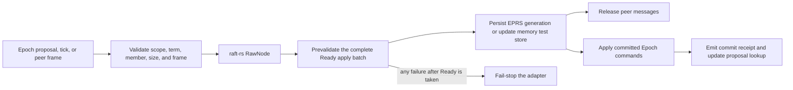

# Consensus Feasibility Spike

**Status:** Stage 1 adapter plus local stable-store slice; not a product replication mode

**Decision:** [ADR-0003](adr/0003-consensus-adapter.md) remains Proposed

This document records exactly what the first Epoch consensus slice proves and,
more importantly, what it does not prove. The runnable node is still
standalone-only and rejects replicated-memory, quorum, and geo durability.

## Implemented boundary

`crates/epoch-consensus` contains an Epoch-owned `ConsensusAdapter` boundary, a
fixed-three-voter `InMemoryRaftAdapter`, and a `PersistentRaftAdapter` over the
local disk stable-store slice. `raft-rs` owns the Raft algorithm; Epoch owns
group and epoch identifiers,
proposal IDs, commit receipts, status, peer framing, durable framing,
validation, application, and deterministic tests. No public API field or
signature exposes a `raft-rs` type.

The adapter currently supports:

- deterministic campaign, tick, peer-message delivery, and leader transfer;
- term, leader, commit-index, and applied-index status;
- group, group-epoch, expected-term, destination, and fixed-voter validation;
- a bounded, versioned Epoch envelope around opaque peer messages;
- explicit `Unknown`, `Pending`, and `Committed` proposal lookup;
- proposal tracking rebuilt from the retained log after restart or overwrite;
- apply-time suppression of an exact duplicate proposal and fail-stop handling
  for the same proposal ID with a different payload;
- full restart-image validation and a canonically framed SHA-256 applied-state
  digest; and
- fail-stop behavior after an error occurs while processing `Ready` work.

The disk sub-slice adds EPRS v1: an immutable fixed-voter identity followed by
checksummed, fsync-backed generations containing complete `HardState` fields, an
applied/publishable state-digest checkpoint, and optional normal entries. EPRS
stores explicit Epoch fields rather than raw `raft-rs` protobuf. Reopen replays
logical uncommitted-suffix replacement, rejects committed-entry overwrite and
state regression, rebuilds applied proposal history, verifies the SHA-256 state
digest, and materializes a fresh in-memory Raft view. Persistent open returns
any receipts or peer messages that become publishable while catching an older
checkpoint up to the durable commit index, so callers cannot silently discard
recovery output. The exact format and limitations are in
[EPRS v1 consensus stable journal](../spec/formats/consensus-stable-store-v1.md).

## Processing contract



For the memory adapter, the stable-store barrier remains an ordering model and
is not disk durability. On the disk path, one complete EPRS transition is one
durable `FileWal` append before persisted messages or commit receipts are
released. A committed batch is decoded and checked in full before Epoch
application state is mutated. Snapshot messages, snapshot-bearing Ready work,
and membership-changing entries are rejected because their required Epoch
state-machine protocols do not exist yet.

## Deterministic evidence

The crate-level harness routes every peer message through `epoch-testkit` rather
than a private FIFO. It uses a fixed seed, canonical EPTR trace bytes, bounded
delivery counts, and full applied histories. The suite covers election,
majority-only commitment, an isolated old leader, re-election and catch-up,
directed partitioning, delayed/reordered delivery, duplicate delivery, leader
transfer, memory-state restart, pending-ID reconstruction, overwritten-ID
reuse, duplicate application, conflicting-payload fail-stop, peer-frame
validation, restart corruption, and stable-store ordering. Separate EPRS unit
tests cover exact identity bytes, create/reopen, immutable identity mismatch,
writer exclusion, `HardState` plus entry replay, uncommitted-suffix replacement,
incomplete-tail repair, checksum corruption, and safety regressions. Persistent
adapter tests reopen all three voters with identical committed histories and
digests, preserve a minority-only pending proposal, order persisted messages
after stable barriers, recover a proposal after an injected post-append error,
and publish a commit-ahead-of-checkpoint receipt exactly once during recovery.

This is deterministic in-process evidence plus local file reopen evidence. It
is not an exhaustive injected-I/O, real-process-crash, zone, model-check,
linearizability, or soak report.

## Dependency decision under test

The released `raft-rs` 0.7 graph was rejected because it includes
`protobuf` 2.28, affected by `RUSTSEC-2024-0437`. The spike instead pins the
exact official upstream `tikv/raft-rs` revision
`ad13f3d90780f53aea2488c6a4b76c0d334bf136` with `prost-codec`; the vulnerable
Rust protobuf dependency is absent from the resulting lockfile.

`RUSTSEC-2025-0057` still reports the transitive `fxhash` package as
unmaintained. CI denies every Cargo advisory and warning except that one
documented temporary exception. The exception is a reason ADR-0003 remains
Proposed, not an acceptance of the dependency. The unreleased git revision,
vendored Protobuf compiler source, transitive unsafe code, license inventory,
and replacement path still require the ADR's dependency and security review.

## Explicit non-claims

This slice does not provide:

- a node-integrated or public quorum-durable acknowledgement, durable-majority
  proof, or replica-acknowledgement count;
- an exhaustive process-crash, fsync-failure, disk-full, or partial-write
  matrix beyond the bounded incomplete-tail and corruption tests;
- snapshots, compaction, log purge, or state-machine checkpoint installation;
- membership changes, learners, joint consensus, or placement;
- an authoritative catalog epoch transition that can fence an old voter set;
- a linearizable read barrier;
- mutually authenticated, encrypted, batched production transport;
- node, engine, profile, API, CLI, SDK, health, or deployment integration;
- bounded proposal-history memory or a configured idempotency-retention window;
- segment rotation, a committed-length manifest, arbitrary post-sync
  truncation detection, authenticated anti-rollback evidence, backup generation
  validation, or detection of a complete valid-prefix rollback;
- 10,000-group density, performance, chaos, or formal-model evidence; or
- acceptance of ADR-0003 or closure of the G3 gate.

## Next acceptance slices

1. Add deterministic crash points around EPRS write, sync, commit, apply,
   `advance`, and receipt publication, then exercise them through a persistent
   three-voter harness.
2. Reopen EPRS bytes in a new process and prove that an acknowledged commit and
   its proposal lookup survive every supported crash boundary.
3. Add a versioned state-machine checkpoint and atomic snapshot installation.
4. Add joint-consensus membership, catalog-authorized epoch transitions, and
   old-configuration fencing tests.
5. Add a read barrier, authenticated peer identity, replica progress, and
   bounded admission/flow control.
6. Integrate one profile mutation through a real three-node runtime without
   raising the public guarantee until the durable majority rule is proven.
7. Complete density, benchmark, model, dependency, license, unsafe-code, and
   security gates before accepting ADR-0003.

## Reproduction

```shell
cargo test --locked -p epoch-consensus --all-features
cargo clippy --locked -p epoch-consensus --all-targets --all-features -- -D warnings
RUSTDOCFLAGS="-D warnings" cargo doc --locked -p epoch-consensus --all-features --no-deps
cargo audit --deny warnings --ignore RUSTSEC-2025-0057
```
