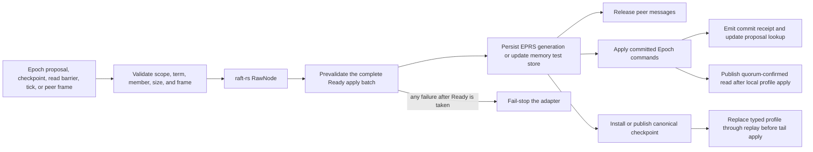

# Consensus Feasibility Spike

**Status:** Stage 2 typed tablets plus bounded consensus checkpoint/snapshot
catch-up; still not a public product replication mode

**Decision:** [ADR-0003](adr/0003-consensus-adapter.md) remains Proposed

This document records exactly what the current Epoch consensus slices prove
and, more importantly, what they do not prove. The public node profiles remain
standalone-only and reject replicated-memory, quorum, and geo durability. An
opt-in diagnostic probe and mutually exclusive typed Stream, Queue, Cache, or
Event Bus tablet modes run on the dedicated experimental listener without
changing that public guarantee ceiling.

## Implemented boundary

`crates/epoch-consensus` contains an Epoch-owned `ConsensusAdapter` boundary, a
fixed-three-voter `InMemoryRaftAdapter`, and a `PersistentRaftAdapter` over the
local disk stable-store slice. `raft-rs` owns the Raft algorithm; Epoch owns
group and epoch identifiers,
proposal IDs, commit receipts, status, peer framing, durable framing,
validation, application, and deterministic tests. No public API field or
signature exposes a `raft-rs` type.

The adapter currently supports:

- deterministic campaign, tick, peer-message delivery, and leader transfer;
- term, leader, commit-index, and applied-index status;
- group, group-epoch, expected-term, destination, and fixed-voter validation;
- a bounded, versioned Epoch envelope around opaque peer messages;
- explicit `Unknown`, `Pending`, and `Committed` proposal lookup;
- bounded group/epoch/term-fenced safe `ReadIndex` requests that complete only
  after quorum confirmation and local application through the read index;
- proposal tracking rebuilt from the retained log after restart or overwrite;
- apply-time suppression of an exact duplicate proposal and fail-stop handling
  for the same proposal ID with a different payload;
- full restart-image validation and a canonically framed SHA-256 applied-state
  digest;
- canonical EPSN v1 checkpoint creation at the applied index, fsync-before-
  install ordering, logical Raft-prefix compaction, snapshot transport and
  fixed-voter installation, checkpoint-plus-tail reopen, and exact proposal
  retry preservation; and
- fail-stop behavior after an error occurs while processing `Ready` work.

The disk sub-slice adds EPRS v1: an immutable fixed-voter identity followed by
checksummed, fsync-backed generations containing complete `HardState` fields, an
applied/publishable state-digest checkpoint, and optional normal entries. EPRS
now also has an additive kind-3 record containing one bounded canonical EPSN
image and contiguous retained tail. It stores explicit Epoch fields rather than raw `raft-rs` protobuf. Reopen replays
logical uncommitted-suffix replacement, rejects committed-entry overwrite and
state regression, rebuilds applied proposal history, verifies the SHA-256 state
digest, and materializes a fresh in-memory Raft view. Persistent open returns
any receipts or peer messages that become publishable while catching an older
checkpoint up to the durable commit index, so callers cannot silently discard
recovery output. The exact format and limitations are in
[EPRS v1 consensus stable journal](../spec/formats/consensus-stable-store-v1.md).

`epoch-node` can opt into a dedicated-listener `ConsensusProbeRuntime`. A
blocking actor thread owns the persistent adapter, periodic ticks drive Raft,
and bounded per-peer workers preserve HTTP delivery order. Actor dispatch uses
nonblocking per-destination reservations, so saturation or failure of one peer
cannot block ticks or traffic to another; local cumulative queue, delivery,
drop, and exhausted-retry evidence is exposed in probe status. Raw internal
frames have a strict body limit and no CORS surface. Experimental status,
checkpoint, propose, and lookup endpoints replicate opaque bytes only and always disclose
local observation, no peer authentication, `profile_replication: false`, and a
`local_durable` product-profile ceiling. A static three-container Compose model
gives every voter its own data volume. See
[Experimental Consensus Probe](CONSENSUS_PROBE.md).

The typed bounded slice attaches `crates/epoch-tablet` to the same runtime for
one configured, single-partition Stream. Canonical typed commands enter the
persistent Raft log, become visible only after fixed-voter majority commit and
local profile application. Startup installs a native checkpoint plus retained
tail before its status route becomes ready, while legacy histories still
replay. Exact recent idempotent retries retain
the original command bytes and Stream offset. A three-container gate proves
leader rejection, ordered failover, lagging-voter catch-up, and identical
profile recovery after all voters receive `SIGKILL`. This mode is documented in
[Experimental Stream Tablet](STREAM_TABLET.md); it remains separate from the
public API and SDKs.

The Queue profile now crosses the same boundary: a strict single-partition
command/state machine with authoritative leader/consumer fencing, monotonic
committed effective time, recorded business outcomes, exact renewal replay,
and immutable DLQ/redrive history is attached to the actor. EPRS replay completes
before readiness, and an internal typed listener exposes mutation resolution
and stale-capable reads. Real-runtime and three-container gates prove active
leader loss, old-term lease rejection, conservative redelivery, convergence,
and all-node `SIGKILL` recovery; see
[Experimental Replicated Queue Tablet](QUEUE_TABLET.md).

The Cache profile attaches a canonical single-shard state machine with checked
revisions, atomic transactions, deterministic expiry, and fenced advisory
locks. Its actor-owned mutation and local observation routes rebuild from EPRS
before readiness; real-runtime and container gates prove term admission,
failover fencing, catch-up, convergence, and all-node recovery. See
[Experimental Replicated Cache Tablet](CACHE_TABLET.md).

The Event Bus profile attaches a canonical single-partition ingress/outbox
state machine. Strict mutations replicate subscription changes, publish
ingress, fenced acquire/ack/fail, and bounded lease-expiry maintenance; each
voter reproduces route-plan evidence, archive state, independent delivery
attempts, and complete digests before exposing status or local filtered
archive/delivery queries. Real-runtime and container gates prove semantic
retry/conflict, target isolation, leader loss, catch-up, convergence, and
all-node recovery. This direct profile has no built-in target executor. The
regional runtime layers the always-enabled Epoch Queue/Stream worker and can
layer the optional signed HTTP/webhook worker outside the state machine, but
neither path claims cross-tablet atomicity or the target's business side effect; see
[Experimental Replicated Event Bus Tablet](BUS_TABLET.md).

## Processing contract


```mermaid
flowchart LR
    Input["Epoch proposal, checkpoint, read barrier, tick, or peer frame"] --> Validate["Validate scope, term, member, size, and frame"]
    Validate --> Raft["raft-rs RawNode"]
    Raft --> Ready["Prevalidate the complete Ready apply batch"]
    Ready --> Store["Persist EPRS generation or update memory test store"]
    Store --> Messages["Release peer messages"]
    Store --> Apply["Apply committed Epoch commands"]
    Store --> Snapshot["Install or publish canonical checkpoint"]
    Snapshot --> Replay["Replace typed profile through replay before tail apply"]
    Apply --> Receipt["Emit commit receipt and update proposal lookup"]
    Apply --> Barrier["Publish quorum-confirmed read after local profile apply"]
    Ready -->|any failure after Ready is taken| Stop["Fail-stop the adapter"]
```

For the memory adapter, the stable-store barrier remains an ordering model and
is not disk durability. On the disk path, one complete EPRS transition is one
durable `FileWal` append before persisted messages or commit receipts are
released. A committed batch is decoded and checked in full before Epoch
application state is mutated. Snapshot messages and snapshot-bearing Ready work
are accepted only for the canonical fixed-voter EPSN protocol.
Membership-changing entries remain rejected because their Epoch transition
protocol does not exist yet.

## Deterministic evidence

The crate-level harness routes every peer message through `epoch-testkit` rather
than a private FIFO. It uses a fixed seed, canonical EPTR trace bytes, bounded
delivery counts, and full applied histories. The suite covers election,
majority-only commitment, an isolated old leader, re-election and catch-up,
directed partitioning, delayed/reordered delivery, duplicate delivery, leader
transfer, memory-state restart, pending-ID reconstruction, overwritten-ID
reuse, duplicate application, conflicting-payload fail-stop, peer-frame
validation, restart corruption, and stable-store ordering. Separate EPRS unit
tests cover exact identity bytes, create/reopen, immutable identity mismatch,
writer exclusion, `HardState` plus entry replay, uncommitted-suffix replacement,
incomplete-tail repair, checksum corruption, and safety regressions. Persistent
adapter tests reopen all three voters with identical committed histories and
digests, preserve a minority-only pending proposal, order persisted messages
after stable barriers, recover a proposal after an injected post-append error,
and publish a commit-ahead-of-checkpoint receipt exactly once during recovery.
Checkpoint tests pin the codec digest, reject foreign group/epoch/voters/term,
corruption and oversize, prove idempotent creation and post-fsync failure reopen,
reopen a compacted prefix plus committed tail, and elect/commit/complete a
quorum read barrier after all voters reopen. A real HTTP/runtime test stops one
typed Catalog voter, checkpoints the leader, commits a tail, then proves the
lagging voter replays the snapshot before its tail and converges exactly.

An explicitly selected multiprocess smoke starts three child test executables,
each owning a `PersistentRaftAdapter` and separate EPRS path. The parent uses
the seeded `epoch-testkit::PeerTransport` to isolate the leader, proves that the
minority proposal stays pending without a commit receipt, heals the partition,
and compares committed receipts, payloads, and state digests. It then sends
`SIGKILL` to one voter and later all three voters, reopens the same bytes in new
processes, and verifies lookup/digest survival without duplicate receipt
publication. The loopback sockets are bounded test-control channels; this is
not itself the node HTTP peer transport or a profile replication path. A
separate node test starts three complete probe runtimes on ephemeral loopback
listeners, elects a leader over real HTTP, commits an opaque proposal, and
compares local committed lookup at all voters. Read-barrier tests prove
deterministic majority-only completion, isolated-leader non-completion,
follower/stale-term rejection, and cancellation. A real three-runtime HTTP
test repeats the majority proof through the actor and times out after both peer
listeners are removed. The regional process campaign verifies barrier evidence
only after typed profile apply.

This is deterministic in-process evidence, local file reopen evidence, and one
bounded real-process `SIGKILL`/reopen history. It is not an exhaustive
crash-point, injected-I/O, zone, model-check, linearizability, or soak report.

## Dependency decision under test

The released `raft-rs` 0.7 graph was rejected because it includes
`protobuf` 2.28, affected by `RUSTSEC-2024-0437`. The spike instead pins the
exact official upstream `tikv/raft-rs` revision
`ad13f3d90780f53aea2488c6a4b76c0d334bf136` with `prost-codec`; the vulnerable
Rust protobuf dependency is absent from the resulting lockfile.

`RUSTSEC-2025-0057` still reports the transitive `fxhash` package as
unmaintained. CI denies every Cargo advisory and warning except that one
documented temporary exception. The exception is a reason ADR-0003 remains
Proposed, not an acceptance of the dependency. The unreleased git revision,
vendored Protobuf compiler source, transitive unsafe code, license inventory,
and replacement path still require the ADR's dependency and security review.

## Explicit non-claims

This slice does not provide:

- a public or zone-aware quorum-durable acknowledgement; the experimental
  tablet reports only `fixed_voter_majority_persisted` with two durable voters;
- an exhaustive process-crash, fsync-failure, disk-full, or partial-write
  matrix beyond the bounded incomplete-tail and corruption tests;
- profile-native compact images, bounded idempotency history, physical EPRS
  reclamation, product backup/PITR, or chunked snapshots larger than one peer
  frame;
- membership changes, learners, joint consensus, or placement;
- an authoritative catalog epoch transition that can fence an old voter set;
- follower-served or cross-group linearizable reads; the implemented safe
  barrier is leader-only and orders one fixed-voter tablet;
- mutually authenticated, encrypted, batched production transport;
- public engine routing, CLI, SDK, or public health integration; the typed
  Stream, Queue, Cache, and Event Bus milestones are confined to the explicitly experimental
  listener;
- bounded proposal-history memory or a configured idempotency-retention window;
- segment rotation, a committed-length manifest, arbitrary post-sync
  truncation detection, authenticated anti-rollback evidence, backup generation
  validation, or detection of a complete valid-prefix rollback;
- 10,000-group density, performance, chaos, or formal-model evidence; or
- acceptance of ADR-0003 or closure of the G3 gate.

## Next acceptance slices

1. Add deterministic crash points around EPRS write, sync, commit, apply,
   `advance`, and receipt publication, then exercise them through a persistent
   three-voter harness.
2. Expand the new-process EPRS reopen harness across every supported crash
   boundary and unknown-outcome publication point.
3. Add profile-native compact state images, bounded idempotency retention,
   physical EPRS reclamation, and automatic checkpoint policy.
4. Add joint-consensus membership, catalog-authorized epoch transitions, and
   old-configuration fencing tests.
5. Add authenticated peer identity, follower routing/forwarding, replica
   progress, and broader bounded admission/flow control around the implemented
   leader read barrier.
6. Expand the typed milestone beyond one partition/resource, add a full
   acknowledgement/failure matrix, and then design public routing without
   raising the guarantee before every required gate is proven.
7. Complete density, benchmark, model, dependency, license, unsafe-code, and
   security gates before accepting ADR-0003.

## Reproduction

```shell
cargo test --locked -p epoch-consensus --all-features
cargo test --locked -p epoch-consensus --test multiprocess persistent_three_node_partition_and_sigkill_reopen -- --ignored --nocapture --test-threads=1
cargo test --locked -p epoch-node --all-targets
docker compose -f deploy/compose/docker-compose.consensus-probe.yml config --quiet
make test-stream-tablet
make test-queue-tablet
make test-cache-tablet
make test-bus-tablet
cargo clippy --locked -p epoch-consensus --all-targets --all-features -- -D warnings
RUSTDOCFLAGS="-D warnings" cargo doc --locked -p epoch-consensus --all-features --no-deps
cargo audit --deny warnings --ignore RUSTSEC-2025-0057
```
