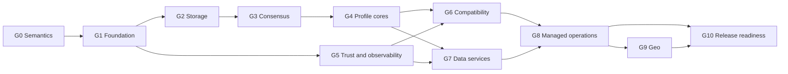

# Epoch Delivery Plan

This plan converts the architecture direction in [PRD.md](./PRD.md) into an executable sequence. The exhaustive requirement-to-milestone mapping lives in [REQUIREMENTS_TRACEABILITY.md](./REQUIREMENTS_TRACEABILITY.md).

## Delivery position

Epoch has 120 catalog requirements: 51 P0, 54 P1, 14 P2, and one explicitly deferred item. “All features” is therefore a roadmap commitment, not a credible first-iteration implementation claim. The first build must prove the shared primitives and failure semantics that later features depend on.

The credible program remains the PRD's 21–26 month route to initial GA for an experienced 12–15 person team. The first 90 days produce a fault-injected vertical slice, not a production broker. Correctness, recovery, and truthful guarantees are schedule gates; protocol and connector breadth are not.

## Dependency-driven architecture sequence

The dependency order has practical consequences:

- Native resource semantics are implemented and history-checked before compatibility gateways translate them.
- The volatile cache path is separate from the durable log; durability is only entered when the selected profile requires it.
- Queue payload storage may reuse immutable log records, but leases, attempts, acknowledgements, schedules, and DLQ state remain queue-owned indexes.
- Rust owns every customer-data correctness path. Go consumes versioned Protobuf/gRPC administration contracts and never reads storage files or in-memory engine state.
- Identity, audit, limits, telemetry, deterministic time, and fault injection begin in M1. They are not a managed-service afterthought.
- Dedicated/self-hosted operation is proven before serverless fleet economics and isolation are attempted.

## M0 — Architecture and semantic freeze

M0 is complete only when the following versioned contracts have owners and review records:

1. Common event envelope, namespaced protocol extensions, identifier rules, and maximum sizes.
2. Resource hierarchy, configuration schema, versioning, idempotent request tokens, and error model.
3. Append, commit, acknowledgement, high-water mark, retention, and recovery semantics.
4. Queue lease, renewal, acknowledgement, retry, schedule, expiry, DLQ, and stale-owner behavior.
5. Cache atomicity, TTL, eviction, durability, and fencing behavior.
6. Partition, key, session, and route ordering scopes.
7. Unknown publish outcomes, idempotency lookup, and achieved-durability metadata.
8. P1 transaction domain, limits, producer epochs, abort visibility, and external-system boundary.
9. Rust/Go ownership boundary and version compatibility policy.
10. Threat model, unsafe-Rust policy, data classification, audit taxonomy, and release provenance policy.

Required artifacts include ADRs, Protobuf/API specifications, a TLA+ or equivalent model plan, benchmark methodology, and the initial compatibility matrix. No gateway may advertise compatibility until the matrix names exact client/protocol versions.

## M1 — Foundational vertical slice, months 0–3

### Intended outcome

One package demonstrates that the same Rust engines and format contracts work in standalone and three-node modes. It implements a native end-to-end path through a stream, a queue view, a volatile cache shard, and a basic event route, with deterministic fault injection and visible guarantees.

### In-scope requirement slices

The traceability register marks the following as **Slice**. A Slice entry can be partial where its final milestone is later; the evidence must say exactly which sub-capability passed.

- Cache: CACHE-001–CACHE-005 and CACHE-007. CACHE-008 snapshots remain M3;
  the M1 segmented WAL is only a prerequisite and is not Cache restore evidence.
- Stream: STREAM-001, STREAM-002 basic retention, STREAM-004, and STREAM-005.
- Queue: QUEUE-001–QUEUE-006 and native credit flow for QUEUE-011.
- Bus: basic direct/fan-out routing for BUS-001 and the native/CloudEvents-shaped envelope foundation for BUS-005.
- Managed/control foundations: MGD-002, MGD-004, MGD-011, MGD-012, MGD-014; CTRL-001, CTRL-002, CTRL-004.
- Developer/runtime: DX-001–DX-004, DX-006; GOV-006; PKG-001–PKG-005 and PKG-009.

### Work packages

| Work package | Primary language | Deliverable | Exit evidence |
|---|---|---|---|
| Repository and contracts | Rust, Go, Protobuf | Workspace boundaries, generated interfaces, envelope, error/health/config contracts | Cross-language build and compatibility test |
| Deterministic runtime | Rust | Injectable monotonic/wall clocks, seeded scheduling, crash points, fault transport | Same seed reproduces the same history |
| Segmented WAL | Rust | Configured rotation, checksummed v1 frames, durable identity/manifest, global sequence, exclusive writer, bounded active-suffix repair, safe legacy fallback | Rotation/restart/metadata/corruption/lock/activation/legacy unit and real-process suites |
| Metadata and replication prototype | Rust | Three-node metadata/log group, epochs, quorum commit, fencing, leader transfer | Model check plus node/network/disk chaos report |
| Stream slice | Rust | Key routing, committed offsets, fetch, retention baseline, visible ack policy | Ordered recovery and no-early-ack history |
| Queue slice | Rust | Ready/scheduled/leased/acked/DLQ state, renewal, retry, redrive | Crash-at-every-transition history check |
| Cache slice | Rust | One volatile memory shard, core types, TTL, eviction, atomic batch, pipeline | Linearizability, expiry, and eviction tests; snapshot/restore remains M3 |
| Route slice | Rust | Envelope-normalized direct/fan-out delivery into a queue or stream | Route truth table and backpressure test |
| Standalone and cluster lifecycle | Rust | One selectable node binary, local admin API, truthful mode/guarantee health | Disconnected standalone and three-node smoke suites |
| CLI, SDK, emulator | Rust, Go, Java, Python | Create, append/publish, consume/ack, inspect, deterministic local testing | Cross-language executable quickstarts in CI |
| Control-plane contract scaffold | Go | Reconciler skeleton that uses only gRPC contracts; no record-path ownership | Boundary test and dependency audit |
| Trust and diagnostics baseline | Rust | mTLS-ready identity boundary, audit event skeleton, golden metrics/traces, explain output | Required-event/metric fault assertions |
| Packaging | Release tooling | Development OCI image, Kubernetes dev manifest, signed development binary/SBOM path | Clean-room install and signature CI |

The deterministic-runtime kernel is implemented in `epoch-testkit`: stable
seeded scheduling, independent virtual wall/monotonic time, occurrence-indexed
faults, directed partitions, duplicate/delay/reorder delivery, and canonical
EPTR v1 traces with golden history digests. EPTR is not yet an executable replay
bundle, so the seed and fault plan remain separate evidence. This closes only
the reusable kernel sub-slice. Consensus, storage, process lifecycle, and
profile history runners must integrate it before the M1 simulation or emulator
exit evidence is met.

The segmented-WAL work package is implemented as the single-node storage
sub-slice at `$EPOCH_DATA_DIR/engine-wal/segment-*.wal`. The implementation has
a 64 MiB default and a configurable rotation threshold; tests exercise small
thresholds, continuous sequence validation, checksummed restart replay,
exclusive ownership, and recovery that discards only an active-segment suffix
beyond its manifest-committed length. Fresh data directories receive an
invalid-to-old-readers staging/active marker at
`engine.wal`; `engine-wal/identity.v1` and `manifest.v1` bind a WAL UUID to the
ordered topology, committed lengths, last sequences, content CRC32 values, and
pending rotation. Missing, truncated, foreign, untracked, or changed committed
state fails closed. A pre-existing valid `engine.wal` instead remains on the
legacy single-file writer, including new appends; no segmented directory or
automatic migration is created, preserving offline downgrade. This does not
close the broader storage or replication gates: no snapshots, compaction,
retention deletion, consensus, replicas, or repair exist yet.

### M1 exit criteria

- A three-node replicated log survives injected process loss, partial writes, stale leaders, and a network partition without acknowledging outside its configured rule.
- A queue record can be scheduled, leased, renewed, failed, retried, acknowledged, dead-lettered, and redriven; deterministic history checking finds no silently skipped committed eligible record.
- A volatile cache operation does not traverse the durable log, while a prototype durable mutation uses the changelog intentionally.
- Standalone data is reopened by the same engine code used in cluster mode; the health response states the real deployment and guarantee ceiling.
- The native client and CLI expose epoch/commit position, unknown-outcome handling, retry guidance, and the selected durability/ordering/delivery semantics.
- Metrics, traces, immutable audit-event shape, fault injection, and benchmark harnesses exist before comparative performance tuning begins.
- The codebase builds and tests in a clean environment with reproducible dependency resolution and no unreviewed unsafe Rust.

M1 does not claim full Redis, Kafka, AMQP, MQTT, webhook, serverless, geo, transaction, connector, search, or GA security compatibility.

## M2 — Private alpha core, months 4–8

M2 turns the slice into a reliable native product and completes the production-core behavior assigned to alpha.

Primary scope:

- Complete P0 native cache, stream, and queue behavior: CACHE-001–CACHE-007; STREAM-001–STREAM-006; QUEUE-001–QUEUE-006 and QUEUE-011.
- Complete basic route topology BUS-001 while keeping the broader Event Bus target matrix for M4.
- Complete multi-zone placement/failover, safe topology operations, admission, and observability: MGD-002, MGD-004, MGD-012, MGD-014; CTRL-001–CTRL-005.
- Deliver Go, Java, and Python SDKs, guarantee-aware docs, emulator, integration containers, and explain: DX-001–DX-004 and DX-006.
- Establish audit/tag governance and standalone/cluster/embedded lifecycle foundations: MGD-011 basics, GOV-005, GOV-006 basics, PKG-002–PKG-009.

Exit gate:

- Thirty-day soak and fault campaigns complete with no known quorum acknowledgement or queue deletion invariant violation.
- Single-region, multi-zone dedicated topology supports shadow traffic from design partners.
- Profile benchmarks publish matched persistence, replication, batch, compression, payload, concurrency, and hardware settings.
- Restore is exercised even where PITR and managed backup automation remain M3/M4 work.

## M3 — Private beta compatibility, months 9–14

M3 earns migration credibility and data-management depth.

Primary scope:

- Durable cache recovery, lossy Pub/Sub, and change streams: CACHE-008–CACHE-010.
- Stream idempotence prototype, compaction, tiering, expansion, capture, and logical streams: STREAM-009–STREAM-011, STREAM-013, STREAM-015. Transactional completion remains M5.
- Queue lifecycle limits QUEUE-007.
- Named RESP3, Kafka producer/consumer/group, and AMQP core subsets under G6.
- Schemas and validation INT-001–INT-002; migration scanner DX-007; console foundation DX-005; additional SDKs DX-009.
- Backups/restore validation MGD-006, Terraform MGD-017, templates CTRL-007, migration/import PKG-010, and signed OS packages PKG-011.

Exit gate:

- A public compatibility matrix names supported, partial, translated, and unsupported behavior for exact versions.
- Differential, fuzz, malformed-frame, compression, and real-client suites pass for every advertised protocol surface.
- Comparative Redis/Kafka/RabbitMQ performance gates pass on matched semantics for the subset being advertised.
- Two design partners complete cutover and rollback drills with checksums, lag, offsets, sampled reads, and retained reverse replication.

## M4 — Public beta managed service, months 15–20

M4 adds the complete Event Bus beta, managed fleet experience, integration runtime, and hosted trust controls.

Primary scope:

- BUS-002–BUS-007 and BUS-009–BUS-012, BUS-015: filters, target types, retry/DLQ, CloudEvents, archive/replay, transforms, schemas, MQTT, secure webhooks, API destinations, functions/connectors.
- INT-003 and INT-005–INT-008: deterministic transforms, checkpointed initial connectors, record-level recovery, secret and egress isolation.
- MGD-001, MGD-003, MGD-005 foundation, MGD-008–MGD-010, MGD-013, MGD-016; private networking, organization policy, redaction, residency, soft deletion, and full audit coverage.
- Cross-region stream replication STREAM-014 and DR foundation under G9, without claiming GA failback maturity.
- Full end-to-end trace DX-008 and governed console actions DX-005.

Exit gate:

- Security architecture and penetration reviews pass; connector/webhook SSRF and exfiltration tests pass.
- The service demonstrates the 99.95% beta regional SLO with operational paging, incident communication, capacity reserve, and on-call ownership.
- Metering reconciles raw use, fan-out, retries, failures, throttles, object requests, and cross-region traffic.
- Geo-async lag and last-safe checkpoint are visible; planned switchover is fenced and audited.

## M5 — Initial GA, months 21–26

M5 closes correctness and operational maturity rather than adding broad new surfaces.

Primary feature completion:

- STREAM-007 and STREAM-008: idempotent producers and scoped Epoch transactions.
- QUEUE-008–QUEUE-010, QUEUE-012, QUEUE-015: sessions, dedupe, fair priority, dispatch protection, reliable DL forwarding.
- Mature geo promotion/failback for MGD-005 and STREAM-014.
- Guarded rolling upgrades MGD-007 and billing reconciliation MGD-013.
- Named client/protocol compatibility certifications and published release limits.

GA is blocked until every criterion below has durable evidence:

1. Zero acknowledged loss in documented node and zone fault tests for quorum mode.
2. Every GA profile passes its matched performance gate on a published reference setup.
3. Compatibility claims name exact client/protocol versions and pass the full associated matrix.
4. Restore, geo promotion, and failback drills meet declared RPO/RTO.
5. Every API and console surface exposes achieved latency, availability, durability, ordering, retention, and delivery semantics.
6. Unknown publish outcomes are resolvable through idempotency or status lookup.
7. Tenant isolation, authorization, encryption, audit, payload access, and connector egress reviews pass.
8. SLO dashboards, paging, incident response, customer communication, support, and escalation are staffed and exercised.
9. Billing reconciles against raw usage including retries, failures, and throttling.
10. At least two design partners have run production traffic for 60 days; at least one migrated from a reference product.

## M6 — North-star expansion, months 27–36+

M6 contains all 14 P2 items:

- CACHE-011–CACHE-014.
- STREAM-012.
- QUEUE-013–QUEUE-014.
- BUS-008, BUS-013, BUS-014.
- MGD-015.
- INT-004, INT-009.
- GOV-002.

Each M6 feature requires its own demand evidence, architecture decision, capacity/cost model, security review, and non-regression proof against core profile SLOs. Search/vector, sandboxed enrichment, global routing, legal hold, and marketplace breadth must not destabilize the production core.

## Explicit deferrals and scope fences

CACHE-015 remains deferred until a named set of CRDT types, customer demand, conflict semantics, storage cost, and convergence model are approved.

The P1 transaction domain is deliberately bounded to supported Epoch resources and coordinator limits. The following remain deferred independently of the 120-row catalog:

- Arbitrary global transactions.
- Transactions spanning unknown external APIs.
- Unbounded cross-profile transactions that destroy partition autonomy.

Also outside v1 are a relational/SQL engine, a Flink/Beam-class stream processor, a durable workflow orchestrator, complete parity with every vendor extension, arbitrary active-active mutable state, and magical exactly-once effects in external systems.

## Verification program

### Evidence classes

| Class | Required evidence |
|---|---|
| Semantic | Versioned contract, ADR, compatibility statement, and explicit failure behavior |
| Formal/correctness | Model-check result, property/history/linearizability report, deterministic seed and reproduction command |
| Compatibility | Named server/client versions, conformance result, differential corpus, fuzz summary, known exceptions |
| Performance | Infrastructure manifest, commit SHA, payload/dataset/concurrency/replication settings, percentiles, saturation curve, failure-tail results |
| Resilience | Chaos scenario, expected invariant, observed timeline, data comparison, RPO/RTO, corrective action |
| Security | Threat model, authorization matrix, tenant isolation, secrets/egress tests, scan/penetration findings and closure |
| Operations | Dashboard/alert/runbook links, on-call drill, capacity reserve, upgrade/restore/repair evidence |
| Release | Signed artifact, SBOM, provenance, installation matrix, migration/rollback evidence, supported limits |

### Reference performance gates

- Volatile Cache: at least 80% of Redis throughput and at most 1.5× Redis p99 on matched commands/hardware; design p50 below 0.5 ms and p99 below 1.5 ms in-zone.
- Quorum State: p99 write below 5 ms in a suitable low-latency three-zone region.
- Stream: at least 80% of tuned Kafka throughput and at most 1.5× produce p99 with matching replication, ack, batch, compression, and hardware.
- Queue: at least 80% of RabbitMQ quorum-queue throughput on matched semantics; p99 publish-to-ready below 10 ms and ready-to-first-delivery below 15 ms.
- Bus: p99 broker filtering/routing overhead below 10 ms, excluding target network time.
- Scheduled work: 99.9% becomes eligible within ±1 second under provisioned capacity.

Every performance report must include p50, p95, p99, p99.9, maximum, a 30-minute post-warm-up steady state at no more than 70% of the identified bottleneck, a saturation curve, and failure-tail behavior. Averages alone are not evidence.

### Initial production recovery gates

- Regional multi-zone data plane: 99.95% monthly.
- Regional management operations: 99.9% monthly.
- Zero acknowledged loss for one node or one zone failure when quorum placement is satisfied.
- Planned leader transfer under 5 seconds p99; unplanned failover under 30 seconds p99.
- Geo-async RPO under 60 seconds p99 under provisioned capacity; regional promotion under 15 minutes.
- Protected-tier restore validation automated at least weekly.

If protected placement is unsatisfied, strong writes are rejected unless an explicit policy permits a visible downgrade. Silent downgrade is never an availability strategy.

## Requirement definition of done

A row in the traceability register can move from Planned/Slice to Complete only when:

1. Its semantic contract and unsupported cases are documented.
2. Its dependency gates are complete or an approved ADR records a safe exception.
3. Unit, property, integration, recovery, authorization, and observability tests appropriate to the feature pass.
4. Fault and load behavior meet the declared guarantee and published limit.
5. User-visible APIs, CLI, SDK docs, explain output, metrics, audit, and runbooks are updated.
6. Compatibility translation is classified as lossless, translated, partial, or unsupported.
7. Evidence replaces the placeholder in the traceability row and is reviewable from a clean environment.

## Change control

- Requirement IDs are stable. Semantic changes update the PRD and record an ADR; they do not silently rewrite an acceptance target.
- Priority or milestone movement requires an owner, reason, dependency impact, and revised exit criteria.
- P0 may move later than alpha when its owning product surface itself launches later, as with the Event Bus, but it cannot be omitted from the production-worthy surface.
- Scope is cut in this order: P2 breadth, long-tail connectors/protocol extensions, serverless before dedicated, geo before single-region. Quorum correctness, fencing, recovery, observability, security boundaries, and honest guarantees are never schedule cuts.
- Release limits must be no higher than the capacity and recovery conditions actually verified.
