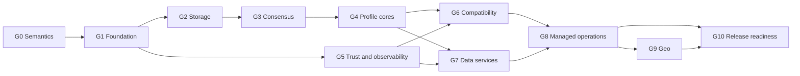

# Epoch Delivery Plan

This plan converts the architecture direction in [PRD.md](./PRD.md) into an
executable sequence. The exhaustive requirement-to-milestone mapping lives in
[REQUIREMENTS_TRACEABILITY.md](./REQUIREMENTS_TRACEABILITY.md), while the
maintained gate and release tables live in
[DELIVERY_CHECKLIST.md](./DELIVERY_CHECKLIST.md).

## Delivery position

Epoch has 120 catalog requirements: 51 P0, 54 P1, 14 P2, and one explicitly deferred item. “All features” is therefore a roadmap commitment, not a credible first-iteration implementation claim. The first build must prove the shared primitives and failure semantics that later features depend on.

The credible program remains the PRD's 21–26 month route to initial GA for an experienced 12–15 person team. The first 90 days produce a fault-injected vertical slice, not a production broker. Correctness, recovery, and truthful guarantees are schedule gates; protocol and connector breadth are not.

The `v0.1.0-alpha.4` M1/M2 boundary is the authenticated regional multi-tablet
slice. Protected `main` evidence covers the consensus-backed catalog, durable
single-owner hosted control, topology admission, quorum-confirmed leader reads,
all four regional profile SDKs, multi-shard Stream routing, atomic batches,
retention, coordinated and session-fenced consumption, profile-native
checkpoints with physical EPRS reclamation, and automatic maintenance and
checkpoint scheduling through leader and process loss.

PR #74 extends that boundary with leader-owned signed HTTP/webhook execution.
The Event Bus commits and awaits an exact lease before I/O, emits CloudEvents
binary-mode headers and a canonical HMAC-SHA-256 signature, applies strict
public-HTTPS/DNS/redirect/proxy/timeout controls, and commits deterministic
Ack, retry, or rejection state. Exact-main CI `32365193683`, main-only Pages
`32365193694`, and the live docs prove the Rust worker, Go/Java/Python target
and verifier contracts, real 503-to-204 retry, convergence, and all-voter
same-storage reopen.

The current cohesive P0 data-plane slice implements durable Event Bus Queue and
Stream target execution. Source-leader ownership, immutable destination
generation/tablet binding, shared Stream key routing, target-owned admission and
ordering, stable destination idempotency, internal forwarding to a different
group leader, committed-target-before-source-Ack ordering, and all-voter reopen
are working in the local real-process campaign. Public SDK examples, operator
status, ADR/API/semantics evidence, and the cross-tablet non-claim are part of
the same feature-sized delivery; protected CI, Pages, and merge evidence remain
the exit gate. Stable
streaming protocols, replicated multi-instance hosted metadata, production
identity, follower routing, dynamic membership/voter selection,
repair/rebalance, and the broader M2 security/performance gates remain open.

## Dependency-driven architecture sequence

```mermaid
flowchart LR
    S["G0 Semantics"] --> F["G1 Foundation"]
    F --> L["G2 Storage"]
    L --> C["G3 Consensus"]
    C --> P["G4 Profile cores"]
    F --> T["G5 Trust and observability"]
    P --> X["G6 Compatibility"]
    P --> D["G7 Data services"]
    T --> X
    T --> D
    X --> M["G8 Managed operations"]
    D --> M
    M --> R["G9 Geo"]
    M --> A["G10 Release readiness"]
    R --> A
```

The dependency order has practical consequences:

- Native resource semantics are implemented and history-checked before compatibility gateways translate them.
- The volatile cache path is separate from the durable log; durability is only entered when the selected profile requires it.
- Queue payload storage may reuse immutable log records, but leases, attempts, acknowledgements, schedules, and DLQ state remain queue-owned indexes.
- Rust owns every customer-data correctness path. Go consumes versioned Protobuf/gRPC administration contracts and never reads storage files or in-memory engine state.
- Identity, audit, limits, telemetry, deterministic time, and fault injection begin in M1. They are not a managed-service afterthought.
- Dedicated/self-hosted operation is proven before serverless fleet economics and isolation are attempted.

## M0 — Architecture and semantic freeze

M0 is complete only when the following versioned contracts have owners and review records:

1. Common event envelope, namespaced protocol extensions, identifier rules, and maximum sizes.
2. Resource hierarchy, configuration schema, versioning, idempotent request tokens, and error model.
3. Append, commit, acknowledgement, high-water mark, retention, and recovery semantics.
4. Queue lease, renewal, acknowledgement, retry, schedule, expiry, DLQ, and stale-owner behavior.
5. Cache atomicity, TTL, eviction, durability, and fencing behavior.
6. Partition, key, session, and route ordering scopes.
7. Unknown publish outcomes, idempotency lookup, and achieved-durability metadata.
8. P1 transaction domain, limits, producer epochs, abort visibility, and external-system boundary.
9. Rust/Go ownership boundary and version compatibility policy.
10. Threat model, unsafe-Rust policy, data classification, audit taxonomy, and release provenance policy.

Required artifacts include ADRs, Protobuf/API specifications, a TLA+ or equivalent model plan, benchmark methodology, and the initial compatibility matrix. No gateway may advertise compatibility until the matrix names exact client/protocol versions.

## M1 — Foundational vertical slice, months 0–3

### Intended outcome

One package demonstrates that the same Rust engines and format contracts work in standalone and three-node modes. It implements a native end-to-end path through a stream, a queue view, a volatile cache shard, and a basic event route, with deterministic fault injection and visible guarantees.

### In-scope requirement slices

The traceability register marks the following as **Slice**. A Slice entry can be partial where its final milestone is later; the evidence must say exactly which sub-capability passed.

- Cache: CACHE-001–CACHE-005 and CACHE-007. CACHE-008 snapshots remain M3;
  the M1 segmented WAL is only a prerequisite and is not Cache restore evidence.
- Stream: STREAM-001, STREAM-002 basic retention, the replicated checkpoint and
  consumer-session coordinator slices of STREAM-003, STREAM-004, STREAM-005,
  and the replicated bounded
  batch/compression slice of STREAM-006.
- Queue: QUEUE-001–QUEUE-006 and native credit flow for QUEUE-011.
- Bus: bounded deterministic direct/fan-out routing for BUS-001,
  filter/archive/transform sub-slices for BUS-002/BUS-006/BUS-007, and the
  native/CloudEvents-shaped envelope foundation for BUS-005. The typed
  ingress/outbox tablet is mounted with EPRS recovery; built-in target
  executors and public delivery contracts remain open.
- Managed/control foundations: MGD-002, MGD-004, MGD-011, MGD-012, MGD-014; CTRL-001, CTRL-002, CTRL-004.
- Developer/runtime: DX-001–DX-004, DX-006; GOV-006; PKG-001–PKG-005 and PKG-009.

### Work packages

| Work package | Primary language | Deliverable | Exit evidence |
|---|---|---|---|
| Repository and contracts | Rust, Go, Protobuf | Workspace boundaries, generated interfaces, envelope, error/health/config contracts | Cross-language build and compatibility test |
| Deterministic runtime | Rust | Injectable monotonic/wall clocks, seeded scheduling, crash points, fault transport | Same seed reproduces the same history |
| Segmented WAL | Rust | Configured rotation, checksummed v1 frames, durable identity/manifest, global sequence, exclusive writer, bounded active-suffix repair, safe legacy fallback | Rotation/restart/metadata/corruption/lock/activation/legacy unit and real-process suites |
| Metadata and replication prototype | Rust | Three-node metadata/log group, epochs, quorum commit, fencing, leader transfer | Model check plus node/network/disk chaos report |
| Stream slice | Rust | Key routing, generation-fenced committed offsets/reset/lag/replay, fetch, retention baseline, visible ack policy, and bounded atomic batch frames for none/gzip/LZ4/Snappy/Zstd | Ordered recovery, stale-owner fencing, no-early-ack history, strict codec corpus, correlated receipts, and record/checkpoint EPRS replay |
| Queue slice | Rust | Ready/scheduled/leased/acked/DLQ state, renewal, retry, redrive | Crash-at-every-transition history check |
| Cache slice | Rust | One volatile memory shard, core types, TTL, eviction, atomic batch, pipeline | Linearizability, expiry, and eviction tests; snapshot/restore remains M3 |
| Route slice | Rust | Bounded envelope-normalized direct/fan-out plan, independent delivery ledger, signed HTTP/webhook worker, and generation-pinned Epoch Queue/Stream worker with canonical replicated commands | Route/filter truth table, atomic outbox capacity, fenced acquire/ack/fail/reject, retry/DLQ isolation, exact replay, signed 503/204 receiver retry, cross-group Queue/Stream commit, and full-voter reopen; unsigned/custom target execution remains open |
| Standalone and cluster lifecycle | Rust | One selectable node binary, local admin API, truthful mode/guarantee health | Disconnected standalone and three-node smoke suites |
| CLI, SDK, emulator | Rust, Go, Java, Python | Create, append/publish, consume/ack, inspect, deterministic local testing | Cross-language executable quickstarts in CI |
| Control-plane contract and durable registry | Go | Reconciler using only administration contracts plus versioned transactional management metadata; no record-path ownership | Boundary/dependency audit, commit-before-visible tests, and real-process metadata reopen |
| Trust and diagnostics baseline | Rust | mTLS-ready identity boundary, audit event skeleton, golden metrics/traces, explain output | Required-event/metric fault assertions |
| Packaging | Release tooling | Development OCI image, Kubernetes dev manifest, signed development binary/SBOM path | Clean-room install and signature CI |

The deterministic-runtime kernel is implemented in `epoch-testkit`: stable
seeded scheduling, independent virtual wall/monotonic time, occurrence-indexed
faults, directed partitions, duplicate/delay/reorder delivery, and canonical
EPTR v1 traces with golden history digests. EPTR is not yet an executable replay
bundle, so the seed and fault plan remain separate evidence. This closes only
the reusable kernel sub-slice. Consensus, storage, process lifecycle, and
profile history runners must integrate it before the M1 simulation or emulator
exit evidence is met.

The Stage 2 consensus spike uses that kernel for a fixed three-voter `raft-rs`
adapter. Its tests cover majority-only commit, isolated leader replacement and
catch-up, directed partitions, delayed/reordered and duplicate delivery,
proposal reconstruction/deduplication, leader transfer, bounded peer frames,
and corrupt restart-image rejection. A local follow-on adds
`PersistentRaftAdapter` and the EPRS v1 checksummed `FileWal` journal, including
immutable identity, explicit `HardState`/entry/checkpoint fields, local reopen,
uncommitted-suffix replacement, partial-tail repair, and corruption rejection.
An explicit three-child-process extension isolates the leader, proves no
minority commit, heals and compares all receipts/digests, then sends `SIGKILL`
to one and all voters before reopening the same EPRS paths without duplicate
receipt publication. An opt-in node runtime and three-container topology add a
dedicated bounded HTTP transport. Its default mode carries opaque diagnostic
proposals; mutually exclusive experimental profile modes apply canonical
commands to one single-partition Stream, Queue, or Event Bus ingress/outbox
tablet or one single-shard Cache after fixed-voter majority commit and rebuild
it from EPRS history. The Bus profile replicates route plans, publish ingress,
archive state, and independent delivery attempts while explicitly declining a
built-in executor or external-side-effect claim. Those
typed receipts are bounded
fixed-topology evidence, not a public or placement-aware quorum-durable
acknowledgement, and all public profile APIs remain standalone. Exhaustive crash
points, membership and authoritative epoch transitions,
follower-served linearizable reads, authenticated transport, dynamic placement,
broader profile/tablet integration, and model/chaos reports remain
required for the metadata/replication work package and G3. See
[Consensus Feasibility Spike](CONSENSUS_SPIKE.md),
[Quorum Read Barriers](adr/0013-quorum-read-barriers.md),
[Experimental Stream Tablet](STREAM_TABLET.md), and
[Experimental Replicated Queue Tablet](QUEUE_TABLET.md).

The replicated consensus storage slice now has compatible EPSN v1/v2
checkpoints, additive EPRS checkpoint and compacted-baseline records,
durable-before-memory ordering, logical Raft-prefix compaction,
checkpoint-plus-tail reopen, and lagging-voter snapshot catch-up. EPSN v2
captures Catalog, Stream, Queue, Cache, or Event Bus state, retains a bounded
exact-retry suffix, and kind 4 physically reclaims obsolete EPRS generations.
Local operator status, an experimental trigger, and the regional scheduler
expose and advance the checkpoint/retained range. Every healthy voter
automatically checkpoints catalog and all profile groups after configurable
applied-index growth. This advances G2/G3, but it does not implement
downloadable backups/PITR, scheduled restore campaigns, automatic repair, or
membership. See
[Consensus Checkpoints and Snapshot Catch-up](CONSENSUS_CHECKPOINTS.md) and
[ADR-0021](adr/0021-consensus-checkpoint-and-snapshot-installation.md) plus
[ADR-0022](adr/0022-profile-native-checkpoints-and-physical-reclamation.md).
The scheduling policy is frozen in
[ADR-0028](adr/0028-automatic-regional-consensus-checkpoints.md).

The Stream application core accepts a version-two atomic batch command
without changing the canonical version-one single append. A batch carries
1–1,000 unique client sequences as canonical JSON inside none, gzip, LZ4-frame,
Snappy-framed, or Zstd-frame encoding. Exact compressed/uncompressed sizes, a
360 KiB frame ceiling, a 4 MiB output ceiling, and an 8 MiB Zstd window are
validated before proposal and voter application. The cloned transition returns
one exact offset per sequence and cannot expose a prefix. Unit/golden/bomb
tests, every-codec real-runtime commits, EPRS reopen, and a Python-produced gzip
container frame are executable. Repository-local Go, Java, and Python regional
clients now expose one explicit-shard atomic batch operation. They build
canonical `none` and gzip frames without optional dependencies, accept exact
caller-produced LZ4/Snappy/Zstd frames, and preserve the frame plus idempotency
key across bounded leader rediscovery. Exact published examples and a real
post-leader-loss Python SDK batch followed by voter catch-up and same-volume
reopen are executable. This advances STREAM-006 but does not complete stable
bidirectional Produce, automatic batching/codec negotiation, cross-shard batch
planning, non-atomic partial results, fuzz/load evidence, or matched
compression benchmarks. See
[ADR-0015](adr/0015-stream-batch-compression.md),
[ADR-0026](adr/0026-regional-stream-batch-sdks.md), and
[Experimental Stream Tablet](STREAM_TABLET.md).

The same Stream tablet now accepts a version-three consumer-group checkpoint
command. Commit advances a durable next offset; reset is the only rewind;
caller-supplied generations fence an old or conflicting member. Typed
committed rejections, exact retry, lag/replay observations, real-three-runtime
convergence, and container `SIGKILL` rebuild are executable. This advances the
per-shard checkpoint boundary of STREAM-003. A fully
qualified authenticated regional Stream v1 route now maps to that same tablet.
Repository-local Go, Java, and Python clients discover a current leader before
each operation, copy generation/tablet fences, preserve caller idempotency
across bounded rediscovery, and request linearizable fetch/lag reads. All three
have contract tests and exact compiled Pages examples; Python additionally
runs after leader loss in the container recovery campaign. Generated response
types, atomic coordinated checkpoint handoff, all-language live-cluster
execution, package publication, and production scale/fault evidence remain open. See
[ADR-0016](adr/0016-stream-consumer-group-checkpoints.md) and
[ADR-0017](adr/0017-regional-stream-v1-and-sdk-routing.md).

The Stream tablet now also accepts a version-four retention mutation without
changing v1 single-append, v2 batch, or v3 checkpoint bytes. A complete policy
may combine record-count, compact canonical JSON byte, and inclusive age
bounds. Configure enforces immediately; append enforces at its committed time;
and maintenance advances idle age deletion through the same Raft
history. Retained offsets are never renumbered, the monotonic time watermark
survives checkpoints, and a consumer checkpoint below the retained base is
preserved and flagged out of range until an explicit fenced reset. Direct and
authenticated regional routes plus Go, Java, and Python clients configure,
maintain, and linearly observe the policy. Deterministic core/tablet tests and
a real three-voter checkpoint/reopen test are executable; the regional
container campaign exercises the same SDK path. The regional leader now
proposes the existing command automatically at the first replicated deadline.
This advances STREAM-002 but does not provide a resource-wide policy
coordinator, keyed compaction/tombstones, object-tier retention,
namespace/legal-hold governance, or production scale evidence. See
[ADR-0023](adr/0023-stream-retention-policies.md) and
[Experimental Stream Tablet](STREAM_TABLET.md).

The regional Stream resource now materializes several ordered shards, each as
its own fixed-three-voter tablet. Discovery advertises
`fnv1a64_utf8_mod_n_v1`, exact UTF-8 encoding, event-ID fallback, and the
resource shard count. Go, Java, and Python keyed append helpers compute the
same target and require its resource generation to match the initial routing
observation before any write. The node externalizes the logical shard in
records, receipts, checkpoints, retention observations, and status while
leaving canonical physical partition-0 commands and snapshots unchanged.
Unit/contract tests and the real regional campaign route keys across three
shards and recover every shard after leader and all-node loss. This advances
STREAM-001, but safe online expansion/remapping (STREAM-011), virtual shards,
multi-partition consumer coordination, cross-shard transactions, and hot-key
automation remain open. See
[ADR-0024](adr/0024-stream-multishard-key-routing.md) and
[Regional Stream SDK](REGIONAL_STREAM_SDK.md).

The Stream tablet now also accepts canonical command v5 on logical shard 0.
It replicates resource-wide consumer membership, inclusive deadlines, a
monotonic committed-time watermark, and deterministic lexical round-robin
assignment across the captured shard count. New joins, leave, and one-or-more
expirations advance the group generation once; heartbeat and leave reject stale
generations as typed committed outcomes. Native Stream snapshot v2 preserves
the coordinator and accepts legacy v1 images. Direct and authenticated regional
routes plus Go, Java, and Python clients expose join, heartbeat, leave,
maintenance, and linearizable observation. Core/SDK tests and a real
three-voter checkpoint/reopen test are executable; the regional container
campaign exercises two members after leader replacement; regional shard-zero
leadership now expires the idle member without a client maintenance call and
verifies the surviving assignment after voter catch-up and all-node reopen.
This advances STREAM-003 but does not provide cooperative revoke,
server-push consumption, sticky/rack-aware assignment, or atomic coupling to
each shard's v3 checkpoint owner. See
[ADR-0025](adr/0025-stream-consumer-sessions.md).

The latest Stream increment adds canonical command v6 and native snapshot v3 for
an offset-preserving per-shard session claim. Exact-member/generation fetch,
commit, and reset are fenced behind that replicated owner. Go, Java, and Python
pin resource generation, read every assigned checkpoint, bridge at most 4,096
monotonic generations with deterministic keys, claim every shard, and re-read
the shard-zero assignment before returning it. The three-shard Python campaign
proves stale-fetch rejection and recovery after leader loss; PR #68,
exact-main CI `31726157672`, main-only Pages `31726157684`, and live-bundle
verification are green. This further
advances STREAM-003 and DX-001 without claiming cooperative revoke,
member-bound authorization, persistent streaming transport, atomic cross-shard
handoff, or STREAM-008 transactions. See
[ADR-0029](adr/0029-stream-session-fenced-consumption.md).

The Queue application core now runs behind the same profile-neutral persistent
actor boundary. It deterministically applies strict single-partition commands,
leader/consumer-fenced leases, retry/schedule/expiry, recorded business
outcomes, immutable DLQ/redrive history, and credit-bounded per-consumer
in-flight windows. A fully qualified authenticated regional Queue v1 route maps
to that same tablet. Repository-local Go, Java, and Python clients cover
enqueue, acquire, lease extension, acknowledge/release/nack/reject, maintenance,
counts, flow, mutation lookup, dead letters, redrive, and status. They discover
the leader before each operation, carry generation/tablet/term fences, preserve
caller idempotency across one bounded rediscovery, and explicitly request
linearizable reads. Contract tests, exact compiled Pages examples, and a real
Python lifecycle after Queue-leader `SIGKILL` plus all-node recovery are
executable. The current regional leader automatically promotes scheduled work
and expires due TTL/max-age/dedupe/leases with exact due-time commands.
Committed-order time normalization also prevents a retained pending
entry followed by a lower-clock leader from fail-stopping live apply or
recovery. This advances QUEUE-001/002/004/005/006/011 but does not complete
native bidirectional receive, connection-level credit, fairness/load proof,
dynamic placement, package publication, generated models, or production
durability evidence. See [Regional Queue SDK](REGIONAL_QUEUE_SDK.md),
[ADR-0018](adr/0018-regional-queue-v1-and-sdk-routing.md), and
[Experimental Replicated Queue Tablet](QUEUE_TABLET.md).

The Cache application work now has a bounded deterministic tablet runtime and
versioned regional application boundary. A
sorted `CacheShard` provides a pure read path, checked
non-repeating revision/version allocation, bounded staged transactions, checked
counters and TTLs, deterministic no-eviction/all-key/volatile LRU, LFU, random,
and TTL capacity policy, committed access metadata, and ordered expiry. Its typed tablet
adds absent-state ABA fencing, advisory composite lock fences, canonical
committed outcomes, exact replay, time normalization, and convergence digests.
`epoch-node` mounts it as an opt-in profile, rejects stale-term admission,
rebuilds from EPRS before readiness, and exposes the authenticated Cache v1
route with leader ReadIndex observations. Repository-local Go, Java, and Python
clients cover all seven values, set/committed-get/delete/CAS/increment, atomic
transaction/batch, fenced locks, explicit expiry controls, lookup, pure
observation, and status with exact retry. Managed configuration is committed
through Go and the Rust catalog before every voter materializes the tablet.
Real-runtime and container gates exercise the Python client after leader loss,
automatic leader-owned TTL reclamation, catch-up, convergence, and all-node
recovery. Concurrent history checking, multi-shard routing, byte-pressure
capacity/SLO evidence, native multiplexing/automatic batch coalescing, exported
and coordinated backup/PITR, and production durability evidence remain open. See
[Regional Cache SDK](REGIONAL_CACHE_SDK.md),
[ADR-0019](adr/0019-regional-cache-v1-and-sdk-routing.md), and
[ADR-0032](adr/0032-regional-cache-eviction-and-access-batches.md), and
[Experimental Replicated Cache Tablet](CACHE_TABLET.md).

The Event Bus application work now runs behind the same actor-owned persistent
boundary. Strict internal routes cover subscription mutation, publish ingress,
fenced delivery acquisition and settlement, bounded timeout maintenance,
mutation lookup, status, delivery-ledger observation, and filtered archive
replay. Every match atomically creates a stable per-subscription outbox record
with captured timeout/max-in-flight/retry policy and immutable attempt history.
Real-runtime and container gates prove majority-before-success, target-isolated
retry/DLQ state, semantic retry/conflict, follower rejection, leader
replacement, catch-up, digest/archive/outbox convergence, and all-node EPRS
recovery. A fully qualified authenticated regional Event Bus v1 route maps to
that same tablet. Repository-local Go, Java, and Python clients cover
subscription policy/removal, publish, acquire/ack/fail/reject/maintenance, mutation
lookup, archive replay, delivery query, and status with exact same-key retry and
linearizable observations. Contract tests, exact compiled Pages examples, and
a real Python lifecycle after Event Bus leader loss automatically time out an
in-flight delivery before retry without client maintenance.

The regional leader now also executes signed HTTP/webhook targets outside the
state machine. It commits and awaits an exact lease before I/O, emits one
CloudEvents 1.0 binary-mode request with the captured key ID and exact-body
HMAC-SHA-256 signature, and commits 2xx acknowledgement, retryable 429/5xx or
network failure, or terminal rejection. HTTPS/public-address validation,
per-attempt DNS resolution and address pinning, redirect/proxy suppression,
lease-capped timeout, strict/redacted key files, and Go/Java/Python receiver
verification helpers are implemented. A real three-process 503/204 campaign
proves distinct signed attempts, voter convergence, and all-voter reopen.

The source Bus leader also executes Epoch Queue and Stream targets. Its exact
lease pins the destination generation/shard/tablet/epoch, the destination
proposal identity remains stable across Bus attempts, and source Ack follows
the committed target receipt. The real three-process campaign covers a Queue
and keyed multi-shard Stream whose groups have independent leaders, then reopens
all voters without adding another destination record. The pair of commits is
not advertised as one cross-tablet transaction.

This advances BUS-001, BUS-003–BUS-006, BUS-011, and DX-001/DX-002. Unsigned
target executors, broad CloudEvents conformance, rate limiting,
redrive/retention, OAuth/API-key destinations, private managed egress, generated
models, package publication, backups/PITR, and production placement remain
open. See
[Regional Event Bus SDK](REGIONAL_EVENT_BUS_SDK.md),
[ADR-0020](adr/0020-regional-event-bus-v1-and-sdk-routing.md), and
[ADR-0030](adr/0030-leader-owned-signed-webhook-delivery.md),
[ADR-0031](adr/0031-leader-owned-epoch-target-delivery.md), and
[Experimental Replicated Event Bus Tablet](BUS_TABLET.md).

ADR-0027 unifies those profile timers in the regional node. State machines
publish pure earliest deadlines, only the local current Raft leader proposes,
the command carries the exact due time, and deterministic proposal identities
make overlapping ticks idempotent. The authenticated topology response exposes
node-local pass/leader/due/submission/pending/error observations. Explicit
maintenance APIs remain available; dynamic/cross-region ownership, timer load
SLOs, and production metrics/alerts remain open.

The segmented-WAL work package is implemented as the single-node storage
sub-slice at `$EPOCH_DATA_DIR/engine-wal/segment-*.wal`. The implementation has
a 64 MiB default and a configurable rotation threshold; tests exercise small
thresholds, continuous sequence validation, checksummed restart replay,
exclusive ownership, and recovery that discards only an active-segment suffix
beyond its manifest-committed length. Fresh data directories receive an
invalid-to-old-readers staging/active marker at
`engine.wal`; `engine-wal/identity.v1` and `manifest.v1` bind a WAL UUID to the
ordered topology, committed lengths, last sequences, content CRC32 values, and
pending rotation. Missing, truncated, foreign, untracked, or changed committed
state fails closed. A pre-existing valid `engine.wal` instead remains on the
legacy single-file writer, including new appends; no segmented directory or
automatic migration is created, preserving offline downgrade. This does not
close the broader storage or replication gates: the standalone engine still
has no snapshots, compaction, retention deletion, or repair. The separate
replicated core now has native-profile consensus checkpoints, logical
Raft-prefix compaction, and physical EPRS reclamation, but no downloadable
profile backup/PITR lifecycle.

### M1 exit criteria

- A three-node replicated log survives injected process loss, partial writes, stale leaders, and a network partition without acknowledging outside its configured rule.
- A queue record can be scheduled, leased, renewed, failed, retried, acknowledged, dead-lettered, and redriven; deterministic history checking finds no silently skipped committed eligible record.
- A volatile cache operation does not traverse the durable log, while a prototype durable mutation uses the changelog intentionally.
- Standalone data is reopened by the same engine code used in cluster mode; the health response states the real deployment and guarantee ceiling.
- The native client and CLI expose epoch/commit position, unknown-outcome handling, retry guidance, and the selected durability/ordering/delivery semantics.
- Metrics, traces, immutable audit-event shape, fault injection, and benchmark harnesses exist before comparative performance tuning begins.
- The codebase builds and tests in a clean environment with reproducible dependency resolution and no unreviewed unsafe Rust.

M1 does not claim full Redis, Kafka, AMQP, MQTT, webhook, serverless, geo, transaction, connector, search, or GA security compatibility.

## M2 — Private alpha core, months 4–8

M2 turns the slice into a reliable native product and completes the production-core behavior assigned to alpha.

Primary scope:

- Complete P0 native cache, stream, and queue behavior: CACHE-001–CACHE-007; STREAM-001–STREAM-006; QUEUE-001–QUEUE-006 and QUEUE-011.
- Complete basic route topology BUS-001 while keeping the broader Event Bus target matrix for M4.
- Complete multi-zone placement/failover, safe topology operations, admission, and observability: MGD-002, MGD-004, MGD-012, MGD-014; CTRL-001–CTRL-005.
- Deliver Go, Java, and Python SDKs, guarantee-aware docs, emulator, integration containers, and explain: DX-001–DX-004 and DX-006.
- Establish audit/tag governance and standalone/cluster/embedded lifecycle foundations: MGD-011 basics, GOV-005, GOV-006 basics, PKG-002–PKG-009.

Exit gate:

- Thirty-day soak and fault campaigns complete with no known quorum acknowledgement or queue deletion invariant violation.
- Single-region, multi-zone dedicated topology supports shadow traffic from design partners.
- Profile benchmarks publish matched persistence, replication, batch, compression, payload, concurrency, and hardware settings.
- Restore is exercised even where PITR and managed backup automation remain M3/M4 work.

## M3 — Private beta compatibility, months 9–14

M3 earns migration credibility and data-management depth.

Primary scope:

- Durable cache recovery, lossy Pub/Sub, and change streams: CACHE-008–CACHE-010.
- Stream idempotence prototype, compaction, tiering, expansion, capture, and logical streams: STREAM-009–STREAM-011, STREAM-013, STREAM-015. Transactional completion remains M5.
- Queue lifecycle limits QUEUE-007.
- Named RESP3, Kafka producer/consumer/group, and AMQP core subsets under G6.
- Schemas and validation INT-001–INT-002; migration scanner DX-007; console foundation DX-005; additional SDKs DX-009.
- Backups/restore validation MGD-006, Terraform MGD-017, templates CTRL-007, migration/import PKG-010, and signed OS packages PKG-011.

Exit gate:

- A public compatibility matrix names supported, partial, translated, and unsupported behavior for exact versions.
- Differential, fuzz, malformed-frame, compression, and real-client suites pass for every advertised protocol surface.
- Comparative Redis/Kafka/RabbitMQ performance gates pass on matched semantics for the subset being advertised.
- Two design partners complete cutover and rollback drills with checksums, lag, offsets, sampled reads, and retained reverse replication.

## M4 — Public beta managed service, months 15–20

M4 adds the complete Event Bus beta, managed fleet experience, integration runtime, and hosted trust controls.

Primary scope:

- BUS-002–BUS-007 and BUS-009–BUS-012, BUS-015: filters, target types, retry/DLQ, CloudEvents, archive/replay, transforms, schemas, MQTT, secure webhooks, API destinations, functions/connectors.
- INT-003 and INT-005–INT-008: deterministic transforms, checkpointed initial connectors, record-level recovery, secret and egress isolation.
- MGD-001, MGD-003, MGD-005 foundation, MGD-008–MGD-010, MGD-013, MGD-016; private networking, organization policy, redaction, residency, soft deletion, and full audit coverage.
- Cross-region stream replication STREAM-014 and DR foundation under G9, without claiming GA failback maturity.
- Full end-to-end trace DX-008 and governed console actions DX-005.

Exit gate:

- Security architecture and penetration reviews pass; connector/webhook SSRF and exfiltration tests pass.
- The service demonstrates the 99.95% beta regional SLO with operational paging, incident communication, capacity reserve, and on-call ownership.
- Metering reconciles raw use, fan-out, retries, failures, throttles, object requests, and cross-region traffic.
- Geo-async lag and last-safe checkpoint are visible; planned switchover is fenced and audited.

## M5 — Initial GA, months 21–26

M5 closes correctness and operational maturity rather than adding broad new surfaces.

Primary feature completion:

- STREAM-007 and STREAM-008: idempotent producers and scoped Epoch transactions.
- QUEUE-008–QUEUE-010, QUEUE-012, QUEUE-015: sessions, dedupe, fair priority, dispatch protection, reliable DL forwarding.
- Mature geo promotion/failback for MGD-005 and STREAM-014.
- Guarded rolling upgrades MGD-007 and billing reconciliation MGD-013.
- Named client/protocol compatibility certifications and published release limits.

GA is blocked until every criterion below has durable evidence:

1. Zero acknowledged loss in documented node and zone fault tests for quorum mode.
2. Every GA profile passes its matched performance gate on a published reference setup.
3. Compatibility claims name exact client/protocol versions and pass the full associated matrix.
4. Restore, geo promotion, and failback drills meet declared RPO/RTO.
5. Every API and console surface exposes achieved latency, availability, durability, ordering, retention, and delivery semantics.
6. Unknown publish outcomes are resolvable through idempotency or status lookup.
7. Tenant isolation, authorization, encryption, audit, payload access, and connector egress reviews pass.
8. SLO dashboards, paging, incident response, customer communication, support, and escalation are staffed and exercised.
9. Billing reconciles against raw usage including retries, failures, and throttling.
10. At least two design partners have run production traffic for 60 days; at least one migrated from a reference product.

## M6 — North-star expansion, months 27–36+

M6 contains all 14 P2 items:

- CACHE-011–CACHE-014.
- STREAM-012.
- QUEUE-013–QUEUE-014.
- BUS-008, BUS-013, BUS-014.
- MGD-015.
- INT-004, INT-009.
- GOV-002.

Each M6 feature requires its own demand evidence, architecture decision, capacity/cost model, security review, and non-regression proof against core profile SLOs. Search/vector, sandboxed enrichment, global routing, legal hold, and marketplace breadth must not destabilize the production core.

## Explicit deferrals and scope fences

CACHE-015 remains deferred until a named set of CRDT types, customer demand, conflict semantics, storage cost, and convergence model are approved.

The P1 transaction domain is deliberately bounded to supported Epoch resources and coordinator limits. The following remain deferred independently of the 120-row catalog:

- Arbitrary global transactions.
- Transactions spanning unknown external APIs.
- Unbounded cross-profile transactions that destroy partition autonomy.

Also outside v1 are a relational/SQL engine, a Flink/Beam-class stream processor, a durable workflow orchestrator, complete parity with every vendor extension, arbitrary active-active mutable state, and magical exactly-once effects in external systems.

## Verification program

### Evidence classes

| Class | Required evidence |
|---|---|
| Semantic | Versioned contract, ADR, compatibility statement, and explicit failure behavior |
| Formal/correctness | Model-check result, property/history/linearizability report, deterministic seed and reproduction command |
| Compatibility | Named server/client versions, conformance result, differential corpus, fuzz summary, known exceptions |
| Performance | Infrastructure manifest, commit SHA, payload/dataset/concurrency/replication settings, percentiles, saturation curve, failure-tail results |
| Resilience | Chaos scenario, expected invariant, observed timeline, data comparison, RPO/RTO, corrective action |
| Security | Threat model, authorization matrix, tenant isolation, secrets/egress tests, scan/penetration findings and closure |
| Operations | Dashboard/alert/runbook links, on-call drill, capacity reserve, upgrade/restore/repair evidence |
| Release | Signed artifact, SBOM, provenance, installation matrix, migration/rollback evidence, supported limits |

### Reference performance gates

- Volatile Cache: at least 80% of Redis throughput and at most 1.5× Redis p99 on matched commands/hardware; design p50 below 0.5 ms and p99 below 1.5 ms in-zone.
- Quorum State: p99 write below 5 ms in a suitable low-latency three-zone region.
- Stream: at least 80% of tuned Kafka throughput and at most 1.5× produce p99 with matching replication, ack, batch, compression, and hardware.
- Queue: at least 80% of RabbitMQ quorum-queue throughput on matched semantics; p99 publish-to-ready below 10 ms and ready-to-first-delivery below 15 ms.
- Bus: p99 broker filtering/routing overhead below 10 ms, excluding target network time.
- Scheduled work: 99.9% becomes eligible within ±1 second under provisioned capacity.

Every performance report must include p50, p95, p99, p99.9, maximum, a 30-minute post-warm-up steady state at no more than 70% of the identified bottleneck, a saturation curve, and failure-tail behavior. Averages alone are not evidence.

### Initial production recovery gates

- Regional multi-zone data plane: 99.95% monthly.
- Regional management operations: 99.9% monthly.
- Zero acknowledged loss for one node or one zone failure when quorum placement is satisfied.
- Planned leader transfer under 5 seconds p99; unplanned failover under 30 seconds p99.
- Geo-async RPO under 60 seconds p99 under provisioned capacity; regional promotion under 15 minutes.
- Protected-tier restore validation automated at least weekly.

If protected placement is unsatisfied, strong writes are rejected unless an explicit policy permits a visible downgrade. Silent downgrade is never an availability strategy.

## Requirement definition of done

A row in the traceability register can move from Planned/Slice to Complete only when:

1. Its semantic contract and unsupported cases are documented.
2. Its dependency gates are complete or an approved ADR records a safe exception.
3. Unit, property, integration, recovery, authorization, and observability tests appropriate to the feature pass.
4. Fault and load behavior meet the declared guarantee and published limit.
5. User-visible APIs, CLI, SDK docs, explain output, metrics, audit, and runbooks are updated.
6. Compatibility translation is classified as lossless, translated, partial, or unsupported.
7. Evidence replaces the placeholder in the traceability row and is reviewable from a clean environment.

## Change control

- Requirement IDs are stable. Semantic changes update the PRD and record an ADR; they do not silently rewrite an acceptance target.
- Priority or milestone movement requires an owner, reason, dependency impact, and revised exit criteria.
- P0 may move later than alpha when its owning product surface itself launches later, as with the Event Bus, but it cannot be omitted from the production-worthy surface.
- Scope is cut in this order: P2 breadth, long-tail connectors/protocol extensions, serverless before dedicated, geo before single-region. Quorum correctness, fencing, recovery, observability, security boundaries, and honest guarantees are never schedule cuts.
- Release limits must be no higher than the capacity and recovery conditions actually verified.
