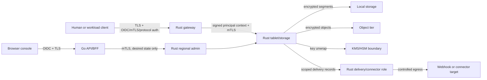

# Epoch Security Architecture

**Status:** Target controls; not yet implemented or certified  
**Date:** 22 July 2026

This document defines Epoch's trust, identity, encryption, audit, egress, and
tenant-isolation boundaries. It refines the security requirements in
[PRD.md](PRD.md) without claiming an audit or certification. Runtime ownership
is defined in [ARCHITECTURE.md](ARCHITECTURE.md), API identity and errors in
[API_CONTRACTS.md](API_CONTRACTS.md), and security verification in
[TESTING.md](TESTING.md).

## 1. Security objectives

Epoch must:

- prevent one tenant from reading, influencing, or inferring another tenant's
  data or control state;
- authenticate every external and node-to-node caller and authorize every
  operation at its actual resource scope;
- keep plaintext data and keys out of the Go hosted plane, logs, metrics, audit
  records, crash reports, and support bundles;
- make replay, redrive, export, payload browse, purge, policy, and key operations
  explicit and auditable;
- fence stale leaders and delivery owners as an integrity control;
- constrain webhook and connector egress so customer configuration cannot reach
  internal services or exfiltrate unrelated data;
- preserve data availability without silently weakening policy when the hosted
  management plane is unavailable.

Epoch does not claim that arbitrary external side effects are exactly once, that
encryption replaces authorization, or that a future compliance architecture is
already certified.

## 2. Trust boundaries



The main boundaries are:

- **Untrusted client boundary:** all frames, schemas, compression, headers, and
  payloads are attacker-controlled.
- **Gateway-to-storage boundary:** the gateway cannot grant authority merely by
  adding headers; it sends a signed, bounded principal context over mTLS and the
  receiving service validates it.
- **Go-to-Rust boundary:** Go can request desired configuration but cannot read
  storage files, unwrap data keys, or mutate data-path state directly.
- **Storage-to-delivery boundary:** workers receive only the records and secret
  references required for their assignment; they do not share storage-process
  memory.
- **KMS/object boundary:** object storage sees ciphertext and opaque tenant-safe
  keys; KMS authorizes key use to a scoped Rust workload identity.

Managed serverless, managed dedicated, hybrid, and self-hosted modes use the
same logical boundaries, although the cloud/customer ownership of each network
and key service differs.

## 3. Principals and authentication

Epoch recognizes distinct principal types:

- human user;
- application/workload identity;
- Epoch node or regional service;
- delivery or connector worker;
- automation such as Terraform or the operator;
- support operator using an explicit break-glass workflow.

Authentication targets are:

| Caller | Primary mechanism |
|---|---|
| Browser/human management | OIDC authorization code with PKCE and short-lived session |
| Workload native API | OAuth 2/OIDC workload token or client mTLS |
| Node/service internal | mutually authenticated workload certificates |
| Operator/automation | workload identity or short-lived service credential |
| RESP/Kafka/AMQP/MQTT clients | protocol-native auth mapped to an Epoch principal and policy |

Passwords, API keys, and long-lived shared secrets are compatibility or bootstrap
mechanisms, not the preferred native identity. Stored credentials are salted,
slow-hashed where password verification requires it, scoped, rotatable, and
never retrievable after creation.

TLS 1.3 is preferred. TLS 1.2 is the minimum only where ecosystem compatibility
requires it. Plaintext protocols are disabled in managed deployments and
require an explicit loopback/development opt-in in standalone mode.

Tokens are checked for issuer, audience, signature, time bounds, tenant binding,
and replay-relevant identifier. Internal certificates identify cluster, role,
node/service, environment, and expiry. Certificate rotation overlaps validity
without accepting an identity from another cluster.

## 4. Authorization hierarchy

Authorization follows the resource tree:

```text
Organization
  Project
    Environment
      Namespace
        Resource
          consumer group / subscription / schema revision / operation
```

RBAC grants named actions. ABAC conditions can restrict region, environment,
classification, network, time, resource tags, principal attributes, and
deployment mode. Organization policy sets guardrails that descendants cannot
weaken, including allowed regions, minimum durability, key policy, public
access, maximum retention, and payload-browse rules.

Representative actions are separate:

```text
cache.read, cache.write
stream.produce, stream.consume, stream.offset.commit
queue.send, queue.receive, queue.settle
bus.publish, subscription.consume
schema.read, schema.manage
data.browse, data.export
replay.preview, replay.execute
redrive.preview, redrive.execute
resource.apply, resource.delete, resource.purge
policy.manage, key.manage, support.access
```

Policy evaluation is deny-by-default. An explicit deny or organization guardrail
wins over a grant. Permissions are checked against immutable resource ID and
current parent, not only a user-supplied name.

The Rust regional catalog holds the policy version authoritative for the data
path. Go submits policy desired state through the regional API. Gateways cache
compiled decisions keyed by policy version and invalidate them when that version
changes. A Go outage does not erase committed regional policy.

Issuer keys and short-lived tokens have bounded cache behavior. When Epoch can
no longer validate a new credential safely, new authentication fails closed.
Existing streaming sessions reauthorize at a bounded interval; they do not live
forever on the policy that existed at connection time.

## 5. Forwarded identity

An edge gateway forwards a compact principal context containing authenticated
principal ID, tenant/resource scope, authentication strength, policy version,
request ID, trace ID, and expiry. The context is integrity-protected and bound
to the internal mTLS channel or signed by an approved gateway identity.

Storage nodes reject:

- client-supplied internal identity headers;
- expired contexts;
- contexts for another cluster, namespace, or resource;
- an unknown or older policy version when the operation requires the newer
  version;
- a gateway not authorized for the target tenant or role.

Authorization is enforced again for high-risk data access and administration;
network location alone is never authority.

## 6. Encryption and key boundary

### In transit

External endpoints use TLS, and internal service/replication traffic uses mTLS.
Certificate identities are verified, not merely encrypted. Protocol downgrade,
weak cipher, hostname, expiry, and revocation behavior are part of compatibility
tests.

### At rest

Epoch uses envelope encryption:

1. a namespace has a versioned data-encryption key (DEK), with a separate key
   available for stricter resource/classification boundaries;
2. a KMS/HSM key-encryption key (KEK) wraps the DEK;
3. segment and snapshot manifests store only the wrapped DEK reference, key
   version, algorithm metadata, and ciphertext integrity data;
4. an authorized Rust storage identity asks KMS to unwrap the DEK and keeps it
   in a bounded in-memory cache;
5. local segments, snapshots, backups, and remote-tier objects contain
   ciphertext.

The Go plane stores key references and desired rotation state, never plaintext
DEKs or customer payload. Delivery workers receive a decrypted record only after
authorization and only for their scoped assignment. Secret-bearing memory is
zeroized where the library and operating system make that meaningful; it is
never serialized into debug output.

Cross-tenant deduplication, compression dictionaries, plaintext block caches,
or shared encrypted objects are prohibited. Each stored object is bound to
tenant, namespace, resource/tablet, format version, and manifest integrity so a
valid ciphertext cannot be rolled back or substituted silently.

### Rotation

Rotation is a resumable operation:

1. create or select a new KEK/DEK version;
2. commit the new write-key reference in regional metadata;
3. write all new segments/snapshots with the new version;
4. rewrap or rewrite old material according to policy;
5. verify every replacement and update manifests;
6. retire the old version only after no live manifest depends on it.

Every stage is audited. Loss of KMS access rejects protected writes that need a
new key and reports the affected read/cache behavior explicitly; it does not
fall back to plaintext.

## 7. Secret management

Connector, webhook, API destination, and compatibility credentials are secret
references. Create/update APIs may accept secret material through a dedicated
write-only path, but Get/List responses return only reference, version, and
rotation status.

Workers retrieve a secret with their own least-privilege workload identity at
execution time or from a short bounded cache. Rotation does not require storing
plaintext in resource specs. Secrets are redacted from errors, traces, audit
events, process arguments, environment dumps, and support bundles.

## 8. Audit model

Audit events are immutable, exportable, tenant-scoped records. Each event
contains event/time identity, actor and delegated actor, authentication method,
tenant/resource, action, decision, reason code, policy version, request/trace,
source network, operation ID, and relevant generation/commit position. Config
changes contain bounded before/after digests, not secret or payload values.

The minimum audit matrix is:

| Event class | Recorded behavior |
|---|---|
| Authentication | Success at session/token-exchange boundary; every failure and credential revocation |
| Authorization | Every deny; grants for high-risk operations; policy version and matched rule |
| Resource/policy/network | Create, plan, apply, delete, purge, region, public access, quota, and policy changes |
| Keys/secrets | Key create/use failure/rotate/disable; secret reference create/read-by-worker/rotate, never value |
| Data access | Payload browse, search, peek, export, backup restore, and support access |
| Business re-execution | Replay, redrive, offset reset, DLQ action, migration cutover, and geo promotion/failback |
| Connector/webhook | Target/config change, egress denial, secret version, pause/resume, and repeated delivery failure |
| Cluster safety | Membership, leader transfer, repair, truncation, corruption, downgrade, and format activation |
| Release/operator | Login, impersonation, break-glass, rollout, rollback, and approval decision |

Ordinary high-volume Get/Produce/Send/Ack operations produce metrics and access
telemetry according to policy; recording every payload operation in the
immutable audit stream is configurable because it can be a separate regulated
requirement and cost. Denials and privileged data access are never sampled.

Audit export uses independently authorized append-only storage with retention
and integrity verification. Audit writers cannot delete or rewrite previously
accepted events. Failed audit delivery raises health/backpressure according to
the namespace compliance policy; a protected audit-required operation cannot
silently proceed without its required audit record.

Audit data never contains payloads, bearer tokens, private keys, webhook
signing secrets, full connector credentials, or unrestricted user headers.

## 9. Webhook SSRF and replay controls

Managed webhook delivery uses a dedicated worker and controlled egress path. A
target is validated when configured and again on every connection attempt:

1. parse and canonicalize scheme, host, IDNA name, port, and path;
2. reject URL user information, fragments, malformed encodings, and ambiguous
   numeric IP forms;
3. require HTTPS in managed mode; standalone HTTP requires an explicit local
   development policy;
4. resolve through an Epoch-controlled resolver and inspect every IPv4/IPv6
   result;
5. reject loopback, link-local, multicast, unspecified, carrier-grade NAT,
   cloud metadata, cluster/service, and private ranges unless an approved
   private-egress profile explicitly owns that range;
6. pin the selected validated IP for the attempt while retaining the original
   hostname for TLS SNI and certificate verification;
7. disable redirects by default; an enabled redirect repeats the entire policy
   and DNS check and has a small hop limit;
8. allow only configured destination ports and ignore ambient proxy environment
   variables;
9. bound connection, TLS, request, response, decompression, and total attempt
   time and bytes.

These checks defend against DNS rebinding and IPv4/IPv6 encoding tricks. A
private destination is reached only through an explicitly configured tenant
network/egress policy, not by weakening the global deny list.

Workers strip hop-by-hop and internal headers. Customer-configured headers are
allowlisted and cannot overwrite Epoch signature, Host, authorization, trace, or
idempotency headers except through a dedicated secret-backed target-auth field.
Response bodies are bounded and discarded unless a connector contract requires
them.

Webhook signing uses a versioned HMAC-SHA-256 contract initially. The signed
input is the following canonical UTF-8/ASCII lines, including the newline
separators:

```text
v1
<unix-timestamp>
<delivery-id>
<lowercase-hex-sha256-of-raw-body>
```

The target receives versioned signature, timestamp, delivery ID, event ID, and
attempt headers. Rotation supports an overlap window with key IDs. Verification
helpers use constant-time comparison, enforce timestamp tolerance, and expose
delivery ID so targets can maintain their own replay/idempotency store. A valid
signature authenticates Epoch delivery; it does not make processing exactly
once.

## 10. Connector and transform isolation

Connector and delivery roles do not run inside the storage role in managed
deployments. They use a non-root, read-only, least-privilege runtime with bounded
CPU, memory, file descriptors, concurrency, disk, and execution time. Their
network namespace or egress proxy enforces the connector's destination policy.

A deterministic WebAssembly transform has no network, ambient filesystem,
process, environment, wall-clock, or random access by default. Input, output,
memory, instruction/fuel, nesting, and expansion are bounded. Network enrichment
runs as a separately classified connector step with retry and idempotency state.

Connector checkpoints bind source resource/position, connector generation,
target idempotency metadata, and secret version. An older connector generation
is fenced. Partial-batch results route individual failures without leaking one
tenant's record into another tenant's error path.

## 11. Tenant isolation

Every internal key, cache entry, log frame, snapshot, object key, checkpoint,
and operation is bound to immutable tenant/namespace/resource identity. A
human-readable name alone is never a storage key.

Serverless isolation includes:

- tenant-aware admission, connection, request, memory, CPU, network, disk I/O,
  background-work, delivery, and object-request quotas;
- fair scheduling and recovery reserve so one tenant cannot consume all repair
  or compaction bandwidth;
- tenant-scoped encryption keys, block/index caches, dedupe state, compression
  context, and object prefixes;
- storage and object IAM that prevents a node/worker outside its assignment from
  accessing another tenant's objects;
- initialized length-checked buffers and no exposure of allocator slack or a
  previous tenant's data;
- bounded-cardinality telemetry and opaque identifiers instead of payload/key
  values in labels;
- redacted logs, traces, diagnostics, crash reports, and support bundles.

Dedicated deployments reduce co-tenancy but do not remove identity,
authorization, encryption, or audit requirements.

Cross-tenant side-channel testing includes hot-key contention, compression and
response-size differences, cache reuse, timing under quotas, object names,
metrics labels, error detail, and support tooling.

## 12. Input and resource-exhaustion defenses

Gateways apply limits before expensive work where possible:

- frame, header, record, batch, nesting, string, map, and extension limits;
- compression ratio and decompressed-byte limits;
- schema recursion/complexity and validation-time limits;
- filter/transform expression size, cost, and output-expansion limits;
- connection, stream, in-flight request, and per-key/partition rate limits;
- authentication failure and credential-replay throttles.

Malformed input returns bounded diagnostics. Parsers and decompressors are
fuzzed. A hot partition cannot allocate unbounded mailboxes; admission returns
the named limiting resource and retry-after metadata.

## 13. Privileged and destructive actions

Payload browse, export, replay, redrive, offset reset, public-network enablement,
key disable, geo promotion, and purge have separate permissions. The managed
console requires recent or step-up authentication for configured high-risk
actions and shows an impact preview. Organization policy may require a second
approver.

Support access is disabled by default, time-bounded, reason-bound, least
privilege, visible to the customer, and fully audited. Break-glass credentials
are separately protected and their use pages security operations. They do not
bypass encryption keys a customer has chosen not to make available.

Delete is soft where supported. Purge names the exact resource and derived
objects, requires a recovery-window acknowledgement, and records the operation
even after data deletion completes.

## 14. Supply chain and release

Release gates include dependency and license policy, vulnerability and secret
scanning, fuzzing, SBOM generation, signed artifacts, provenance, reproducible
build goals, and verification of downloaded tools and generated code. Unsafe
Rust is denied by the workspace unless a reviewed ADR grants a narrow exception.

Protocol parsers, storage formats, cryptography integrations, authorization,
webhook egress, connector sandboxing, and tenant boundaries receive dedicated
threat models and security tests before public exposure.

## 15. What is implemented now

The current scaffold does not implement the security architecture above. It has
basic input validation, an unsafe-Rust prohibition, provisional HTTP/health
configuration, and Rust type boundaries, but no production authentication,
authorization, TLS/mTLS identity, regional policy store, envelope encryption,
KMS integration, immutable audit pipeline, tenant scheduler, secret manager,
webhook sender, SSRF enforcement, connector sandbox, or support workflow.

The current Bus prototype accepts HTTP-shaped target URLs but does not make
network deliveries and must not be interpreted as safe webhook validation. The
current local WAL checksum detects accidental corruption; it is not encryption,
tamper-proofing, replication, or a compliance control.

The development node listens on loopback by default, while the development
container binds its HTTP port on all interfaces. The current HTTP router also
uses permissive CORS. Because that endpoint has no TLS or authentication yet,
it must not be exposed to an untrusted network or used for
untrusted/multi-tenant data.

No deployment is secure for untrusted or multi-tenant production traffic until
the applicable rows in [REQUIREMENTS_TRACEABILITY.md](REQUIREMENTS_TRACEABILITY.md)
have implementation, test, threat-review, and operational evidence.
