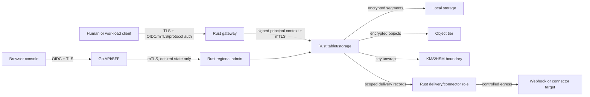

# Epoch Security Architecture

**Status:** Target controls with a bounded bootstrap baseline; not certified
**Date:** 29 July 2026

This document defines Epoch's trust, identity, encryption, audit, egress, and
tenant-isolation boundaries. It refines the security requirements in
[PRD.md](PRD.md) without claiming an audit or certification. Runtime ownership
is defined in [ARCHITECTURE.md](ARCHITECTURE.md), API identity and errors in
[API_CONTRACTS.md](API_CONTRACTS.md), and security verification in
[TESTING.md](TESTING.md).

## 1. Security objectives

Epoch must:

- prevent one tenant from reading, influencing, or inferring another tenant's
  data or control state;
- authenticate every external and node-to-node caller and authorize every
  operation at its actual resource scope;
- keep plaintext data and keys out of the Go hosted plane, logs, metrics, audit
  records, crash reports, and support bundles;
- make replay, redrive, export, payload browse, purge, policy, and key operations
  explicit and auditable;
- fence stale leaders and delivery owners as an integrity control;
- constrain webhook and connector egress so customer configuration cannot reach
  internal services or exfiltrate unrelated data;
- preserve data availability without silently weakening policy when the hosted
  management plane is unavailable.

Epoch does not claim that arbitrary external side effects are exactly once, that
encryption replaces authorization, or that a future compliance architecture is
already certified.

## 2. Trust boundaries


```mermaid
flowchart LR
    User["Human or workload client"] -->|TLS + OIDC/mTLS/protocol auth| Gateway
    Gateway["Rust gateway"] -->|signed principal context + mTLS| Storage["Rust tablet/storage"]
    Storage -->|encrypted segments| Disk["Local storage"]
    Storage -->|encrypted objects| Object["Object tier"]
    Storage -->|key unwrap| KMS["KMS/HSM boundary"]

    Console["Browser console"] -->|OIDC + TLS| Go["Go API/BFF"]
    Go -->|mTLS, desired state only| Regional["Rust regional admin"]
    Regional --> Storage

    Storage -->|scoped delivery records| Worker["Rust delivery/connector role"]
    Worker -->|controlled egress| Target["Webhook or connector target"]
```

The main boundaries are:

- **Untrusted client boundary:** all frames, schemas, compression, headers, and
  payloads are attacker-controlled.
- **Gateway-to-storage boundary:** the gateway cannot grant authority merely by
  adding headers; it sends a signed, bounded principal context over mTLS and the
  receiving service validates it.
- **Go-to-Rust boundary:** Go can request desired configuration but cannot read
  storage files, unwrap data keys, or mutate data-path state directly.
- **Storage-to-delivery boundary:** workers receive only the records and secret
  references required for their assignment; they do not share storage-process
  memory.
- **KMS/object boundary:** object storage sees ciphertext and opaque tenant-safe
  keys; KMS authorizes key use to a scoped Rust workload identity.

Managed serverless, managed dedicated, hybrid, and self-hosted modes use the
same logical boundaries, although the cloud/customer ownership of each network
and key service differs.

## 3. Principals and authentication

Epoch recognizes distinct principal types:

- human user;
- application/workload identity;
- Epoch node or regional service;
- delivery or connector worker;
- automation such as Terraform or the operator;
- support operator using an explicit break-glass workflow.

Authentication targets are:

| Caller | Primary mechanism |
|---|---|
| Browser/human management | OIDC authorization code with PKCE and short-lived session |
| Workload native API | OAuth 2/OIDC workload token or client mTLS |
| Node/service internal | mutually authenticated workload certificates |
| Operator/automation | workload identity or short-lived service credential |
| RESP/Kafka/AMQP/MQTT clients | protocol-native auth mapped to an Epoch principal and policy |

Passwords, API keys, and long-lived shared secrets are compatibility or bootstrap
mechanisms, not the preferred native identity. Stored credentials are salted,
slow-hashed where password verification requires it, scoped, rotatable, and
never retrievable after creation.

The current alpha implements only the bootstrap case. A strict version-one
policy stores SHA-256 token fingerprints, explicit actions, and
organization/project/environment/namespace scopes. Go managed HTTP/gRPC and
Rust regional HTTP callers present a bearer credential; both implementations
evaluate the same decision corpus. This is a migration baseline, not the OIDC,
short-lived credential, or workload-certificate target described below.

The regional Stream, Queue, Cache, and Event Bus v1 routes parse organization, project, environment, and
namespace from the fully qualified URL before authorization. Shard discovery
requires `route.read`, profile GETs require `data.read`, and mutations require
`data.write`. Event Bus archive replay and delivery query are POST-shaped reads
and still require `data.read`; they cannot mutate profile state. Go, Java, and Python regional clients send the supplied bearer
directly to Rust and do not route customer data or credentials through the Go
management service. Their in-memory token configuration is not a credential
store, rotation protocol, or secret-delivery mechanism.

Queue lease tokens remain opaque application values. The clients pass only the
current token into renewal or settlement and never log, decode, or store it as
authentication material. The token is a lease fence, not a bearer credential.

Cache lease tokens follow the same rule. A guarded mutation passes the exact
latest opaque token, while downstream services compare the returned
`(tablet_epoch, acquisition_index)` fencing token. Neither value is an
authentication credential, and SDKs do not decode it.

Event Bus delivery lease tokens are likewise opaque fences. Acknowledge and
fail pass the exact token returned by acquire; SDKs never treat it as identity
or evidence that an external target side effect occurred.

TLS 1.3 is preferred. TLS 1.2 is the minimum only where ecosystem compatibility
requires it. Plaintext protocols are disabled in managed deployments and
require an explicit loopback/development opt-in in standalone mode.

Tokens are checked for issuer, audience, signature, time bounds, tenant binding,
and replay-relevant identifier. Internal certificates identify cluster, role,
node/service, environment, and expiry. Certificate rotation overlaps validity
without accepting an identity from another cluster.

## 4. Authorization hierarchy

Authorization follows the resource tree:

```text
Organization
  Project
    Environment
      Namespace
        Resource
          consumer group / subscription / schema revision / operation
```

RBAC grants named actions. ABAC conditions can restrict region, environment,
classification, network, time, resource tags, principal attributes, and
deployment mode. Organization policy sets guardrails that descendants cannot
weaken, including allowed regions, minimum durability, key policy, public
access, maximum retention, and payload-browse rules.

Representative actions are separate:

```text
cache.read, cache.write
stream.produce, stream.consume, stream.offset.commit
queue.send, queue.receive, queue.settle
bus.publish, subscription.consume
schema.read, schema.manage
data.browse, data.export
replay.preview, replay.execute
redrive.preview, redrive.execute
resource.apply, resource.delete, resource.purge
policy.manage, key.manage, support.access
```

Policy evaluation is deny-by-default. An explicit deny or organization guardrail
wins over a grant. Permissions are checked against immutable resource ID and
current parent, not only a user-supplied name.

The Rust regional catalog holds the policy version authoritative for the data
path. Go submits policy desired state through the regional API. Gateways cache
compiled decisions keyed by policy version and invalidate them when that version
changes. A Go outage does not erase committed regional policy.

Issuer keys and short-lived tokens have bounded cache behavior. When Epoch can
no longer validate a new credential safely, new authentication fails closed.
Existing streaming sessions reauthorize at a bounded interval; they do not live
forever on the policy that existed at connection time.

## 5. Forwarded identity

An edge gateway forwards a compact principal context containing authenticated
principal ID, tenant/resource scope, authentication strength, policy version,
request ID, trace ID, and expiry. The context is integrity-protected and bound
to the internal mTLS channel or signed by an approved gateway identity.

Storage nodes reject:

- client-supplied internal identity headers;
- expired contexts;
- contexts for another cluster, namespace, or resource;
- an unknown or older policy version when the operation requires the newer
  version;
- a gateway not authorized for the target tenant or role.

Authorization is enforced again for high-risk data access and administration;
network location alone is never authority.

## 6. Encryption and key boundary

### In transit

External endpoints use TLS, and internal service/replication traffic uses mTLS.
Certificate identities are verified, not merely encrypted. Protocol downgrade,
weak cipher, hostname, expiry, and revocation behavior are part of compatibility
tests.

### At rest

Epoch uses envelope encryption:

1. a namespace has a versioned data-encryption key (DEK), with a separate key
   available for stricter resource/classification boundaries;
2. a KMS/HSM key-encryption key (KEK) wraps the DEK;
3. segment and snapshot manifests store only the wrapped DEK reference, key
   version, algorithm metadata, and ciphertext integrity data;
4. an authorized Rust storage identity asks KMS to unwrap the DEK and keeps it
   in a bounded in-memory cache;
5. local segments, snapshots, backups, and remote-tier objects contain
   ciphertext.

The Go plane stores key references and desired rotation state, never plaintext
DEKs or customer payload. Delivery workers receive a decrypted record only after
authorization and only for their scoped assignment. Secret-bearing memory is
zeroized where the library and operating system make that meaningful; it is
never serialized into debug output.

Cross-tenant deduplication, compression dictionaries, plaintext block caches,
or shared encrypted objects are prohibited. Each stored object is bound to
tenant, namespace, resource/tablet, format version, and manifest integrity so a
valid ciphertext cannot be rolled back or substituted silently.

### Rotation

Rotation is a resumable operation:

1. create or select a new KEK/DEK version;
2. commit the new write-key reference in regional metadata;
3. write all new segments/snapshots with the new version;
4. rewrap or rewrite old material according to policy;
5. verify every replacement and update manifests;
6. retire the old version only after no live manifest depends on it.

Every stage is audited. Loss of KMS access rejects protected writes that need a
new key and reports the affected read/cache behavior explicitly; it does not
fall back to plaintext.

## 7. Secret management

Connector, webhook, API destination, and compatibility credentials are secret
references. Create/update APIs may accept secret material through a dedicated
write-only path, but Get/List responses return only reference, version, and
rotation status.

Workers retrieve a secret with their own least-privilege workload identity at
execution time or from a short bounded cache. Rotation does not require storing
plaintext in resource specs. Secrets are redacted from errors, traces, audit
events, process arguments, environment dumps, and support bundles.

The regional alpha implements a narrower file-backed boundary for managed Bus
targets. Every node reads one strict, at-most-1-MiB/1,024-entry API-key,
bearer-token, or OAuth-client file at startup; replicated state stores only its
reference. Debug/status output lists references and redacts values. OAuth
access tokens use a bounded in-process expiry cache. There is no hot reload,
external secret-manager identity, or durable token cache yet, so operators must
restart nodes after rotating this development file.

## 8. Audit model

Audit events are immutable, exportable, tenant-scoped records. Each event
contains event/time identity, actor and delegated actor, authentication method,
tenant/resource, action, decision, reason code, policy version, request/trace,
source network, operation ID, and relevant generation/commit position. Config
changes contain bounded before/after digests, not secret or payload values.

The minimum audit matrix is:

| Event class | Recorded behavior |
|---|---|
| Authentication | Success at session/token-exchange boundary; every failure and credential revocation |
| Authorization | Every deny; grants for high-risk operations; policy version and matched rule |
| Resource/policy/network | Create, plan, apply, delete, purge, region, public access, quota, and policy changes |
| Keys/secrets | Key create/use failure/rotate/disable; secret reference create/read-by-worker/rotate, never value |
| Data access | Payload browse, search, peek, export, backup restore, and support access |
| Business re-execution | Replay, redrive, offset reset, DLQ action, migration cutover, and geo promotion/failback |
| Connector/webhook | Target/config change, egress denial, secret version, pause/resume, and repeated delivery failure |
| Cluster safety | Membership, leader transfer, repair, truncation, corruption, downgrade, and format activation |
| Release/operator | Login, impersonation, break-glass, rollout, rollback, and approval decision |

Ordinary high-volume Get/Produce/Send/Ack operations produce metrics and access
telemetry according to policy; recording every payload operation in the
immutable audit stream is configurable because it can be a separate regulated
requirement and cost. Denials and privileged data access are never sampled.

Audit export uses independently authorized append-only storage with retention
and integrity verification. Audit writers cannot delete or rewrite previously
accepted events. Failed audit delivery raises health/backpressure according to
the namespace compliance policy; a protected audit-required operation cannot
silently proceed without its required audit record.

Audit data never contains payloads, bearer tokens, private keys, webhook
signing secrets, full connector credentials, or unrestricted user headers.

## 9. Webhook and managed-target SSRF/replay controls

The regional alpha now has a dedicated leader-owned worker for signed
HTTP/webhook targets. Target syntax is validated when the subscription is
configured, and the network boundary is validated again on every attempt:

1. parse and canonicalize scheme, host, IDNA name, port, and path;
2. reject URL user information, fragments, malformed encodings, and ambiguous
   numeric IP forms;
3. require HTTPS; HTTP requires the explicit
   `EPOCH_REGIONAL_WEBHOOK_ALLOW_HTTP_LOOPBACK=true` development flag and a
   literal loopback or `localhost` target;
4. resolve each domain on every attempt and inspect every IPv4/IPv6 result;
5. reject loopback, link-local, multicast, unspecified, carrier-grade NAT,
   documentation, transition/protocol, benchmark, cloud metadata,
   cluster/service, private, and other non-public ranges using the current
   [IANA special-purpose registries](https://www.iana.org/numbers/registries);
6. pin all validated addresses for the attempt while retaining the original
   hostname for TLS SNI and certificate verification;
7. disable redirects and ignore ambient proxy environment variables; and
8. cap connection time and the complete DNS-plus-request attempt, with the
   attempt never extending beyond the replicated lease deadline; an
   already-expired lease emits no request.

These checks defend against DNS rebinding and IPv4/IPv6 encoding tricks. Mixed
public/private DNS answers fail closed. A private destination will require a
future explicit tenant network/egress policy; this alpha does not provide one.

API destinations, endpoint pools, functions, connectors, and OAuth token URLs
reuse the same address-validation, pinning, redirect/proxy, and lease-timeout
boundary. Function/connector URLs must additionally match their exact
replicated host allowlist. Every managed request carries a stable side-effect
idempotency key. An actual endpoint-pool egress failure commits an unhealthy
observation before failover; authentication/configuration failures do not
change endpoint health.

The worker constructs its own fixed delivery/CloudEvents header set. Every
user-derived header value is parsed through the HTTP library and control
characters terminally reject the delivery. Response bodies are never consumed.

Webhook signing uses a versioned HMAC-SHA-256 contract initially. The signed
input is the following canonical UTF-8/ASCII lines, including the newline
separators:

```text
v1
<unix-timestamp>
<delivery-id>
<attempt>
<lowercase-hex-sha256-of-raw-body>
```

The target receives versioned signature, key ID, timestamp, delivery ID, event
ID, subscription, and attempt headers. Rotation supports an overlap window by
retaining multiple IDs in the external key file while new subscriptions select
the desired ID. Go, Java, and Python verification helpers use constant-time
comparison, reject non-canonical decimal/hex fields, enforce timestamp
tolerance, and expose `(delivery ID, attempt)` so targets can maintain their own
durable replay/idempotency store. A valid signature authenticates Epoch
delivery; it does not make processing exactly once. See
[ADR-0030](adr/0030-leader-owned-signed-webhook-delivery.md).

## 10. Connector and transform isolation

Connector and delivery roles do not run inside the storage state machine. A
production managed deployment must place them in a non-root, read-only,
least-privilege runtime with bounded
CPU, memory, file descriptors, concurrency, disk, and execution time. Their
network namespace or egress proxy enforces the connector's destination policy.

A deterministic WebAssembly transform has no network, ambient filesystem,
process, environment, wall-clock, or random access by default. Input, output,
memory, instruction/fuel, nesting, and expansion are bounded. The current
deterministic lookup enrichment forbids network access. A future network
enrichment runs as a separately classified connector step with retry and
idempotency state.

Connector checkpoints bind source resource/position, connector generation,
target idempotency metadata, and secret version. An older connector generation
is fenced. Partial-batch results route individual failures without leaking one
tenant's record into another tenant's error path.

In alpha.9 the managed target worker runs in the `epoch-node` process, although
all network I/O remains outside committed state application. The validation,
allowlist, and SSRF boundary is implemented; OS/container sandbox separation,
a network-level egress proxy, and connector certification remain production
gates.

## 11. Tenant isolation

Every internal key, cache entry, log frame, snapshot, object key, checkpoint,
and operation is bound to immutable tenant/namespace/resource identity. A
human-readable name alone is never a storage key.

Serverless isolation includes:

- tenant-aware admission, connection, request, memory, CPU, network, disk I/O,
  background-work, delivery, and object-request quotas;
- fair scheduling and recovery reserve so one tenant cannot consume all repair
  or compaction bandwidth;
- tenant-scoped encryption keys, block/index caches, dedupe state, compression
  context, and object prefixes;
- storage and object IAM that prevents a node/worker outside its assignment from
  accessing another tenant's objects;
- initialized length-checked buffers and no exposure of allocator slack or a
  previous tenant's data;
- bounded-cardinality telemetry and opaque identifiers instead of payload/key
  values in labels;
- redacted logs, traces, diagnostics, crash reports, and support bundles.

Dedicated deployments reduce co-tenancy but do not remove identity,
authorization, encryption, or audit requirements.

Cross-tenant side-channel testing includes hot-key contention, compression and
response-size differences, cache reuse, timing under quotas, object names,
metrics labels, error detail, and support tooling.

## 12. Input and resource-exhaustion defenses

Gateways apply limits before expensive work where possible:

- frame, header, record, batch, nesting, string, map, and extension limits;
- compression ratio and decompressed-byte limits;
- schema recursion/complexity and validation-time limits;
- filter/transform expression size, cost, and output-expansion limits;
- connection, stream, in-flight request, and per-key/partition rate limits;
- authentication failure and credential-replay throttles.

Malformed input returns bounded diagnostics. Parsers and decompressors are
fuzzed. A hot partition cannot allocate unbounded mailboxes; admission returns
the named limiting resource and retry-after metadata.

## 13. Privileged and destructive actions

Payload browse, export, replay, redrive, offset reset, public-network enablement,
key disable, geo promotion, and purge have separate permissions. The managed
console requires recent or step-up authentication for configured high-risk
actions and shows an impact preview. Organization policy may require a second
approver.

Support access is disabled by default, time-bounded, reason-bound, least
privilege, visible to the customer, and fully audited. Break-glass credentials
are separately protected and their use pages security operations. They do not
bypass encryption keys a customer has chosen not to make available.

Delete is soft where supported. Purge names the exact resource and derived
objects, requires a recovery-window acknowledgement, and records the operation
even after data deletion completes.

## 14. Supply chain and release

Release gates include dependency and license policy, vulnerability and secret
scanning, fuzzing, SBOM generation, signed artifacts, provenance, reproducible
build goals, and verification of downloaded tools and generated code. Unsafe
Rust is denied by the workspace unless a reviewed ADR grants a narrow exception.

The implemented Rust dependency gate pins `cargo-audit` 0.22.2 and denies audit
warnings. Its only temporary exception is `RUSTSEC-2025-0057`, the unmaintained
`fxhash` dependency inherited through `raft`. This exception does not accept the
consensus dependency or change ADR-0003 from Proposed; removal or replacement
must be resolved through that decision. CI caches only the exact binary produced
by the pinned locked-source build under an OS, architecture, toolchain, and
version-specific immutable key; the advisory database is not cached and the
audit still runs on every job. The Linux `protoc` 35.1 installer pins
separate SHA-256 values for x86_64 and aarch64, requires an explicit destination
that does not already exist, verifies the extracted compiler version, and fails
closed.

The release artifact path builds node, control, operator, CLI, and compatibility
gateway images from digest-pinned bases with exact version/revision OCI labels
and explicit non-root users. Pull requests inspect those five images and
generate one SPDX JSON SBOM per candidate without registry credentials. Only a
`v*` tag whose commit equals
the current `main` may publish Linux amd64/arm64 manifests to GHCR; it never
publishes `latest`. Matching native runners build each architecture and pass
only immutable digests to the manifest stage, avoiding QEMU in the trusted
publication path. The tag workflow attaches manifest provenance, attests each
platform SBOM, signs the immutable manifest digest through GitHub Actions OIDC,
and verifies both the Sigstore workflow identity and GitHub attestation before
creating the release. [Release artifacts](RELEASE_ARTIFACTS.md) defines the
consumer verification procedure and
[ADR-0041](adr/0041-tag-only-oci-supply-chain.md) records the boundary.
Protected tag evidence remains required before any candidate image is called
published.

Protocol parsers, storage formats, cryptography integrations, authorization,
webhook egress, connector sandboxing, and tenant boundaries receive dedicated
threat models and security tests before public exposure.

## 15. What is implemented now

The current alpha implements a bounded authentication/authorization/audit
baseline at the managed and regional public boundaries:

- `spec/auth/bootstrap-policy-v1.schema.json` defines a strict, bounded policy
  containing only token fingerprints, principal IDs, explicit actions, and
  exact-or-`*` tenant scopes. Go and Rust reject unknown or ambiguous policy
  input and pass the same checked-in decision corpus.
- `epoch-control` requires `EPOCH_AUTH_POLICY_PATH`. Its `/v1` HTTP endpoints
  and RegionalAdmin gRPC methods require strict bearer authentication, enforce
  action and parsed-resource scope before mutation or lookup, and filter list
  results so unauthorized tenant resources are not disclosed.
- `epoch-control` uses the distinct credential supplied by
  `EPOCH_CONTROL_REGIONAL_TOKEN` for every Rust catalog or route request.
  Regional `epoch-node` processes independently authenticate and authorize
  catalog apply/delete/read, route read, topology read, and typed data
  read/write actions. Topology responses contain no bearer or tenant payload.
- Authentication failures and authorization decisions produce bounded
  structured events with request/principal/policy/action/decision/reason/scope
  fields and no credential or payload field. The console keeps an interactively
  entered token only in browser session storage; no token is compiled into
  Pages.
- The experimental Stream batch boundary validates canonical base64 and JSON,
  exact compressed/expanded sizes and record count, unique sequences, a
  360 KiB frame ceiling, a 4 MiB output ceiling, and an 8 MiB Zstd window before
  proposal and again on voter decode. Unit tests cover corrupt metadata,
  unknown fields, and oversized expansion; corpus fuzzing and sustained
  adversarial compression-ratio testing remain open.
- Event Bus Queue/Stream delivery resolves targets only inside the source
  organization/project/environment/namespace and durably pins the destination
  generation/tablet fence before forwarding. Public mutation DTOs reject the
  internal binding, and topology counters contain neither payloads nor
  credentials. This is same-runtime routing, not a substitute for authenticated
  peer transport or per-target authorization: the current fixed voter set and
  bootstrap trust boundary must remain private.
- Event Bus managed delivery acquires a replicated leader/lease fence before
  egress, reuses public-only DNS validation/pinning with redirects/proxies
  disabled, enforces function/connector host allowlists, keeps secret values
  out of replicated/status state, and commits connector checkpoint before
  source settlement. A real loopback OAuth/target test exercises the boundary;
  OS sandboxing, secret-manager identity, private egress, and penetration
  evidence remain open.
- HTTP source ingestion reuses the same strict secret-reference, hostname
  allowlist, public-address DNS validation/pinning, redirect/proxy suppression,
  response-size, and timeout boundary. Object, PostgreSQL, MySQL, and Kafka
  adapters resolve typed values from the bounded node-local
  `connector_credentials` entry; references alone enter replicated state.
  TLS certificate/hostname verification is the default, explicit plaintext is
  loopback-development only, and configured database/broker hosts must match
  the replicated allowlist. Leadership loss, pause, deletion, or route loss
  drops PostgreSQL/Kafka sessions. Independent abuse certification, cloud IAM
  and workload identity, secret-manager hot rotation, private egress, and live
  Azure/GCS security evidence remain open.
- The supported operator deployment sets `EPOCH_TLS_REQUIRED=true`. Rust public
  HTTP uses a configured server certificate and client trust root; Rust peer
  transport and Go-to-Rust transport use mTLS, reject untrusted client chains,
  verify server DNS names, disable ambient proxies, and reject redirects.
  Missing, partial, malformed, or untrusted material fails before application
  traffic is served. Go public HTTP/gRPC uses the corresponding mandatory TLS
  server boundary. Bearer authorization remains independent of certificate
  trust.
- Regional semantic backup requires the separate cluster-scoped
  `backup.create` action. The managed Job accepts its bearer, mTLS identity,
  destination, and encryption key only through read-only mounted files. It
  validates the canonical manifest, encrypts with AES-256-GCM and a fresh
  nonce, authenticates key ID/digests/size as associated data, publishes
  without overwrite, and never copies key bytes into the custom resource,
  artifact header, status, process arguments, or logs. Restore authenticates
  before creating fresh consensus state. During rotation, bounded
  `previous.<key-id>` Secret fields let retention authenticate older objects;
  an absent key or duplicate key material fails before any deletion.
- Governance metadata is bounded, non-secret desired state. New managed
  resources require canonical owner, cost center, classification, and tags;
  `epoch.io/` tag keys are reserved. The Go BFF filters tenant visibility before
  computing any cost attribution, preventing cross-tenant aggregation leakage.
  The bootstrap policy does not yet evaluate classification or tags as ABAC
  conditions, so they must not be described as an enforcement boundary.

Health and CORS preflight remain public. The stable standalone local-emulator
HTTP API remains unauthenticated and must stay on a trusted interface. Compose
and an explicitly configured local diagnostic runtime may still use plaintext;
that mode is not the supported Kubernetes boundary. In the operator deployment,
public port 7601 and peer port 7701 use TLS/mTLS and secure `https` peer URLs.

This is not the complete security architecture above. There is still no OIDC,
credential expiry/revocation service, certificate issuance/revocation service,
certificate-subject-to-role policy, signed forwarded context, replicated or
hot-reloaded regional policy, WAL/data-volume encryption, external KMS
integration, immutable audit pipeline/export, tenant scheduler, external secret
manager/hot reload, private managed webhook egress, connector OS sandbox, quota
system, or support workflow. Signed public HTTPS delivery has request-local
SSRF enforcement but not a network-level egress proxy or tenant egress policy.
The example policy tokens are public development fixtures.

Unsigned legacy Bus HTTP targets remain durable intent only. The current local WAL
checksum detects accidental corruption; it is not encryption, tamper-proofing,
replication, or a compliance control.

The development node listens on loopback by default, while the development
container binds its HTTP port on all interfaces. Browser CORS is fail-closed:
the node returns access-control headers only for the exact, canonical HTTP(S)
origins in `EPOCH_ALLOWED_ORIGINS`. Local Vite development and preview origins
on ports 5173 and 4173 are allowed by default; wildcard, opaque, credentialed,
path-bearing, and malformed origins are rejected during startup. The GitHub
Pages artifact is documentation-only and does not contain the live console
client.

The opt-in standalone consensus probe remains a development-only diagnostic
surface with no CORS or public SDK contract. When launched through the managed
regional mode it shares the mTLS peer listener; when launched explicitly
without required TLS it must remain on trusted loopback. Outbound peer requests
ignore ambient proxy settings and reject redirects in both modes.

CORS is only a browser boundary, not authentication. Managed and regional
requests without an `Origin` still require bearer authentication and, in the
supported deployment, the configured TLS client trust boundary. The standalone
API remains available to native SDKs, CLI tools, and any network peer that can
reach it, so plaintext standalone/Compose modes must not be exposed to an
untrusted network.

No deployment is secure for untrusted or multi-tenant production traffic until
the applicable rows in [REQUIREMENTS_TRACEABILITY.md](REQUIREMENTS_TRACEABILITY.md)
have implementation, test, threat-review, and operational evidence.
