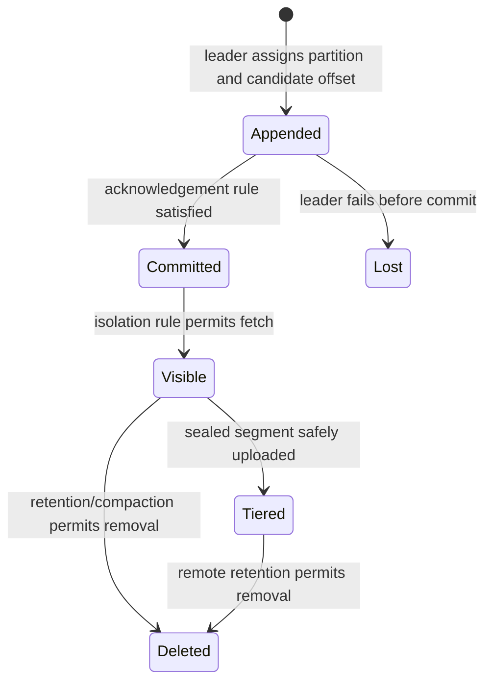
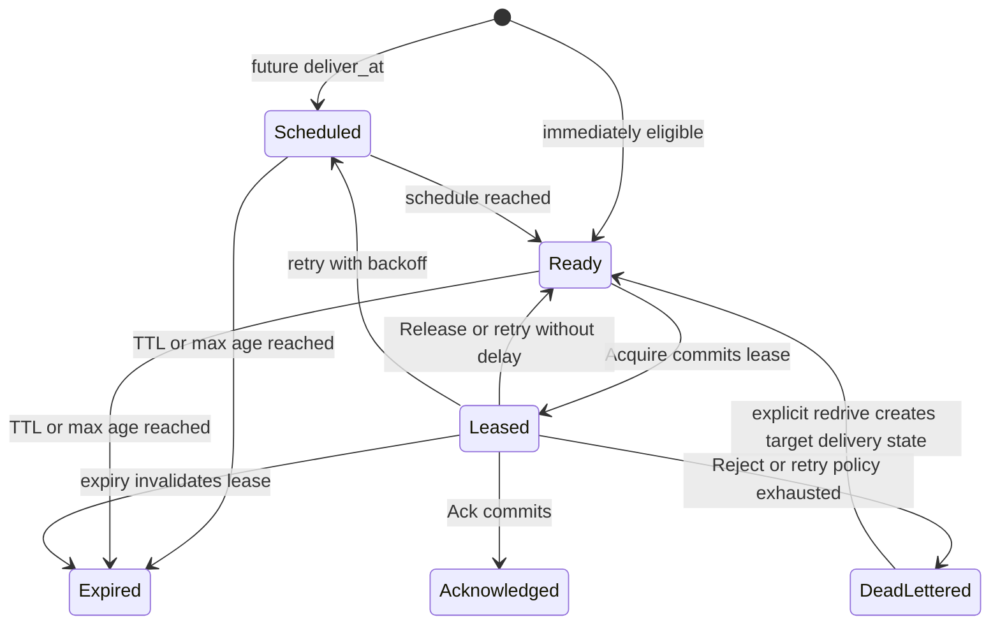

# Epoch Semantics

**Status:** Target contract; not a production claim  
**Date:** 22 July 2026

This document defines the observable success points and state transitions that
the implementation must earn. It refines the product requirements in
[PRD.md](PRD.md) without repeating the feature catalog. Component ownership is
defined in [ARCHITECTURE.md](ARCHITECTURE.md), API shapes in
[API_CONTRACTS.md](API_CONTRACTS.md), and evidence requirements in
[TESTING.md](TESTING.md).

The terms **must**, **must not**, **should**, and **may** are normative for the
target behavior. The final section records what the current scaffold has and
has not implemented.

## 1. Common vocabulary

Epoch uses these terms consistently:

- **Accepted:** a leader has admitted a request. Acceptance alone is not a
  successful durable write.
- **Appended:** a replica has written an entry to its configured memory or
  storage path. It may not yet be committed.
- **Committed:** the configured acknowledgement rule has been satisfied and the
  entry's position cannot be replaced within the documented fault model.
- **Applied:** the profile state machine has processed a committed entry.
- **Visible:** the operation is available to a reader with the requested
  isolation level.
- **Eligible:** a queued or scheduled record can be selected for delivery.
- **Leased:** one consumer owns a fenced, time-bounded right to settle a queue
  record.
- **Delivered:** Epoch sent a record to a consumer or target. Delivery is not
  proof of an external side effect.
- **Settled:** the Queue or subscription ledger durably recorded Ack, Reject, or
  another terminal transition.

Every mutating resource has a monotonically increasing epoch or generation.
Every successful data write has a logical position. Epochs fence owners;
positions identify committed history. They are not interchangeable.

## 2. Write success and acknowledgement

A configured durability profile is a minimum floor. A request may ask for a
stronger acknowledgement, but it cannot silently ask for less than the resource
floor.

| Durability | Success point |
|---|---|
| Volatile | The current leader applied the operation in memory |
| Replicated memory | The current leader and the configured number of memory replicas appended/applied it |
| Local durable | The leader appended it and completed the configured group-fsync policy |
| Quorum durable | A voter majority durably appended it and the leader established the commit position |
| All in-sync replicas | Quorum commit completed and every replica in the acknowledged in-sync set appended it |
| Geo async | Regional commit completed; the response reports the current remote checkpoint separately |
| Geo sync | The configured region-spanning quorum committed it; this is not a default profile |

A successful response includes a write receipt containing the configured and
achieved durability, resource/tablet epoch, logical position, commit time,
replica acknowledgement count, and deduplication result. A leader-only or
volatile success is truthful about its possible loss ceiling.

For quorum-protected resources, Epoch must not return success before the durable
majority condition is true. If placement cannot satisfy the resource policy,
the write is rejected unless an explicit policy permits a visible, audited
downgrade.

## 3. Response outcome classes

A client observes one of three result classes:

1. **Success:** a receipt proves the stated success point.
2. **Definite rejection:** Epoch proves the operation did not commit, for
   example validation failure, authorization denial, stale fence, or admission
   rejection before proposal.
3. **Unknown outcome:** the client lost the response after the operation might
   have committed. A timeout, connection reset, gateway crash, or leader change
   can create this class.

Unknown is neither failure nor success. A mutating client must reuse the same
idempotency token and payload fingerprint or call status lookup. If the original
operation committed, Epoch returns the original receipt. If the token is known
not to have committed, the client may resubmit. If the token has aged out before
resolution, Epoch returns an explicit unresolved result rather than inventing a
definite answer.

The idempotency scope is principal, resource, operation kind, and token. Reusing
a token with different semantic input is a conflict.

## 4. Ordering and consistency

- Cache commands are linearizable within one leader shard when the resource
  selects a linearizable mode. Replica reads are explicitly stale-capable.
- Stream order is per partition. A key is ordered only while it maps to one
  partition history.
- Queue FIFO is scoped to a session or message group. Unrelated groups may run
  concurrently.
- Priority changes selection among currently eligible records. It does not
  revoke an existing lease.
- Bus source order is preserved only when the source, route, transform, and
  target share the same supported ordering key.
- Metadata mutations are strongly consistent.
- Geo-async reads may lag the primary and expose the last imported checkpoint.

Cross-shard operations are not atomic merely because they share a namespace.
The API rejects an unsupported atomic scope rather than silently decomposing it.

### Delivery guarantees

At-most-once delivery advances or discards delivery state before dispatch and
therefore may lose a record but does not intentionally redeliver it.
At-least-once delivery retains state until Ack and therefore may duplicate after
an unknown target or consumer outcome. Effectively-once adds a bounded dedupe
identifier/window; it does not remember every historical side effect.
Transactional exactly-once applies only to coordinated reads, writes, and offset
commits inside the documented Epoch transaction domain.

No delivery label changes the durability of the underlying record or extends to
an arbitrary external API.

## 5. Cache and State semantics

### Writes and reads

A volatile Cache write succeeds when the leader applies it in memory. Process or
node loss may remove it. It must not traverse the durable commit log unless the
resource selects replication, durability, or change capture.

A durable State write is a deterministic mutation committed through the tablet
log and then applied. A linearizable read either runs on the current leader
after an appropriate read barrier or returns a redirect/unavailable result.
Explicit replica reads include staleness metadata where practical.

Single-key operations and same-shard batches are atomic. Compare-and-set checks a
version in the same mutation. A lock or lease primitive returns a monotonically
increasing fencing token; possession of an unexpired time value alone is not
proof of current ownership.

### Expiry and eviction

TTL establishes an eligibility deadline for removal. A passive read treats an
expired value as absent even if background reclamation has not freed its memory.
Active expiry reclaims storage later. A durable expiry transition is committed
before its durable change event is visible; a volatile expiry event is
best-effort.

Eviction is part of the chosen Cache contract, not an acknowledged-write loss
incident. `no-eviction` rejects the mutation that would exceed its limit.
Eviction policies may use documented approximations, but must not evict keys
outside the selected volatile/all-key eligibility class.

Snapshots and change logs do not retroactively make a volatile write durable.

## 6. Stream Log semantics

### Record lifecycle



Only committed records are returned to ordinary consumers. A logical partition
offset is assigned by its leader and is never reused for a different committed
record. Consensus-only entries do not appear as user records.

Leader acknowledgement below quorum can lose an acknowledged record according
to the selected profile. Quorum acknowledgement cannot lose it under the stated
voter and failure-domain model.

Retention removes replay availability; it does not change whether an earlier
write was committed. A fetch before the earliest retained offset returns an
explicit out-of-range result containing the earliest available position.

### Producers and consumers

An idempotent producer has a producer ID, epoch, and monotonic sequence per
partition. A lower producer epoch is fenced. A repeated sequence with the same
input returns the original result; conflicting input is rejected.

A consumer-group offset denotes the **next** record to consume. Offset commits
are independent durable state unless they participate in an Epoch transaction.
Rebalancing changes group ownership epochs; a member from an older generation
cannot commit offsets.

Read-committed consumers skip prepared and aborted transactional entries. They
may wait behind an unresolved transaction up to a documented bound.

## 7. Work Queue semantics

### Message state machine



`Send` succeeds at the queue resource's configured durability point. It does not
mean a consumer has received the message.

`Acquire` selects an eligible record and durably creates a lease before exposing
the delivery. The delivery attempt increments when this lease is granted. The
opaque lease token binds resource, partition, message, leader epoch, consumer or
session generation, lease generation, and deadline.

Settlement behavior is:

- **Ack:** terminal success after the acknowledgement state commits.
- **Release:** give up the current lease and make the record eligible without
  treating the application result as success.
- **Nack retryable:** record failure metadata and apply configured backoff.
- **Reject:** do not retry normally; dead-letter when configured, otherwise
  create an explicit discarded terminal outcome.
- **Extend:** commit a later lease deadline if the same lease is still current
  and resource limits allow it.

A stale or expired lease returns `LeaseLost`; it never converts to success. If a
consumer times out waiting for an Ack response, it retries Ack with the same
lease token. It must not infer success from the connection closing.

TTL and max-age bound eligibility. A lease deadline cannot extend past the
message's terminal expiry. If time or leadership uncertainty prevents proving
expiry, Epoch delays redelivery rather than permitting two valid owners.

Deduplication suppresses a known identifier only within the configured window
and scope. It returns the original send receipt. It is not unlimited historical
exactly-once delivery.

Session FIFO grants an exclusive renewable session epoch. Messages within the
session are selected in session order; other sessions proceed independently.
Priority applies across eligible work with starvation protection.

Dead-letter state preserves original resource, reason, attempts, timestamps,
and last failure. Redrive is an explicit, audited operation with a new delivery
history and an origin reference; it does not erase the dead-letter evidence.

## 8. Event Bus semantics

For a durable Bus, Publish commits the normalized envelope and route-plan
version to an ingress/archive tablet. Its success does not wait for every
target. Route evaluation is deterministic for the captured plan version.

Each durable subscription owns independent target state:

```text
pending -> leased/sending -> delivered-awaiting-ack -> acknowledged
                     |                |
                     +-> retry -------+
                     +-> dead-letter / expired
```

Pull subscription settlement follows Queue lease semantics. A Stream or Queue
target succeeds when the target write commits at that resource's guarantee.
Webhook delivery is at-least-once unless explicitly configured at-most-once;
HTTP success only proves the target returned an accepted status, not that its
business side effect occurred.

Webhook attempts carry a stable delivery ID and idempotency key. Target retry,
timeout, rate, and dead-letter policy are per subscription. Transform failure is
a target failure with an observable reason; it must not silently drop the
record.

Archive replay creates new delivery attempts linked to the archived origin.
Replay and redrive preview count, target, rate, duplicate exposure, and cost
before execution.

## 9. Pipes and cross-profile behavior

A pipe is an explicit source position plus filter/transform plus target write.
It owns a durable checkpoint only after its target result meets the declared
delivery contract. On unknown target outcome, it resolves the target
idempotency token before advancing.

Cross-tablet delivery writes a new target record and preserves origin identity
and position. A Stream offset never becomes a Queue Ack implicitly, and a Queue
lease never changes source Stream retention.

Connectors default to at-least-once. “Exactly once” is permitted only when both
ends participate in a documented transaction protocol or the scope remains
inside an Epoch transaction domain.

## 10. Transactions

One-tablet mutations are the first atomic boundary. A later bounded regional
transaction uses a durable coordinator and prepare/decision markers:

```text
open -> preparing -> committed
                  -> aborted
```

Commit succeeds only after the coordinator decision is durable. A timeout does
not prove abort; status lookup resolves the transaction ID. Participants reject
an older producer or coordinator epoch. Transactions have bounded duration,
bytes, and participant count.

Epoch does not claim exactly-once effects for arbitrary databases, functions,
or HTTP services. Those require idempotency, inbox/outbox, or an explicit
transactional connector.

## 11. Time and leadership failures

Time-dependent state uses the injectable clock and fencing rules in
[ADR-0005](adr/0005-time-and-fencing.md). Wall-clock movement never revives an
expired generation. A new leader rejects all tokens from the old leader epoch.
When expiry cannot be proven safely after failover, work may be late but does
not gain two valid owners.

Quorum loss rejects protected writes. Stale reads are returned only when the
resource and request permit them. A metadata or hosted-management outage does
not authorize a local node to invent placement, policy, or a lower guarantee.

## 12. What is implemented now

The current Phase 0 scaffold contains useful semantic prototypes, not the
distributed contract described above:

- shared envelope, durability, delivery, ordering, deployment, receipt, and
  error types;
- an injectable `Clock` trait and deterministic test clock;
- in-memory Cache, Stream, Queue, and Bus state machines with a subset of core
  operations;
- standalone commit positions and acknowledgement metadata;
- a checksummed, versioned local WAL with partial-tail recovery;
- basic in-process routing between Bus, Queue, and Stream resources.

It does **not** yet implement tablet consensus, replicated quorum durability,
regional catalog/placement, distributed fencing, persisted profile snapshots,
consumer-group coordination, bounded transactions, object tier, geo
replication, native Protobuf services, compatibility gateways, durable webhook
delivery, connector execution, or the security controls in
[SECURITY.md](SECURITY.md).

Current JSON-shaped payloads, standalone epochs, HTTP endpoints, and local WAL
frames are provisional scaffold interfaces. They are not frozen compatibility
or production durability claims. A feature becomes supported only when its
traceability row has implementation and acceptance evidence in
[REQUIREMENTS_TRACEABILITY.md](REQUIREMENTS_TRACEABILITY.md).
