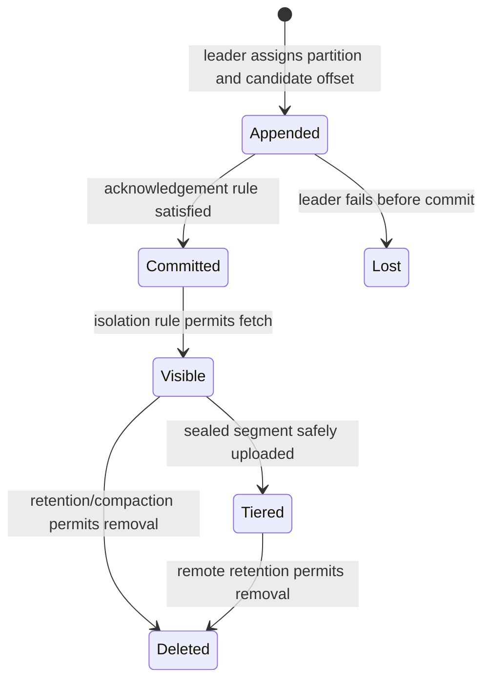
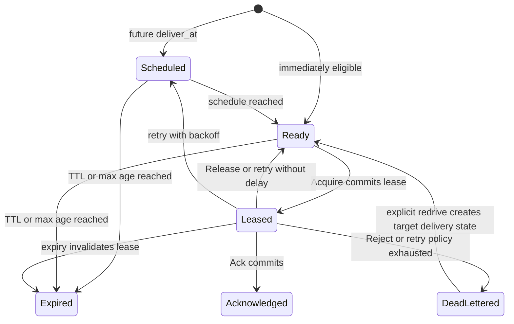

# Epoch Semantics

**Status:** Target contract; not a production claim  
**Date:** 22 July 2026

This document defines the observable success points and state transitions that
the implementation must earn. It refines the product requirements in
[PRD.md](PRD.md) without repeating the feature catalog. Component ownership is
defined in [ARCHITECTURE.md](ARCHITECTURE.md), API shapes in
[API_CONTRACTS.md](API_CONTRACTS.md), and evidence requirements in
[TESTING.md](TESTING.md).

The terms **must**, **must not**, **should**, and **may** are normative for the
target behavior. The final section records what the current scaffold has and
has not implemented.

## 1. Common vocabulary

Epoch uses these terms consistently:

- **Accepted:** a leader has admitted a request. Acceptance alone is not a
  successful durable write.
- **Appended:** a replica has written an entry to its configured memory or
  storage path. It may not yet be committed.
- **Committed:** the configured acknowledgement rule has been satisfied and the
  entry's position cannot be replaced within the documented fault model.
- **Applied:** the profile state machine has processed a committed entry.
- **Visible:** the operation is available to a reader with the requested
  isolation level.
- **Eligible:** a queued or scheduled record can be selected for delivery.
- **Leased:** one consumer owns a fenced, time-bounded right to settle a queue
  record.
- **Delivered:** Epoch sent a record to a consumer or target. Delivery is not
  proof of an external side effect.
- **Settled:** the Queue or subscription ledger durably recorded Ack, Reject, or
  another terminal transition.

Every mutating resource has a monotonically increasing epoch or generation.
Every successful data write has a logical position. Epochs fence owners;
positions identify committed history. They are not interchangeable.

## 2. Write success and acknowledgement

A configured durability profile is a minimum floor. A request may ask for a
stronger acknowledgement, but it cannot silently ask for less than the resource
floor.

| Durability | Success point |
|---|---|
| Volatile | The current leader applied the operation in memory |
| Replicated memory | The current leader and the configured number of memory replicas appended/applied it |
| Local durable | The leader appended it and completed the configured group-fsync policy |
| Quorum durable | A voter majority durably appended it and the leader established the commit position |
| All in-sync replicas | Quorum commit completed and every replica in the acknowledged in-sync set appended it |
| Geo async | Regional commit completed; the response reports the current remote checkpoint separately |
| Geo sync | The configured region-spanning quorum committed it; this is not a default profile |

A successful response includes a write receipt containing the configured and
achieved durability, resource/tablet epoch, logical position, commit time,
replica acknowledgement count, and deduplication result. A leader-only or
volatile success is truthful about its possible loss ceiling.

For quorum-protected resources, Epoch must not return success before the durable
majority condition is true. If placement cannot satisfy the resource policy,
the write is rejected unless an explicit policy permits a visible, audited
downgrade.

## 3. Response outcome classes

A client observes one of three result classes:

1. **Success:** a receipt proves the stated success point.
2. **Definite rejection:** Epoch proves the operation did not commit, for
   example validation failure, authorization denial, stale fence, or admission
   rejection before proposal.
3. **Unknown outcome:** the client lost the response after the operation might
   have committed. A timeout, connection reset, gateway crash, or leader change
   can create this class.

Unknown is neither failure nor success. A mutating client must reuse the same
idempotency token and payload fingerprint or call status lookup. If the original
operation committed, Epoch returns the original receipt. If the token is known
not to have committed, the client may resubmit. If the token has aged out before
resolution, Epoch returns an explicit unresolved result rather than inventing a
definite answer.

The idempotency scope is principal, resource, operation kind, and token. Reusing
a token with different semantic input is a conflict.

## 4. Ordering and consistency

- Cache commands are linearizable within one leader shard when the resource
  selects a linearizable mode. Replica reads are explicitly stale-capable.
- Stream order is per partition. A key is ordered only while it maps to one
  partition history.
- Queue FIFO is scoped to a session or message group. Unrelated groups may run
  concurrently.
- Priority changes selection among currently eligible records. It does not
  revoke an existing lease.
- Bus source order is preserved only when the source, route, transform, and
  target share the same supported ordering key.
- Metadata mutations are strongly consistent.
- Geo-async reads may lag the primary and expose the last imported checkpoint.

Cross-shard operations are not atomic merely because they share a namespace.
The API rejects an unsupported atomic scope rather than silently decomposing it.

### Delivery guarantees

At-most-once delivery advances or discards delivery state before dispatch and
therefore may lose a record but does not intentionally redeliver it.
At-least-once delivery retains state until Ack and therefore may duplicate after
an unknown target or consumer outcome. Effectively-once adds a bounded dedupe
identifier/window; it does not remember every historical side effect.
Transactional exactly-once applies only to coordinated reads, writes, and offset
commits inside the documented Epoch transaction domain.

No delivery label changes the durability of the underlying record or extends to
an arbitrary external API.

## 5. Cache and State semantics

### Writes and reads

A volatile Cache write succeeds when the leader applies it in memory. Process or
node loss may remove it. It must not traverse the durable commit log unless the
resource selects replication, durability, or change capture.

A durable State write is a deterministic mutation committed through the tablet
log and then applied. A linearizable read either runs on the current leader
after an appropriate read barrier or returns a redirect/unavailable result.
Explicit replica reads include staleness metadata where practical.

Single-key operations and same-shard batches are atomic. Compare-and-set checks a
version in the same mutation. A lock or lease primitive returns a monotonically
increasing fencing token; possession of an unexpired time value alone is not
proof of current ownership.

### Expiry and eviction

TTL establishes an eligibility deadline for removal. A passive read treats an
expired value as absent even if background reclamation has not freed its memory.
Active expiry reclaims storage later. A durable expiry transition is committed
before its durable change event is visible; a volatile expiry event is
best-effort.

Eviction is part of the chosen Cache contract, not an acknowledged-write loss
incident. `no-eviction` rejects the mutation that would exceed its limit.
Eviction policies may use documented approximations, but must not evict keys
outside the selected volatile/all-key eligibility class.

Snapshots and change logs do not retroactively make a volatile write durable.

## 6. Stream Log semantics

### Record lifecycle


```mermaid
stateDiagram-v2
    [*] --> Appended: leader assigns partition and candidate offset
    Appended --> Committed: acknowledgement rule satisfied
    Appended --> Lost: leader fails before commit
    Committed --> Visible: isolation rule permits fetch
    Visible --> Tiered: sealed segment safely uploaded
    Visible --> Deleted: retention/compaction permits removal
    Tiered --> Deleted: remote retention permits removal
```

Only committed records are returned to ordinary consumers. A logical partition
offset is assigned by its leader and is never reused for a different committed
record. Consensus-only entries do not appear as user records.

Leader acknowledgement below quorum can lose an acknowledged record according
to the selected profile. Quorum acknowledgement cannot lose it under the stated
voter and failure-domain model.

Retention removes replay availability; it does not change whether an earlier
write was committed. A fetch before the earliest retained offset returns an
explicit out-of-range result containing the earliest available position.

### Batches and compression

The experimental replicated tablet treats one submitted batch as one atomic
single-partition command. Its records remain ordered by array position, while
each result is correlated by the caller's unique `client_sequence`. Validation
or decompression failure is a definite pre-proposal rejection; after admission,
the ordinary unknown-outcome and exact-idempotent-retry rules apply to the whole
command. A successful exact retry returns the original per-record offsets.

Regional Go, Java, and Python clients expose this exact single-shard atomic
operation. Their built-in canonical encoders cover `none` and gzip; typed frame
constructors carry caller-produced standard LZ4, Snappy, or Zstd bytes without
rewriting them. The same exact frame and idempotency key survive one bounded
leader rediscovery. This remains client-framed request/response mutation, not
automatic producer batching or codec negotiation.

`none`, gzip, LZ4 frame, Snappy framed, and Zstd frame are transport encodings
of the same canonical record array. Compression does not change record
identity, partition ordering, visibility, acknowledgement evidence, or fetch
format. The replicated command's codec, exact frame bytes, counts, and sizes
are semantic input for its idempotency key. This bounded tablet behavior is not
the eventual non-atomic native Produce contract: that surface must be able to
report a bad record independently without making successful sibling results
ambiguous. See [ADR-0015](adr/0015-stream-batch-compression.md) and the bounded
regional SDK decision in [ADR-0026](adr/0026-regional-stream-batch-sdks.md).

### Producers and consumers

An idempotent producer has a producer ID, epoch, and monotonic sequence per
partition. A lower producer epoch is fenced. A repeated sequence with the same
input returns the original result; conflicting input is rejected.

A consumer-group offset denotes the **next** record to consume. Offset commits
are independent durable state unless they participate in an Epoch transaction.
Rebalancing changes group ownership epochs; a member from an older generation
cannot commit offsets.

The experimental single-partition tablet implements the checkpoint subset of
that contract. Its first caller-supplied generation is 1; the current member
may commit again at the same generation, while a new member must use exactly
the next generation. Lower generations, skipped generations, and another
member reusing the current generation are committed fenced rejections. A
normal commit is monotonic. Only an explicit reset may rewind, and either
operation must remain between the earliest retained and end offsets. Rejected
business outcomes do not change ownership/checkpoint state but remain in the
replicated history and digest. Automatic join, heartbeat, assignment, revoke,
generation allocation, and rebalance are deliberately outside this v3
checkpoint primitive. The separate shard-zero v5 `ConsumerSession` implements
join, heartbeat, leave, explicit expiry, generation allocation, and eager
assignment, but does not atomically install its fence in every checkpoint; see
[ADR-0016](adr/0016-stream-consumer-group-checkpoints.md) and
[ADR-0025](adr/0025-stream-consumer-sessions.md).

Read-committed consumers skip prepared and aborted transactional entries. They
may wait behind an unresolved transaction up to a documented bound.

## 7. Work Queue semantics

### Message state machine


```mermaid
stateDiagram-v2
    [*] --> Scheduled: future deliver_at
    [*] --> Ready: immediately eligible
    Scheduled --> Ready: schedule reached
    Ready --> Leased: Acquire commits lease
    Leased --> Acknowledged: Ack commits
    Leased --> Ready: Release or retry without delay
    Leased --> Scheduled: retry with backoff
    Leased --> DeadLettered: Reject or retry policy exhausted
    Scheduled --> Expired: TTL or max age reached
    Ready --> Expired: TTL or max age reached
    Leased --> Expired: expiry invalidates lease
    DeadLettered --> Ready: explicit redrive creates target delivery state
```

`Send` succeeds at the queue resource's configured durability point. It does not
mean a consumer has received the message.

`Acquire` selects an eligible record and durably creates a lease before exposing
the delivery. The delivery attempt increments when this lease is granted. The
opaque lease token binds resource, partition, message, leader epoch, consumer or
session generation, lease generation, and deadline.

A flow-controlled acquire grants explicit request credit inside a declared
per-consumer in-flight window. The atomic delivery bound is
`min(credit, max_in_flight - current_in_flight, ready)`. The count includes
every live lease for that consumer identity even when an older consumer epoch
created it; advancing an epoch cannot manufacture overlapping capacity.
Settlement or explicit expiry processing replenishes capacity. Different
consumer identities have independent windows.

The applied in-flight count is state-machine state, not a wall-clock
observation. Reading it never expires leases. The current experimental HTTP
slice returns exact before/after/remaining evidence but does not claim a native
bidirectional receive stream, connection-scoped credit, fairness, or automatic
prefetch. See [ADR-0014](adr/0014-queue-consumer-credit.md).

Settlement behavior is:

- **Ack:** terminal success after the acknowledgement state commits.
- **Release:** give up the current lease and make the record eligible without
  treating the application result as success.
- **Nack retryable:** record failure metadata and apply configured backoff.
- **Reject:** do not retry normally; dead-letter when configured, otherwise
  create an explicit discarded terminal outcome.
- **Extend:** commit a later lease deadline if the same lease is still current
  and resource limits allow it.

A stale or expired lease returns `LeaseLost`; it never converts to success. If a
consumer times out waiting for an Ack response, it retries Ack with the same
lease token. It must not infer success from the connection closing.

TTL and max-age bound eligibility. A lease deadline cannot extend past the
message's terminal expiry. If time or leadership uncertainty prevents proving
expiry, Epoch delays redelivery rather than permitting two valid owners.

Deduplication suppresses a known identifier only within the configured window
and scope. It returns the original send receipt. It is not unlimited historical
exactly-once delivery.

Session FIFO grants an exclusive renewable session epoch. Messages within the
session are selected in session order; other sessions proceed independently.
Priority applies across eligible work with starvation protection.

Dead-letter state preserves original resource, reason, attempts, timestamps,
and last failure. Redrive is an explicit, audited operation with a new delivery
history and an origin reference; it does not erase the dead-letter evidence.

## 8. Event Bus semantics

For a durable Bus, Publish commits the normalized envelope and route-plan
version to an ingress/archive tablet. Its success does not wait for every
target. Route evaluation is deterministic for the captured plan version.

The current standalone engine and typed tablet core make the first part of that
contract concrete. Subscription names are evaluated in lexical order,
wildcards operate on Unicode scalar values, and event-type, source, subject,
header, and JSON-equality predicates are conjunctive across filter dimensions.
Patterns within one dimension are alternatives. A publish captures one
route-plan version before evaluating every subscription. Its transformed
delivery list is hashed into the committed tablet receipt so voters can compare
the exact plan without retaining one envelope copy per target in every receipt.

Route updates and publishes use checked `u64` counters. Subscription, archive,
and outbox capacity, malformed filters/paths/targets/policies, replay/query
limits, deadline overflow, and counter exhaustion fail before live Bus state
changes. A rejected tablet business operation still advances the consensus
command index and chained tablet digest, but preserves the prior business
state. Exact retries require identical proposal term, index, and command bytes
and return the stored outcome without rerouting or redispatching.

Each durable subscription owns independent target state:

```text
pending -> leased/sending -> delivered-awaiting-ack -> acknowledged
                     |                |
                     +-> retry -------+
                     +-> dead-letter / expired
```

Pull subscription settlement follows Queue lease semantics. A Stream or Queue
target succeeds when the target write commits at that resource's guarantee.
Webhook delivery is at-least-once unless explicitly configured at-most-once;
HTTP success only proves the target returned an accepted status, not that its
business side effect occurred.

Webhook attempts carry a stable delivery ID and idempotency key. Target retry,
timeout, rate, and dead-letter policy are per subscription. Transform failure is
a target failure with an observable reason; it must not silently drop the
record.

Archive replay creates new delivery attempts linked to the archived origin.
Replay and redrive preview count, target, rate, duplicate exposure, and cost
before execution.

The implemented tablet core now atomically creates one bounded delivery record
per matched subscription. It captures target and timeout/max-in-flight/retry
policy, assigns a stable ID, fences leases by leader term and dispatcher epoch,
retains immutable attempts, schedules deterministic retry, and records terminal
acknowledgement or dead-letter state. Expired leases advance only through a
committed bounded maintenance operation. The complete ledger participates in
EPRS replay and the v2 recovery digest, and a bounded local query exposes it.

The core still has no target executor: it does not perform Queue/Stream writes,
serve public pull/long-poll, or send webhook/HTTP requests. Rate limiting,
redrive and terminal retention, signed webhooks, SSRF policy, archive retention,
and replay-origin lineage remain required before the full durable semantics
above are a product claim.

## 9. Pipes and cross-profile behavior

A pipe is an explicit source position plus filter/transform plus target write.
It owns a durable checkpoint only after its target result meets the declared
delivery contract. On unknown target outcome, it resolves the target
idempotency token before advancing.

Cross-tablet delivery writes a new target record and preserves origin identity
and position. A Stream offset never becomes a Queue Ack implicitly, and a Queue
lease never changes source Stream retention.

Connectors default to at-least-once. “Exactly once” is permitted only when both
ends participate in a documented transaction protocol or the scope remains
inside an Epoch transaction domain.

## 10. Transactions

One-tablet mutations are the first atomic boundary. A later bounded regional
transaction uses a durable coordinator and prepare/decision markers:

```text
open -> preparing -> committed
                  -> aborted
```

Commit succeeds only after the coordinator decision is durable. A timeout does
not prove abort; status lookup resolves the transaction ID. Participants reject
an older producer or coordinator epoch. Transactions have bounded duration,
bytes, and participant count.

Epoch does not claim exactly-once effects for arbitrary databases, functions,
or HTTP services. Those require idempotency, inbox/outbox, or an explicit
transactional connector.

## 11. Time and leadership failures

Time-dependent state uses the injectable clock and fencing rules in
[ADR-0005](adr/0005-time-and-fencing.md). Wall-clock movement never revives an
expired generation. A new leader rejects all tokens from the old leader epoch.
When expiry cannot be proven safely after failover, work may be late but does
not gain two valid owners.

Quorum loss rejects protected writes. Stale reads are returned only when the
resource and request permit them. A metadata or hosted-management outage does
not authorize a local node to invent placement, policy, or a lower guarantee.

## 12. What is implemented now

The current Phase 0 scaffold contains useful semantic prototypes, not the
distributed contract described above:

- shared envelope, durability, delivery, ordering, deployment, receipt, and
  error types;
- an injectable `Clock` trait with separate wall and monotonic observations, a
  deterministic test clock, and a serializable hybrid-logical timestamp;
- in-memory Cache, Stream, Queue, and Bus state machines with a subset of core
  operations;
- standalone commit positions and acknowledgement metadata;
- a checksummed, versioned, manifest-committed rotating local WAL;
- basic in-process routing between Bus, Queue, and Stream resources.

All four runnable profiles support **volatile** resources. Stream and Queue also
support an explicit **local durable** mode. Stream creation, record append, and
consumer-offset mutation are recorded alongside Queue creation, enqueue,
acquire, settlement, redrive, and time-driven maintenance in a versioned,
checksummed WAL and fsynced before success. Fresh data directories store it as
`$EPOCH_DATA_DIR/engine-wal/segment-*.wal`; it rotates at a configured byte
threshold and maintains one global contiguous record sequence across files.
The WAL identity and manifest are versioned and checksummed. The manifest is the
commit authority for the exact segment set, committed byte lengths, ending
sequences, and whole-file checksums. Recovery replays only manifested,
checksum-valid entries at their original apply times. It may discard only an
uncommitted suffix beyond the active segment's manifested length. Missing or
truncated committed data, extra sealed bytes, metadata mismatch, checksum
failure, or a sequence gap fails recovery. A failed journal append does not
mutate live Stream or Queue state.

The node uses `engine.wal` as the segmented layout activation marker and a
cross-version single-writer lock. A fresh activation becomes visible only after
the segmented identity, manifest, and first segment are durable; old binaries
cannot parse either staging or active markers as a valid v1 WAL. A pre-existing
valid legacy `engine.wal` instead stays on its single-file writer: the current
binary replays and appends to it without creating a second history, preserving
safe offline downgrade. Ambiguous mixed layouts fail closed.

That mode is single-node only. Segment rotation is not retention: this slice
has no snapshot, compaction, segment deletion, or replication path and does not
survive loss of the machine/storage. Cache and Event Bus still reject local
durability, and every profile rejects replicated-memory, quorum, and geo
durability instead of returning a false acknowledgement.

An opt-in experimental listener now integrates one configured,
single-partition Stream tablet with the fixed three-voter persistent consensus
runtime. It encodes typed commands canonically, returns success only after a
durable fixed-voter majority commit plus local profile application, rebuilds
the profile from committed EPRS history before readiness, and resolves exact
retries to the original offset. Waiters revalidate committed semantic input,
and actor/profile divergence fails the process instead of applying from an HTTP
task. The receipt names this as bounded fixed-voter evidence, not the PRD's
zone-aware quorum profile. It remains intentionally separate from the public
standalone API, which continues to reject quorum durability.

The replicated Stream tablet applies retention only as canonical committed
state transitions. Command v4 can replace a complete record-count,
compact-canonical-JSON byte, and inclusive-age policy or run explicit idle
maintenance at a supplied time. Append/configure/maintain use a monotonic
retention watermark, remove oldest records for the union of enabled bounds,
advance the base without renumbering offsets, and persist the policy and
watermark in the native checkpoint. A consumer checkpoint below the retained
base remains visible as `checkpoint_out_of_range`; replay fails until an
explicit generation-fenced reset. Go, Java, and Python expose configure,
maintain, and quorum-confirmed observe methods on the regional v1 route. The
current regional leader also proposes due idle maintenance automatically from
the earliest replicated record deadline. This does not add
compaction/tombstones, object tiering, legal hold, or a resource-wide retention
coordinator. See
[ADR-0023](adr/0023-stream-retention-policies.md).

The regional Stream resource may contain several independently replicated
logical partitions. For a fixed resource generation, nonempty event keys are
mapped by unsigned FNV-1a 64 over UTF-8 bytes modulo the advertised shard
count; an empty or missing key uses the event ID. Each selected shard has its
own offsets, order, checkpoints, retention policy, leader, and recovery
history. The internal tablet remains physical partition 0, but regional
responses externalize the logical shard. A keyed SDK append pins the generation
used to choose the shard and sends no write if target discovery reports another
generation. Therefore Epoch makes no ordering or exactly-once claim across an
online remap. See [ADR-0024](adr/0024-stream-multishard-key-routing.md).

Consumer-session membership is a separate replicated command stream on logical
shard 0. New joins, leaves, and inclusive deadline expiry advance one
resource-wide generation; valid rejoin and heartbeat only renew the deadline.
Committed time is monotonic across leader changes. Lexically ordered members
own shard `s` by `s mod member_count`, so every voter reproduces the same
balanced assignment. The regional shard-zero leader automatically proposes the
same expiry command at the first member deadline; explicit maintenance remains
available. Session
generation does not atomically replace the independent v3 checkpoint-owner
generation on each shard; applications must stop revoked work and hand off
offsets explicitly. See
[ADR-0025](adr/0025-stream-consumer-sessions.md).

Regional Queue, Cache, and Event Bus timers follow the same authority rule.
Only the current Raft leader proposes an existing canonical maintenance command
at the exact earliest replicated deadline. Reads remain pure, retries use
deterministic proposal identities, and bounded sweeps can continue at the same
deadline after their prior command applies. Scheduler delay may delay
visibility but never changes the command's logical time. See
[ADR-0027](adr/0027-regional-leader-maintenance.md).

The same persistent actor can instead mount a separate, single-partition Queue
state machine over the shared committed-command substrate. Given the same
ordered history, independent voters reproduce fenced acquire/settlement,
monotonic consumer epochs and applied time, retry/schedule/expiry transitions,
recorded business rejections, exact renewed-token replay, immutable DLQ/redrive
history, and one state digest. Effective Queue time is the maximum of each
command's server-assigned candidate and the prior committed effective time, so
an uncommitted entry retained across leader failover cannot make later replay
regress or fail-stop. EPRS recovery completes before its internal
typed listener becomes ready. This remains a bounded experimental mode and
raises no public durability claim. See
[Experimental Replicated Queue Tablet](QUEUE_TABLET.md).

The Cache profile now also has a deterministic, single-shard tablet on the
opt-in fixed-voter runtime. Its pure observations, checked global value
revision, non-repeating item versions, staged same-shard transactions,
deterministic expiry, committed-order effective time, and composite fenced locks
rebuild from EPRS before readiness. Writes require expected-current-term
admission and majority persistence before the local profile receipt is returned.
Direct profile reads remain explicitly local and stale-capable. The regional
resource/shard boundary now implements the general rule above: reads default to
a safe leader ReadIndex and expose barrier term/read/applied evidence, while an
explicit `local_stale` request preserves the direct behavior. This does not
make the standalone Cache durable or establish placement-aware public quorum durability.
See [Experimental Replicated Cache Tablet](CACHE_TABLET.md).

The Event Bus profile mounts the same committed-command boundary for canonical
subscription changes, publish ingress, and independent delivery state. Each
voter deterministically derives the captured route-plan version, transformed
ordered delivery-plan digest, archive record, publish position, per-subscription
outbox record, fenced attempt history, retry/dead-letter state, and chained
digest. Startup installs the canonical native voter checkpoint when present,
then applies only its retained EPRS tail before the internal listener is
returned; legacy histories still replay. Archive replay and delivery-ledger
queries are local and stale-capable. Internal dispatchers acquire under both
leader term and
dispatcher epoch, then commit an acknowledgement or failure; lease expiry is an
explicit bounded maintenance command. Status reports
`durable_target_outbox: true` and
`target_dispatch: external_executor_not_implemented`. Thus a committed publish
means replicated ingress and durable delivery intent, never by itself a
webhook/Queue/Stream/HTTP side effect. See
[Experimental Replicated Event Bus Tablet](BUS_TABLET.md).

Epoch does **not** yet provide a production clustered durability contract,
dynamic regional placement/membership, user-exportable backups/PITR,
consumer-group coordination, bounded transactions, object tier, geo
replication, native Protobuf data services, compatibility gateways, durable
webhook delivery, connector execution, or the production security controls in
[SECURITY.md](SECURITY.md).
The direct experimental Stream, Queue, Cache, and Event Bus profile routes also
lack a read barrier, authenticated transport, multiple tablets, and bounded
idempotency retention. The regional resource/shard wrapper supplies several
independent Stream tablets and a leader ReadIndex by default; it does not change
the direct-route contract. The
regional Stream, Queue, Cache, and Event Bus v1 SDKs make those explicit
wrappers callable from Go, Java, and Python, including Stream keyed routing,
retention policy operations, and shard-zero consumer-session coordination.
They do not turn fixed-voter evidence into a production durability claim,
atomically couple assignment with per-shard offsets, or execute external Bus
targets. See
[REGIONAL_STREAM_SDK.md](REGIONAL_STREAM_SDK.md),
[REGIONAL_QUEUE_SDK.md](REGIONAL_QUEUE_SDK.md),
[REGIONAL_CACHE_SDK.md](REGIONAL_CACHE_SDK.md),
[REGIONAL_EVENT_BUS_SDK.md](REGIONAL_EVENT_BUS_SDK.md),
[STREAM_TABLET.md](STREAM_TABLET.md), and
[QUEUE_TABLET.md](QUEUE_TABLET.md).
The Cache tablet additionally lacks user-exportable backup/PITR, automatic
checkpoint scheduling, background active expiry, multi-shard routing, and a
public idempotency-retention contract; see [CACHE_TABLET.md](CACHE_TABLET.md). The Bus
profile additionally lacks target executors, rate limiting, redrive/terminal
retention, replay-attempt lineage, public pull/push contracts, and target
security; see [BUS_TABLET.md](BUS_TABLET.md).

The replicated core separately supports bounded **consensus checkpoints**: a
canonical complete proposal registry at one applied Raft index is fsynced before
logical prefix compaction and can replace a lagging fixed voter's state before
tail replay. This preserves exact retry semantics but is not a Cache snapshot,
Stream retention compaction, backup, PITR, or physical EPRS space reclamation.
See [Consensus Checkpoints](CONSENSUS_CHECKPOINTS.md) and
[ADR-0021](adr/0021-consensus-checkpoint-and-snapshot-installation.md).

Current JSON-shaped payloads, standalone epochs, HTTP endpoints, and local WAL
frames are provisional scaffold interfaces. They are not frozen compatibility
or production durability claims. A feature becomes supported only when its
traceability row has implementation and acceptance evidence in
[REQUIREMENTS_TRACEABILITY.md](REQUIREMENTS_TRACEABILITY.md).
